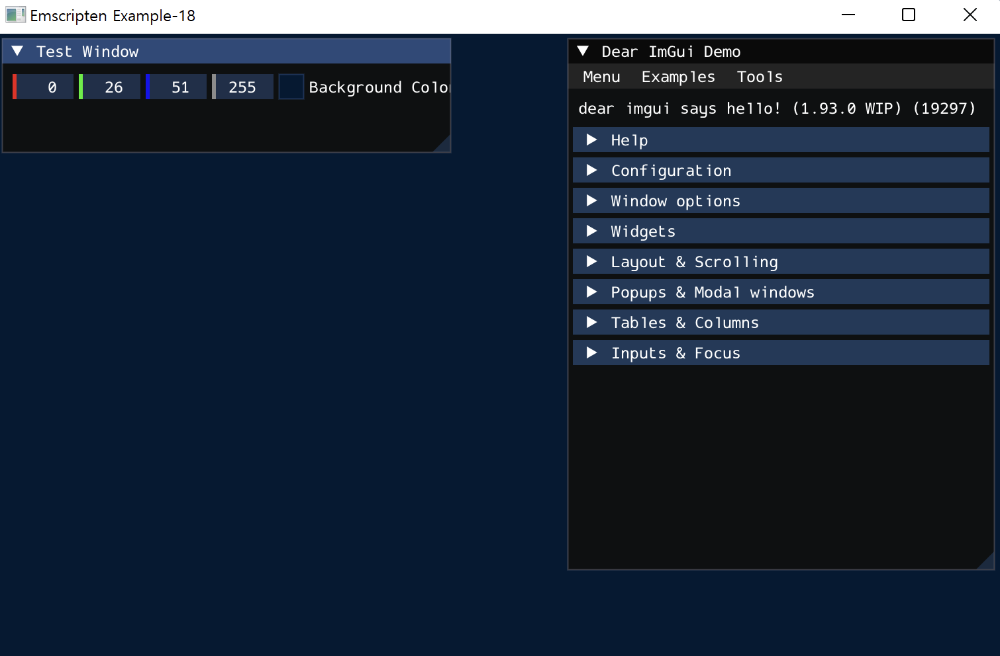
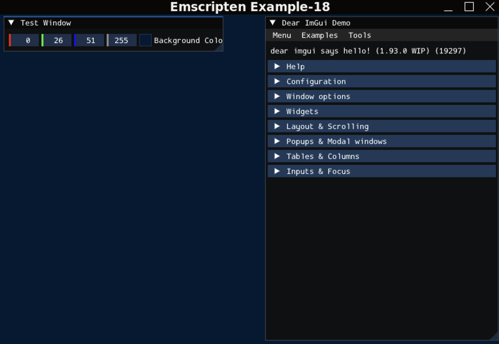
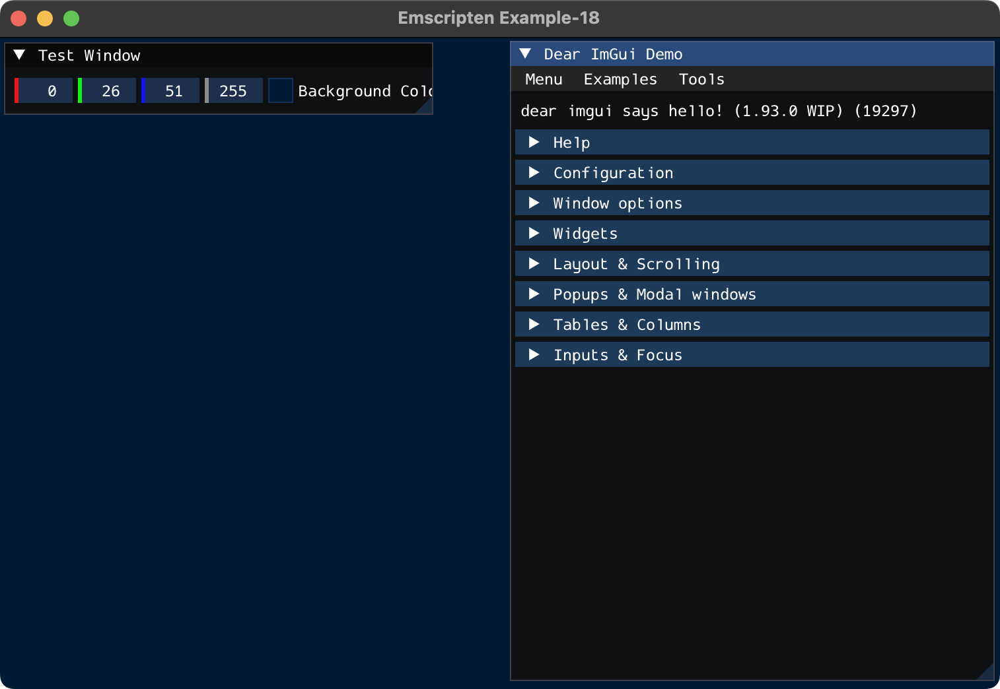
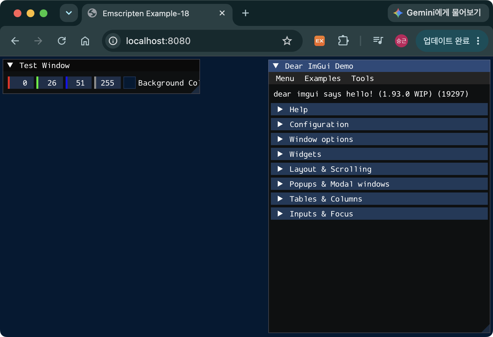

> [!SUMMARY]
> Native와 Web 환경에서 동일하게 동작하는 3D 그래픽스 앱 개발환경을 구성한다. Native에서는 OpenGL 3.3 Core를 사용하고, Web에서는 Emscripten이 OpenGL ES 3.0 API를 WebGL 2로 연결한다. GLFW, GLAD와 Dear ImGui를 조합하여 동일한 C++ 소스 코드를 양쪽 플랫폼에서 빌드한다.

## 개발환경 설정

### Prerequisites

- CMake - 3.20 이상
- C++ 컴파일러
  - Windows: MSVC (Visual Studio)
  - Linux: GCC
  - macOS: AppleClang
  - Web: [emsdk](/posts/emscripten-install/)

> [!NOTE]
> 이 글처럼 `FetchContent`로 GLFW 3.5.1을 빌드하면 Linux에서는 X11과 Wayland backend가 기본으로 활성화된다. Ubuntu에서 두 backend를 모두 빌드하기 위한 개발 패키지는 다음과 같이 설치한다. 한쪽만 사용할 경우에는 `GLFW_BUILD_X11` 또는 `GLFW_BUILD_WAYLAND` CMake 옵션을 끄고 해당 backend의 의존성을 제외할 수 있다.
>
> ```bash
> sudo apt update
> sudo apt install libwayland-dev libxkbcommon-dev xorg-dev
> ```

### Dependencies

#### GLFW

- 윈도우와 OpenGL/OpenGL ES Context를 생성하고 키보드·마우스 입력 및 이벤트를 처리하는 크로스 플랫폼 라이브러리
- Vulkan을 위한 윈도우 surface도 생성할 수 있음
- Native 빌드: v3.5.1
- https://github.com/glfw/glfw

> [!NOTE]
> Web 빌드에서는 Native용 GLFW 3.5.1을 컴파일하지 않고, Emscripten에 포함된 GLFW 3 호환 구현을 링크 옵션(`-sUSE_GLFW=3`)으로 사용한다.

#### GLAD-2

- OpenGL 드라이버의 함수 포인터를 런타임에 찾아 연결해주는 Loader
- [GLAD 코드 생성기 사이트](https://gen.glad.sh/)에서 Generator와 APIs를 선택하면 glad 코드를 버전에 맞게 생성해 줌
  - Generator: C/C++
  - gl: Version 3.3, Core
- 생성된 코드의 구조는 아래와 같음

```
glad/
├── include/
│   ├── glad/
│   │   └── gl.h
│   └── KHR/
│       └── khrplatform.h
└── src/
    └── gl.c
```

> [!NOTE]
> Emscripten은 OpenGL ES 함수를 WebGL에 연결하는 구현을 제공하므로 Web 빌드에서는 GLAD를 사용하지 않는다.

#### ImGui

- 그래픽 애플리케이션에서 버튼, 메뉴, 창 등의 GUI를 쉽게 구현하기 위한 Immediate Mode GUI 라이브러리
- GLFW와 마찬가지로 OpenGL 외에 다양한 그래픽스 API에서 활용 가능함
- v1.92.9b
- https://github.com/ocornut/imgui
- 아래의 파일을 가져와 프로젝트에 포함시키면 됨. 다른 그래픽스 API를 사용하는 경우에 backends 폴더 아래에서 opengl3이 아닌 다른 구현체와 헤더 파일을 가져와야 함

```
backends/imgui_impl_glfw.cpp
backends/imgui_impl_glfw.h
backends/imgui_impl_opengl3_loader.h
backends/imgui_impl_opengl3.cpp
backends/imgui_impl_opengl3.h
imconfig.h
imgui_demo.cpp
imgui_draw.cpp
imgui_internal.h
imgui_tables.cpp
imgui_widgets.cpp
imgui.cpp
imgui.h
imstb_rectpack.h
imstb_textedit.h
imstb_truetype.h
LICENSE.txt
```

### 소스 코드

```CMake
# CMakeLists.txt
cmake_minimum_required(VERSION 3.20)

project(ex-18 LANGUAGES C CXX)

set(CMAKE_CXX_STANDARD 17)
set(CMAKE_CXX_STANDARD_REQUIRED ON)
set(CMAKE_CXX_EXTENSIONS OFF)

add_executable(main main.cpp)

if(EMSCRIPTEN)
  target_compile_definitions(main PRIVATE
    GLFW_INCLUDE_ES3
  )

  # Use the GLFW implementation included with Emscripten
  target_link_options(main PRIVATE
    "-sUSE_GLFW=3"
    "-sMIN_WEBGL_VERSION=2"  # Set the minimum WebGL version to 2
    "-sMAX_WEBGL_VERSION=2"  # Set the maximum WebGL version to 2
  )

  # Same as specifying "-o main.js"
  set_target_properties(main PROPERTIES SUFFIX ".js")
else()
  target_compile_definitions(main PRIVATE
    GLFW_INCLUDE_NONE
  )

  include(FetchContent)

  # Disable building GLFW documentation, tests, and examples
  set(GLFW_BUILD_DOCS OFF CACHE BOOL "" FORCE)
  set(GLFW_BUILD_TESTS OFF CACHE BOOL "" FORCE)
  set(GLFW_BUILD_EXAMPLES OFF CACHE BOOL "" FORCE)
  set(GLFW_INSTALL OFF CACHE BOOL "" FORCE)

  FetchContent_Declare(
    glfw
    GIT_REPOSITORY https://github.com/glfw/glfw.git
    GIT_TAG        3.5.1
    GIT_SHALLOW    TRUE
  )
  FetchContent_MakeAvailable(glfw)

  # GLAD library for loading OpenGL functions
  add_library(glad STATIC
    third_party/glad/src/gl.c
  )

  target_include_directories(glad PUBLIC
    third_party/glad/include
  )

  target_link_libraries(main PRIVATE glad)
endif()

# IMGUI library for graphical user interfaces(GUI)
add_library(imgui STATIC
  third_party/imgui/imgui_demo.cpp
  third_party/imgui/imgui_draw.cpp
  third_party/imgui/backends/imgui_impl_glfw.cpp
  third_party/imgui/backends/imgui_impl_opengl3.cpp
  third_party/imgui/imgui_tables.cpp
  third_party/imgui/imgui_widgets.cpp
  third_party/imgui/imgui.cpp
)

target_include_directories(imgui PUBLIC
  third_party/imgui
  third_party/imgui/backends
)

if(EMSCRIPTEN)
  target_compile_definitions(imgui PUBLIC
    IMGUI_IMPL_OPENGL_ES3
  )
else()
  target_link_libraries(imgui PUBLIC glfw)
endif()

target_link_libraries(main PRIVATE imgui)
```

- `GLFW_INCLUDE_ES3`: GLFW가 Desktop OpenGL 헤더 대신 OpenGL ES 3 헤더를 포함하도록 지정하는 정의
- `-sUSE_GLFW=3`: Emscripten의 GLFW 3 호환 구현을 링크하는 옵션
- `-sMIN_WEBGL_VERSION=2`, `-sMAX_WEBGL_VERSION=2`: WebGL 2만 생성하도록 제한하는 옵션
- `IMGUI_IMPL_OPENGL_ES3`: Dear ImGui의 OpenGL renderer backend가 OpenGL ES 3/WebGL 2 경로를 사용하도록 지정하는 정의

```C++
// main.cpp
#include <iostream>

#ifdef __EMSCRIPTEN__
  #include <emscripten.h>
  #include <emscripten/html5.h>
#else
  #include <glad/gl.h>  // GLAD
#endif

// GLFW
#include <GLFW/glfw3.h>

// ImGui
#include <imgui_impl_glfw.h>
#include <imgui_impl_opengl3.h>

// 초기 배경색
float g_BgColor[4] = {0.0f, 0.1f, 0.2f, 1.0f};

namespace {

#ifdef _WIN32
// Windows의 배율에 따라 GUI의 크기를 변경하기 위한 함수
void applyImGuiScale(float scale) {
  if (scale <= 0.0f) {
    scale = 1.0f;
  }

  ImGuiStyle style;
  ImGui::StyleColorsDark(&style);
  style.ScaleAllSizes(scale);
  style.FontScaleDpi = scale;
  ImGui::GetStyle() = style;
}

void windowContentScaleCallback(GLFWwindow*, float xScale, float yScale) {
  applyImGuiScale(xScale > 0.0f ? xScale : yScale);
}
#endif

// 매 프레임마다 렌더링을 위해 호출되는 함수
void renderFrame(GLFWwindow* window) {
  glfwPollEvents();

  // Render ImGui frame
  ImGui_ImplOpenGL3_NewFrame();
  ImGui_ImplGlfw_NewFrame();
  ImGui::NewFrame();

  ImGui::Begin("Test Window");
  ImGui::ColorEdit4("Background Color", g_BgColor);
  ImGui::End();

  ImGui::ShowDemoWindow();

  glClearColor(g_BgColor[0], g_BgColor[1], g_BgColor[2], g_BgColor[3]);
  glClear(GL_COLOR_BUFFER_BIT);

  ImGui::Render();
  ImGui_ImplOpenGL3_RenderDrawData(ImGui::GetDrawData());

  glfwSwapBuffers(window);
}

void framebufferSizeCallback(GLFWwindow*, int width, int height) {
  glViewport(0, 0, width, height);
}

void shutdownGlfw(GLFWwindow* window) {
  if (window) {
    glfwDestroyWindow(window);
  }
  glfwTerminate();
}

void shutdownApplication(GLFWwindow* window) {
#ifdef __EMSCRIPTEN__
  emscripten_set_resize_callback(
    EMSCRIPTEN_EVENT_TARGET_WINDOW, nullptr, false, nullptr);
  emscripten_set_fullscreenchange_callback(
    EMSCRIPTEN_EVENT_TARGET_DOCUMENT, nullptr, false, nullptr);
  emscripten_set_wheel_callback(
    "#canvas", nullptr, false, nullptr);
#endif

  ImGui_ImplOpenGL3_Shutdown();
  ImGui_ImplGlfw_Shutdown();
  ImGui::DestroyContext();

  shutdownGlfw(window);
}

#ifdef __EMSCRIPTEN__
// 브라우저의 크기가 변경되는 경우 호출되는 함수
EM_BOOL browserResizeCallback(
  int, const EmscriptenUiEvent* event, void* userData) {
  auto* window = static_cast<GLFWwindow*>(userData);

  if (event->windowInnerWidth > 0 && event->windowInnerHeight > 0) {
    glfwSetWindowSize(
      window, event->windowInnerWidth, event->windowInnerHeight);
  }

  return EM_FALSE;
}

// emscripten_set_main_loop_arg에 의해 호출되는 함수
void browserMainLoop(void* argument) {
  auto* window = static_cast<GLFWwindow*>(argument);

  if (glfwWindowShouldClose(window)) {
    emscripten_cancel_main_loop();
    shutdownApplication(window);
    return;
  }

  renderFrame(window);
}
#endif

}  // namespace

int main() {
  int windowWidth = 800;
  int windowHeight = 600;

  std::cout << "Initialize GLFW" << std::endl;

  if (!glfwInit()) {
    std::cerr << "Failed to initialize GLFW" << std::endl;
    return -1;
  }

#ifdef __EMSCRIPTEN__
  glfwWindowHint(GLFW_SCALE_TO_MONITOR, GLFW_TRUE);
  glfwWindowHint(GLFW_CONTEXT_VERSION_MAJOR, 3);
  glfwWindowHint(GLFW_CONTEXT_VERSION_MINOR, 0);
  glfwWindowHint(GLFW_CLIENT_API, GLFW_OPENGL_ES_API);

  // Emscripten을 사용하는 경우에는 브라우저의 크기에 맞게 canvas의 CSS 크기를 가져와서 framebuffer의 크기를 재설정해야 함
  double canvasWidth;
  double canvasHeight;
  if (emscripten_get_element_css_size(
        "#canvas", &canvasWidth, &canvasHeight) == EMSCRIPTEN_RESULT_SUCCESS &&
      canvasWidth > 0.0 && canvasHeight > 0.0) {
    windowWidth = static_cast<int>(canvasWidth);
    windowHeight = static_cast<int>(canvasHeight);
  }
#else
  glfwWindowHint(GLFW_CONTEXT_VERSION_MAJOR, 3);
  glfwWindowHint(GLFW_CONTEXT_VERSION_MINOR, 3);
  glfwWindowHint(GLFW_OPENGL_PROFILE, GLFW_OPENGL_CORE_PROFILE);
#ifdef __APPLE__
  glfwWindowHint(GLFW_OPENGL_FORWARD_COMPAT, GLFW_TRUE);
#endif
#ifdef _WIN32
  glfwWindowHint(GLFW_SCALE_TO_MONITOR, GLFW_TRUE);
#endif
#endif

  std::cout << "Create GLFW window" << std::endl;

  GLFWwindow* window = glfwCreateWindow(
    windowWidth, windowHeight, "Emscripten Example-18", nullptr, nullptr);
  if (!window) {
    std::cerr << "Failed to create GLFW window" << std::endl;
    glfwTerminate();
    return -1;
  }
  glfwMakeContextCurrent(window);

  std::cout << "GLFW window created successfully" << std::endl;

#ifndef __EMSCRIPTEN__
  int version = gladLoadGL(glfwGetProcAddress);
  if (!version) {
    std::cerr << "Failed to initialize GLAD" << std::endl;
    shutdownGlfw(window);
    return -1;
  }
  std::cout << "GLAD initialized successfully, version: " << version << std::endl;
#endif

  const auto glVersion = glGetString(GL_VERSION);
  if (!glVersion) {
    std::cerr << "Failed to get OpenGL version" << std::endl;
    shutdownGlfw(window);
    return -1;
  }
  std::cout << "OpenGL version: "
            << reinterpret_cast<const char*>(glVersion) << std::endl;

  // ImGui initialization
  IMGUI_CHECKVERSION();
  ImGui::CreateContext();
  ImGuiIO& io = ImGui::GetIO();
  io.Fonts->AddFontDefaultVector();
  ImGui::StyleColorsDark();
  if (!ImGui_ImplGlfw_InitForOpenGL(window, true)) {
    std::cerr << "Failed to initialize ImGui GLFW backend" << std::endl;
    ImGui::DestroyContext();
    shutdownGlfw(window);
    return -1;
  }

#ifdef _WIN32
  applyImGuiScale(ImGui_ImplGlfw_GetContentScaleForWindow(window));
  glfwSetWindowContentScaleCallback(window, windowContentScaleCallback);
#endif

#ifdef __EMSCRIPTEN__
  const char* glslVersion = "#version 300 es";
#else
  const char* glslVersion = "#version 330";
#endif
  if (!ImGui_ImplOpenGL3_Init(glslVersion)) {
    std::cerr << "Failed to initialize ImGui OpenGL backend" << std::endl;
    ImGui_ImplGlfw_Shutdown();
    ImGui::DestroyContext();
    shutdownGlfw(window);
    return -1;
  }

#ifdef __EMSCRIPTEN__
  ImGui_ImplGlfw_InstallEmscriptenCallbacks(window, "#canvas");

  // Keep GLFW's HiDPI framebuffer while matching the canvas to the browser.
  emscripten_set_resize_callback(
    EMSCRIPTEN_EVENT_TARGET_WINDOW,
    window,
    false,
    browserResizeCallback);
#endif

  glfwSetFramebufferSizeCallback(window, framebufferSizeCallback);

  int framebufferWidth;
  int framebufferHeight;
  glfwGetFramebufferSize(window, &framebufferWidth, &framebufferHeight);
  framebufferSizeCallback(window, framebufferWidth, framebufferHeight);

  // Main loop
#ifdef __EMSCRIPTEN__
  emscripten_set_main_loop_arg(browserMainLoop, window, 0, true);
#else
  while (!glfwWindowShouldClose(window)) {
    renderFrame(window);
  }

  shutdownApplication(window);
#endif

  return 0;
}
```

- `browserMainLoop`
  - Emscripten을 사용하는 경우에 while 문을 사용하여 `renderFrame` 함수를 호출하면, Wasm이 브라우저 이벤트 루프에 제어권이 반환되지 않아 화면과 입력 처리가 멈춤
  - `emscripten_set_main_loop_arg`: 브라우저가 제어권을 가지고, 인자로 전달된 콜백함수를 반복 호출하기 때문에 문제가 발생하지 않음

```HTML
<!-- index.html -->
<!doctype html>
<html>
  <head>
    <meta name="viewport" content="width=device-width, initial-scale=1" />
    <title>Emscripten Example-18</title>
    <style>
      html,
      body {
        width: 100%;
        height: 100%;
        margin: 0;
        overflow: hidden;
      }
      canvas {
        display: block;
        width: 100%;
        height: 100%;
      }
    </style>
  </head>
  <body>
    <canvas id="canvas" width="800" height="600"></canvas>
    <script>
      var Module = {
        canvas: document.getElementById("canvas"),
      };
    </script>
    <script async type="text/javascript" src="build/web/main.js"></script>
  </body>
</html>
```

- 이 예제처럼 직접 작성한 HTML에서 JavaScript 출력 파일을 불러올 때는 `main.js`보다 먼저 [`Module.canvas`](/posts/emscripten-module/)에 렌더링 대상 `<canvas>`를 지정함

### 빌드 하기 및 실행 결과

#### Windows

```bash
# Configure and Build
cmake -S . -B build/native
cmake --build build/native --config Debug

# Run Executable
.\build\native\Debug\main.exe
```

- Generator를 생략하면 설치된 Visual Studio에 맞는 기본 generator가 선택됨. 특정 버전을 지정하려면 현재 CMake가 지원하는 generator 이름을 `cmake --help`에서 확인하여 `-G` 옵션으로 전달해야 함
- `--config Debug`: Debug 모드로 빌드


_그림 1. Windows에서 실행한 모습_

#### Ubuntu

```bash
# Configure and Build
cmake -S . -B build/native
cmake --build build/native

# Run Executable
./build/native/main  # Ubuntu & macOS
```


_그림 2. Ubuntu에서 실행한 모습_

#### macOS

```bash
# Configure and Build
cmake -S . -B build/native
cmake --build build/native

# Run Executable
./build/native/main  # Ubuntu & macOS
```


_그림 3. macOS에서 실행한 모습_

#### Web

```bash
# Configure and Build
emcmake cmake -S . -B build/web
cmake --build build/web

# Run Server
python -m http.server 8080
```

> [!NOTE]
> Wasm을 빌드할 때 CMake를 활용하기 위해서는 configure 단계에서 `emcmake`를 붙이면 된다. 빌드 단계는 native와 동일하게 `cmake --build {build 폴더}`로 수행할 수 있다.


_그림 4. 브라우저에서 실행한 모습_

### 예제 코드 및 테스트 환경

- https://github.com/dadak797/blog-examples/tree/master/examples/ex-18
- Windows 11 Pro (Parallels Desktop VM)
  - Compiler: MSVC 19.51.36260.0
  - OpenGL 3.3 Metal - 88.1
- Ubuntu 22.04 ARM64 (Parallels Desktop VM)
  - Compiler: GCC-11.4.0
  - OpenGL 4.0 Core Profile, Mesa 23.2.1
- macOS Sonoma 14.6.1
  - Compiler: AppleClang 16.0.0.16000026
  - OpenGL 4.1 Metal - 88.1
- Web
  - Compiler: emsdk 5.0.3
  - OpenGL ES 3.0 (WebGL 2.0 (OpenGL ES 3.0 Chromium))

## FAQ



네. 이 글처럼 OpenGL 3.3 Core와 WebGL 2가 공유하는 현대적인 API 범위를 사용하면 대부분의 C++ 코드를 그대로 공유할 수 있습니다. 이 예제도 context 설정, GLAD 사용 여부, GLSL version과 main loop 연결처럼 플랫폼에 따라 달라지는 작은 부분만 전처리기로 구분하고, 프레임별 rendering code와 Dear ImGui를 사용하는 application logic은 Windows, Linux, macOS, Web에서 동일하게 실행합니다.

직접 renderer를 구현할 때도 VAO·VBO와 shader를 사용하는 방식으로 공통 범위를 유지하면 대부분의 rendering 코드를 함께 사용할 수 있습니다. 다만 WebGL 2는 OpenGL ES 3.0을 기반으로 하면서 브라우저의 보안과 이식성을 위한 제약을 추가하므로, Desktop OpenGL 전용 함수나 extension이 필요한 부분은 조건부로 분리해야 합니다. Shader 역시 핵심 logic은 공유할 수 있지만 Desktop GLSL과 GLSL ES의 version 및 일부 문법 차이는 작은 전처리 단계나 별도 header로 처리하는 것이 좋습니다.





Dear ImGui는 기본적으로 창의 크기와 위치 등의 설정을 `imgui.ini`에 저장합니다. Native에서는 이 파일이 디스크에 남지만, Emscripten의 기본 파일시스템인 [MEMFS](/posts/emscripten-file-handling-memfs/#memfs)에 작성된 파일은 메모리에만 존재하므로 페이지를 다시 불러오면 사라집니다.

브라우저에서도 설정을 유지하려면 IDBFS를 마운트하고 `FS.syncfs()`로 브라우저의 IndexedDB와 동기화하거나, `ImGui::SaveIniSettingsToMemory()`의 결과를 직접 저장해야 합니다. 자세한 예제는 [브라우저에서 데이터 유지하기]()를 참고하세요.





Native OpenGL에서는 운영체제와 driver가 제공하는 함수 주소를 실행 시점에 불러와야 하므로 GLAD 같은 loader가 필요합니다. Web 빌드에서는 Emscripten이 OpenGL ES 함수 호출을 WebGL 호출로 연결하는 구현과 헤더를 제공하므로 별도의 OpenGL 함수 loader를 초기화하지 않습니다.

Dear ImGui의 `imgui_impl_opengl3.cpp`도 자체적으로 필요한 함수만 처리하지만, 애플리케이션 코드에서 사용하는 Native OpenGL 함수까지 대신 불러오는 것은 아니므로 Native 빌드의 GLAD는 계속 필요합니다.





브라우저의 main thread에서 종료되지 않는 `while` loop를 실행하면 JavaScript event loop로 제어권이 돌아가지 않아 화면 갱신과 입력 처리가 멈춥니다. `emscripten_set_main_loop_arg()`에 FPS를 `0`으로 전달하면 Emscripten이 `requestAnimationFrame()`을 이용해 rendering callback을 반복 호출하므로 브라우저가 frame 사이에 event를 처리할 수 있습니다.

이 예제는 `simulate_infinite_loop`를 `true`로 설정했으므로 함수 호출 뒤의 코드는 실행되지 않습니다. 따라서 Web 종료 처리는 main loop callback에서 `emscripten_cancel_main_loop()`를 호출한 뒤 수행합니다.





이 예제처럼 학습이나 기존 코드의 cross-platform 검증 목적으로는 사용할 수 있지만, Apple은 macOS 10.14부터 OpenGL을 deprecated 상태로 유지하고 있습니다. 또한 macOS는 최신 Desktop OpenGL이 아니라 최대 4.1 Core Profile까지만 제공하므로 새 macOS 전용 제품을 장기적으로 개발한다면 Metal 또는 Metal을 지원하는 renderer를 검토하는 편이 적절합니다.

GLFW 3.4 이상은 macOS에서 forward-compatible context를 자동으로 반환하지만, 예제에서는 이전 GLFW와의 호환성과 의도를 명확히 하기 위해 `GLFW_OPENGL_FORWARD_COMPAT` hint도 함께 지정합니다.



## 참고 자료

- [Compiling GLFW](https://www.glfw.org/docs/latest/compile.html)
- [GLAD](https://github.com/Dav1dde/glad)
- [Dear ImGui - Getting Started](https://github.com/ocornut/imgui/wiki/Getting-Started)
- [OpenGL support in Emscripten](https://emscripten.org/docs/porting/multimedia_and_graphics/OpenGL-support.html)
- [Emscripten main loop API](https://emscripten.org/docs/api_reference/emscripten.h.html#c.emscripten_set_main_loop_arg)
- [Emscripten File System Overview](https://emscripten.org/docs/porting/files/file_systems_overview.html)
- [OpenGL on macOS](https://www.glfw.org/docs/latest/compat_guide.html#compat_osx)
