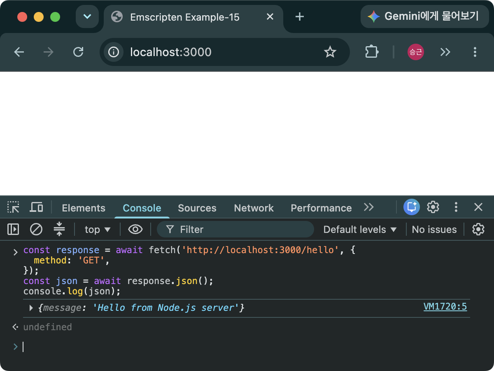
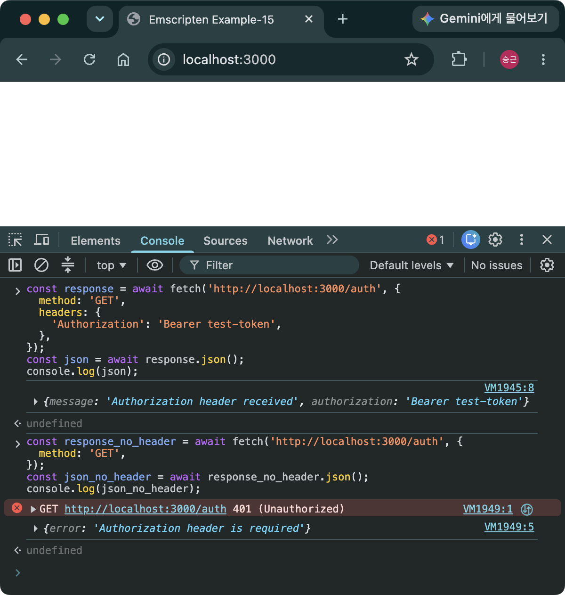
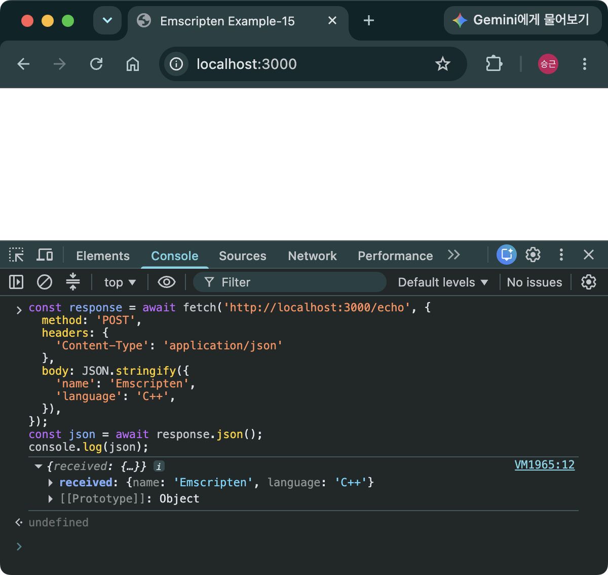
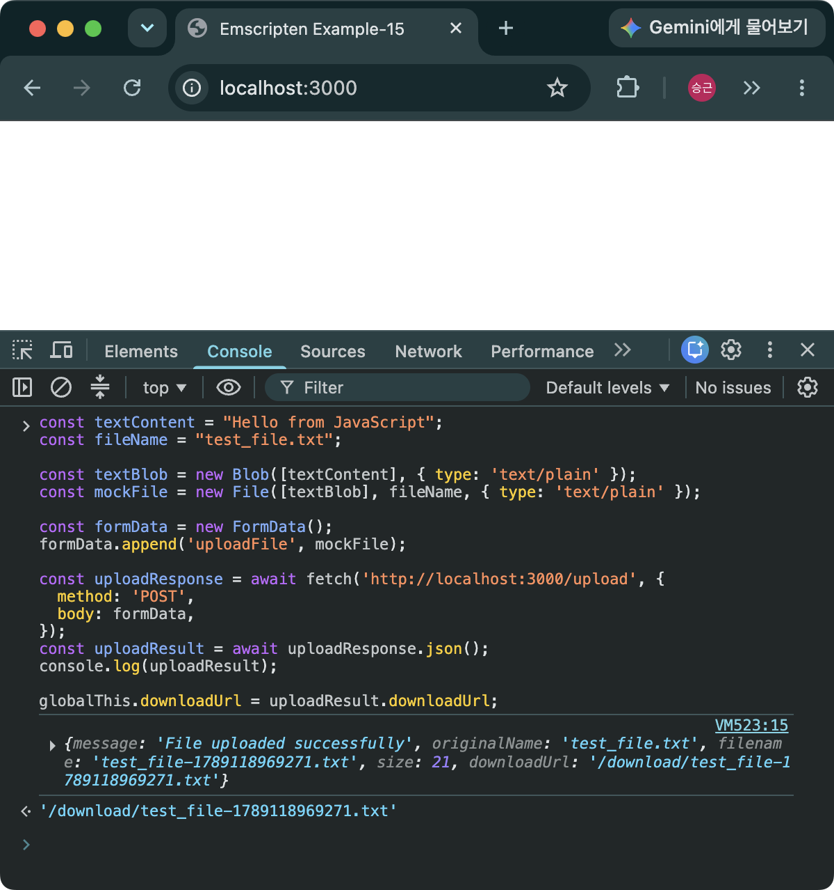
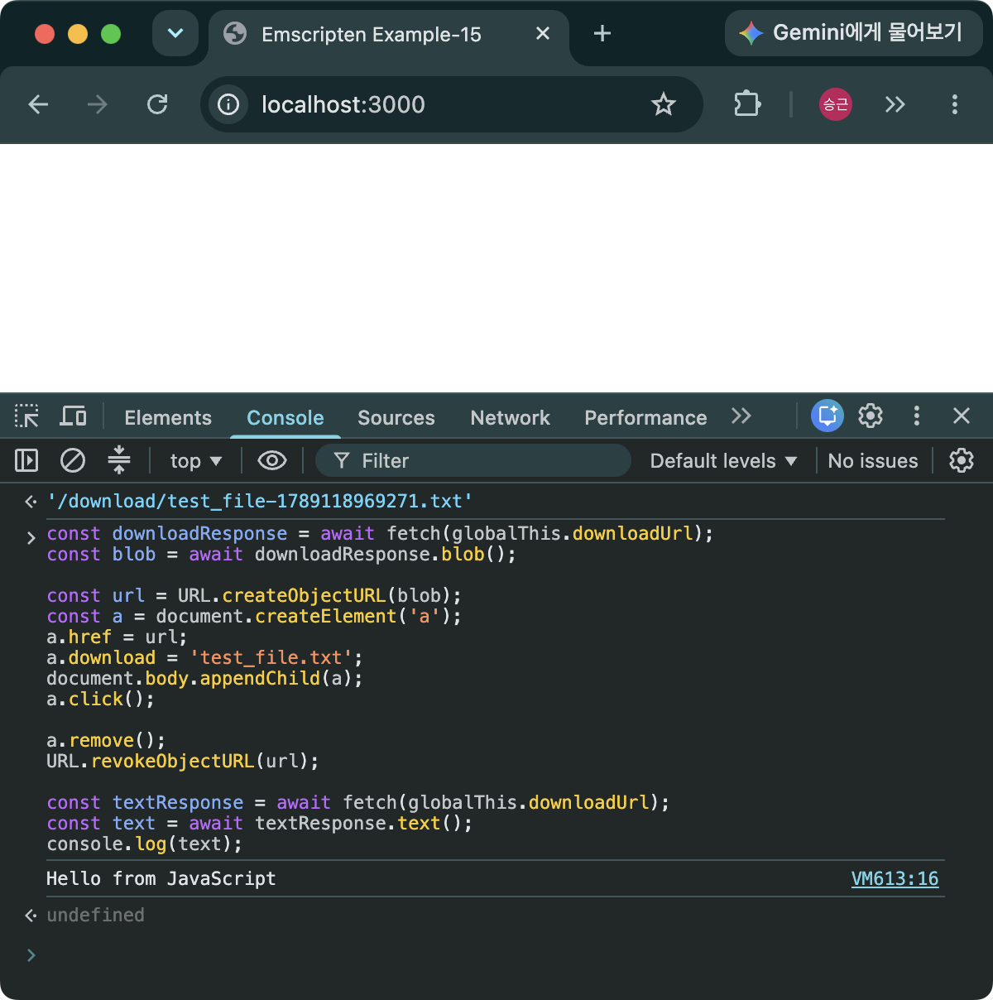

> [!SUMMARY]
> VS Code's Live Server extension and Python's `http.server` are development preview tools that only serve static files. They cannot implement dynamic features such as authentication, data storage, or generated API responses. This post builds a simple backend with Node.js and Express that runs server-side logic for each request, then verifies that each API behaves as expected.

## Installing Node.js

```bash
node -v  # Check the Node.js installation
npm -v   # Check the npm installation
```

- https://nodejs.org/en/download
- If both commands print a version, the installation was successful.

## Initializing the Project

```bash
npm init
```

- Enter a value for each prompt to create `package.json`. To accept all the defaults, use `npm init -y` instead.

```jsonc
// package.json
{
  "name": "ex-15",
  "version": "1.0.0",
  "description": "",
  "main": "index.js",
  "scripts": {
    "test": "echo \"Error: no test specified\" && exit 1",
  },
  "keywords": [],
  "author": "",
  "license": "ISC",
  "type": "commonjs",
}
```

- name: The project name
- version: The project version
- description: A short description of the project
- main: The package entry point. When another module loads this package with a call such as `require("ex-15")`, Node.js loads `index.js`. A server application that is run directly does not import this package, so this field can be removed.
- scripts: Frequently used commands. Running `npm run test` executes `echo \"Error: no test specified\" && exit 1`.
- keywords: Keywords describing the package
- author: The author's name
- license: The type of license
- type: The module system to use. `commonjs` uses the traditional `require()` and `module.exports` syntax, while `module` enables ES module syntax with `import` and `export`.

## Installing Server Packages

```bash
npm install express
npm install cors
npm install multer
npm install --save-dev nodemon
```

- `express`: Creates the web server and handles routes.
- `cors`: Sets Cross-Origin Resource Sharing (CORS) response headers. It is needed when a browser must read an API response from a different origin.
- `multer`: Processes `multipart/form-data` file uploads.
- `nodemon`: Automatically restarts the server process when its source code changes.
- `--save-dev`: Installs a package that is only needed during development.
- Installing these packages adds them to `package.json` and creates the `node_modules` directory and `package-lock.json` file.

```jsonc
// package.json
{
  // ...
  "scripts": {
    "start": "node server.js",
    "dev": "nodemon server.js",
  },
  // ...
  "type": "module",
  "dependencies": {
    "cors": "^2.8.6",
    "express": "^5.2.1",
    "multer": "^2.3.0",
  },
  "devDependencies": {
    "nodemon": "^3.1.14",
  },
}
```

- scripts: Remove the default script and add two scripts, `start` and `dev`.
- dependencies: Packages required in production. A package installed with `npm install package-name` is added here.
- devDependencies: Packages needed only during development. A package installed with `npm install package-name --save-dev` is added here.
- `node_modules`
  - Contains the installed package files.
  - This directory can be very large and can be recreated from `package.json` and `package-lock.json`, so add it to `.gitignore` instead of committing it to the repository.

> [!NOTE]
> `package.json` records the version ranges of packages that may be installed, while `package-lock.json` records the exact versions in the complete dependency tree that was installed. To reproduce the same dependency environment, commit both files and use `npm ci`. This command fails when the two files do not match and does not modify either `package.json` or `package-lock.json` during installation.

## Server Configuration and Project Structure

- Create an `index.html` file to use when testing the APIs in the browser's developer tools. The server automatically creates the `uploads` directory for uploaded files the first time it starts.

```javascript
// server.js
import express from "express";
import cors from "cors";
import multer from "multer";
import path from "path";
import { fileURLToPath } from "url";
import fs from "fs";

const app = express();
const port = 3000;
const __filename = fileURLToPath(import.meta.url);
const __dirname = path.dirname(__filename);
const uploadDir = path.join(__dirname, "uploads");

// Create the upload directory when the server starts.
fs.mkdirSync(uploadDir, { recursive: true });

// Configure CORS.
// Allow a separate client running at http://localhost:8080
// to call the API at http://localhost:3000.
app.use(
  cors({
    origin: "http://localhost:8080",
    allowedHeaders: ["Content-Type", "Authorization"],
  }),
);

// Parse JSON POST requests.
// This middleware runs when the request Content-Type is application/json.
app.use(express.json());

// Configure where uploaded files are stored.
// Multer normally generates random filenames. Here, a timestamp is appended
// to the original filename to make it unique.
const storage = multer.diskStorage({
  destination: (req, file, cb) => {
    cb(null, uploadDir);
  },
  filename: (req, file, cb) => {
    const ext = path.extname(file.originalname);
    const base = path.basename(file.originalname, ext);
    cb(null, `${base}-${Date.now()}${ext}`);
  },
});
const upload = multer({ storage });

// Home page
app.get("/", (req, res) => {
  res.sendFile(path.join(__dirname, "index.html"));
});

// Define the API endpoints.
// 1. Basic GET request
app.get("/hello", (req, res) => {
  res.json({
    message: "Hello from Node.js server",
  });
});

// 2. GET request with an authorization header
app.get("/auth", (req, res) => {
  const authorization = req.get("Authorization");

  // Return an error when the Authorization header is missing.
  if (!authorization) {
    return res.status(401).json({
      error: "Authorization header is required",
    });
  }

  res.json({
    message: "Authorization header received",
    authorization: authorization,
  });
});

// 3. POST request with a JSON body
app.post("/echo", (req, res) => {
  console.log("POST body:");
  console.log(req.body);

  // Return the received JSON body unchanged.
  res.json({
    received: req.body,
  });
});

// 4. File upload
app.post("/upload", upload.single("uploadFile"), (req, res) => {
  if (!req.file) {
    return res.status(400).json({
      error: "No file uploaded",
    });
  }

  res.json({
    message: "File uploaded successfully",
    originalName: req.file.originalname,
    filename: req.file.filename,
    size: req.file.size,
    downloadUrl: `/download/${encodeURIComponent(req.file.filename)}`,
  });
});

// 5. File download
app.get("/download/:filename", (req, res) => {
  // The root option makes Express confine the file path to the uploads directory.
  res.sendFile(req.params.filename, { root: uploadDir });
});

app.listen(port, () => {
  console.log(`Server running at http://localhost:${port}`);
});
```

```html
<!-- index.html -->
<!doctype html>
<html>
  <head>
    <title>Emscripten Example-15</title>
  </head>
  <body></body>
</html>
```

- Configure JSON POST request parsing and CORS.
- `cors`: Middleware that sets CORS response headers so a browser can read an API response from another origin. The developer-tools tests in this post run on the same origin and do not require CORS. This configuration is included for a separate client running at `http://localhost:8080` that calls the API at `http://localhost:3000`.
- Automatically create the `uploads` directory when the server starts if it does not already exist.
- Configure file uploads with Multer.
- Create controllers for five basic API tests using GET and POST requests:
  1. `/hello`: Returns a basic JSON object.
  2. `/auth`: Checks for an authorization header. This is only a header-checking example and does not validate the token.
  3. `/echo`: Accepts a JSON body in a POST request and returns it unchanged.
  4. `/upload`: Saves a file in the `uploads` directory and returns its stored filename and download URL.
  5. `/download/:filename`: Downloads a file. The value after `/download/` is passed as `req.params.filename`, and the `root` option prevents access to files outside the `uploads` directory.

### Project Structure

```
ex-15/
├── node_modules/
├── uploads/
├── index.html
├── package-lock.json
├── package.json
└── server.js
```

## Testing the Server

### Starting the Server

```bash
npm run dev
```

- Open `http://localhost:3000`, then run the following scripts in order from the Console tab of the browser's developer tools.

### Testing a GET Request

```javascript
const response = await fetch('http://localhost:3000/hello', {
  method: 'GET',
});
const json = await response.json();
console.log(json);
```


_Figure 1. GET request result—the server responds successfully._

### Testing a GET Request with an Authorization Header

```javascript
// Send a request with an authorization header.
const response = await fetch('http://localhost:3000/auth', {
  method: 'GET',
  headers: {
    'Authorization': 'Bearer test-token',
  },
});
const json = await response.json();
console.log(json);

// Send a request without an authorization header.
const response_no_header = await fetch('http://localhost:3000/auth', {
  method: 'GET',
});
const json_no_header = await response_no_header.json();
console.log(json_no_header);
```


_Figure 2. GET request with an authorization header—the request without the header returns an error._

### Testing a POST Request

```javascript
const response = await fetch('http://localhost:3000/echo', {
  method: 'POST',
  headers: {
    'Content-Type': 'application/json'
  },
  body: JSON.stringify({
    'name': 'Emscripten',
    'language': 'C++',
  }),
});
const json = await response.json();
console.log(json);
```


_Figure 3. POST request result—the server returns the submitted JSON body unchanged._

### Testing a File Upload

```javascript
const textContent = "Hello from JavaScript";
const fileName = "test_file.txt";

const textBlob = new Blob([textContent], { type: 'text/plain' });
const mockFile = new File([textBlob], fileName, { type: 'text/plain' });

const formData = new FormData();
formData.append('uploadFile', mockFile);

const uploadResponse = await fetch('http://localhost:3000/upload', {
  method: 'POST',
  body: formData,
});
const uploadResult = await uploadResponse.json();
console.log(uploadResult);

// Use this in the next download test.
globalThis.downloadUrl = uploadResult.downloadUrl;
```

- Create a `File` object from a string, add it to `FormData`, and send it in a POST request.
- The server saves the file in the `uploads` directory as `test_file-{timestamp}.txt` and returns its stored filename and download URL.


_Figure 4. POST file upload result—a `test_file-{timestamp}.txt` file is created in the `uploads` directory._

### Testing a File Download

- Use the `downloadUrl` returned by the preceding upload test to download the file saved in the `uploads` directory. Run this without refreshing the browser after the upload test.

```javascript
// Download the file.
const downloadResponse = await fetch(globalThis.downloadUrl);
const blob = await downloadResponse.blob();

const url = URL.createObjectURL(blob);
const a = document.createElement('a');
a.href = url;
a.download = 'test_file.txt';
document.body.appendChild(a);
a.click();

a.remove();
URL.revokeObjectURL(url);   // Release the object URL.

// Read the response body as text.
const textResponse = await fetch(globalThis.downloadUrl);
const text = await textResponse.text();
console.log(text);
```


_Figure 5. GET file download result—the first request downloads `test_file.txt`, and the second reads the response body as text to verify the file contents._

### Example Code and Node.js Version

- https://github.com/dadak797/blog-examples/tree/master/examples/ex-15
- Node.js v26.5.0
- npm 11.17.0

## FAQ



- Node.js is a JavaScript runtime, while Express is a web framework that runs on it. Strictly speaking, an Express-based Node.js server should therefore be compared with Flask, Django, or Spring Boot.
- Using JavaScript or TypeScript for both the frontend and backend makes it easier to share a language and data models, and it provides access to the npm ecosystem. Node.js also handles asynchronous, I/O-heavy requests efficiently, making it a lightweight choice for API and real-time communication servers.
- Django or Spring Boot may be more convenient for large applications that need built-in features such as authentication, an ORM, and administrative tools. CPU-intensive work can block the Node.js event loop, so the best choice depends on the server's purpose and the team's technology stack.
  



- The `server.js` file in this post uses ES module features such as `import` and `import.meta.url`. To interpret a `.js` file as an ES module, set `"type": "module"` in the nearest `package.json`.
- To keep `"type": "commonjs"`, replace `import` with `require()` and `module.exports`. Alternatively, use the `.mjs` extension to run the file as an ES module regardless of the `type` setting.
  



- No. When you open the developer tools at `http://localhost:3000` and call an API on the same origin, as this post does, CORS configuration is not required.
- The `cors` middleware in this example is configured for a separate client running at `http://localhost:8080` that calls the API at `http://localhost:3000`. An origin is defined by the combination of protocol, host, and port, so these two addresses have different origins because their ports differ. CORS is not an authentication mechanism; it is a browser policy that controls whether code can read a response from another origin.
  



- The argument passed to `upload.single("uploadFile")` is the file field name expected by the server. The client must use the same name, as in `formData.append("uploadFile", mockFile)`. Using a different name can cause an `Unexpected field` error.
  



- No. `res.sendFile()` streams the file, so it does not need to load the entire file into memory first as `fs.readFile()` does. This makes it suitable for APIs that download relatively large files.
- In this example, the `root` option is set to the `uploads` directory, preventing the requested path from escaping that directory. However, the client's `response.text()` waits for the complete response before converting it to a string, so that code verifies the response body rather than demonstrating streaming reception.
  



- This server is a test example intended to demonstrate basic Express features. In particular, `/auth` only checks whether an `Authorization` header exists; it does not validate the token or check the user's permissions.
- A production service also needs authentication and authorization, request validation, upload size and file type limits, safe filename generation, HTTPS, rate limiting, logging, and centralized error handling.
  
