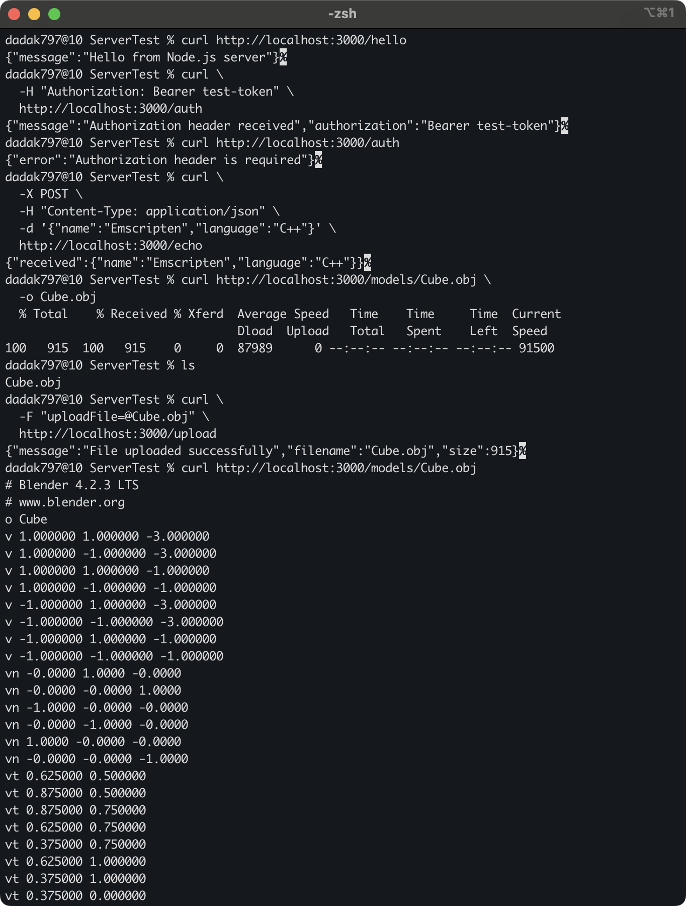

> [!SUMMARY]
> VS-Code의 확장 프로그램인 Live Server나 Python `http.server`는 정적 파일을 보여주기만 하는 개발용 미리보기 도구라서, 실제 서비스처럼 로그인·데이터 저장·API 응답 같은 동적 기능을 구현할 수는 없다. 이 글에서는 Node.js와 Express를 이용하여 요청마다 서버 로직을 실행할 수 있는 백엔드를 간단히 구축하고, 각 API가 요청한 동작을 잘 수행하는지 테스트한다.

## Node.js 설치

```bash
node -v  # Node.js 설치 확인
npm -v   # npm 설치 확인
```

- https://nodejs.org/ko/download
- 각 버전이 출력되면 설치가 잘 되었다는 뜻

## 프로젝트 초기화

```bash
npm init
```

- 각 항목을 입력하면 package.json이 생성됨. 귀찮으면 `npm init -y`로 하여 기본값을 사용

```jsonc
// package.json
{
  "name": "ex-15",
  "version": "1.0.0",
  "description": "",
  "main": "index.js",
  "scripts": {
    "test": "echo \"Error: no test specified\" && exit 1",
  },
  "keywords": [],
  "author": "",
  "license": "ISC",
  "type": "commonjs",
}
```

- name: 프로젝트 이름
- version: 버전
- description: 프로젝트에 관한 간단한 설명
- main: 이 패키지의 진입점(entry point)이 되는 파일. 다른 코드에서 `require("ex-15")`처럼 이 패키지를 불러오면 `index.js`가 로드됨. 직접 실행하는 서버 애플리케이션에서는 이 패키지를 import 하지 않기 때문에 삭제해도 무방함
- scripts: 자주 쓰는 명령어를 등록할 수 있음. `npm run test`를 실행하면 `echo \"Error: no test specified\" && exit 1`가 실행됨
- keywords: 핵심어
- author: 작성자의 이름
- license: 라이선스의 종류
- type: 사용할 모듈 시스템을 지정함. `commonjs`는 전통적인 `require()`/`module.exports` 방식을 사용한다는 뜻이고, `module`로 바꾸면 ES module 방식(`import`/`export`)을 사용하겠다는 뜻

## 서버 구동을 위한 패키지 설치

```bash
npm install express
npm install cors
npm install multer
npm install --save-dev nodemon
```

- `express`: 웹 서버를 생성해 주는 패키지
- `cors`: 교차 출처 리소스 공유(Cross-Origin Resource Sharing; CORS)를 위한 응답 헤더를 설정하는 패키지. 브라우저에서 다른 origin의 API 응답을 읽어야 할 때 필요함
- `multer`: `multipart/form-data` 파일 업로드를 쉽게 처리하기 위해 사용하는 패키지
- `nodemon`: 서버의 소스코드가 수정되면 프로세스를 자동 재시작
- `--save-dev`: 개발 중에만 사용하는 패키지를 설치할 때 붙여줘야 함
- 패키지들을 설치하면 `package.json`에 아래와 같이 패키지 목록이 추가되고, `node_modules` 폴더와 `package-lock.json` 파일이 생성됨

```jsonc
// package.json
{
  // ...
  "scripts": {
    "start": "node server.js",
    "dev": "nodemon server.js",
  },
  // ...
  "type": "module",
  "dependencies": {
    "cors": "^2.8.6",
    "express": "^5.2.1",
    "multer": "^2.3.0",
  },
  "devDependencies": {
    "nodemon": "^3.1.14",
  },
}
```

- scripts: 기본 스크립트를 삭제하고, 두 가지 스크립트(`start`, `dev`)를 추가
- dependencies: 배포에 필요한 패키지 목록. `npm install 패키지명`으로 패키지를 설치했을 때, 그 이름이 여기에 추가됨
- devDependencies: 개발 중에만 필요한 패키지 목록. `npm install 패키지명 --save-dev`로 설치하면 여기에 추가됨
- `node_modules`
  - 설치한 패키지 파일들이 저장되는 폴더
  - 용량이 매우 크고 `package.json`과 `package-lock.json`을 통해 다시 생성할 수 있으므로, `.gitignore`에 추가하고 저장소에는 포함하지 않음

> [!NOTE]
> `package.json`은 설치 가능한 패키지의 버전 범위를 기록하고, `package-lock.json`은 실제로 설치된 전체 의존성 트리의 정확한 버전을 기록한다. 동일한 의존성 환경을 재현하려면 두 파일을 저장소에 함께 커밋하고 `npm ci`를 사용한다. `npm ci`는 두 파일의 내용이 일치하지 않으면 오류를 발생시키며, 설치 과정에서 `package.json`이나 `package-lock.json`을 수정하지 않는다.

## 기본 서버 설정 파일

- 서버를 실행하기 전에 프로젝트 루트에 업로드 파일을 저장할 `uploads` 폴더를 만들고, 다운로드 테스트에 사용할 `Cube.obj` 파일을 `models` 폴더에 넣어둠

```JavaScript
// server.js
import express from "express";
import cors from "cors";
import multer from "multer";
import path from "path";
import { fileURLToPath } from "url";

const app = express();
const port = 3000;
const __filename = fileURLToPath(import.meta.url);
const __dirname = path.dirname(__filename);

// CORS 설정
// 다른 origin에서 실행되는 클라이언트의 API 호출 허용
// 예: http://localhost:8080 → http://localhost:3000
app.use(
  cors({
    origin: "http://localhost:8080",
    allowedHeaders: ["Content-Type", "Authorization"],
  }),
);

// JSON POST 요청 처리 설정
// 요청의 Content-Type이 application/json 일 때 동작함
app.use(express.json());

// 업로드된 파일 저장 위치 설정
// 기본적으로 파일명은 무작위로 생성되지만, 여기서는 파일이름에 타임스탬프를 붙여 고유하게 만듦
const storage = multer.diskStorage({
  destination: (req, file, cb) => {
    cb(null, "uploads/");
  },
  filename: (req, file, cb) => {
    const ext = path.extname(file.originalname);
    const base = path.basename(file.originalname, ext);
    cb(null, `${base}-${Date.now()}${ext}`);
  },
});
const upload = multer({ storage });

// API 생성
// 1. GET 요청
app.get("/hello", (req, res) => {
  res.json({
    message: "Hello from Node.js server",
  });
});

// 2. 인증 헤더가 포함된 GET
app.get("/auth", (req, res) => {
  const authorization = req.get("Authorization");

  // 인증 헤더에 Authorization이 없으면 오류 발생
  if (!authorization) {
    return res.status(401).json({
      error: "Authorization header is required",
    });
  }

  res.json({
    message: "Authorization header received",
    authorization: authorization,
  });
});

// 3. JSON body를 가지고 POST 요청
app.post("/echo", (req, res) => {
  console.log("POST body:");
  console.log(req.body);

  // 요청으로 받은 JSON body를 그대로 리턴
  res.json({
    received: req.body,
  });
});

// 4. 파일 업로드
app.post("/upload", upload.single("uploadFile"), (req, res) => {
  if (!req.file) {
    return res.status(400).json({
      error: "No file uploaded",
    });
  }

  console.log(req.file);

  res.json({
    message: "File uploaded successfully",
    filename: req.file.originalname,
    size: req.file.size,
  });
});

// 5. 파일 스트리밍과 다운로드
app.get("/models/:filename", (req, res) => {
  const filesDir = path.join(__dirname, "models");

  // root 옵션을 지정하면 Express가 파일 경로를 models 폴더 내부로 제한함
  res.sendFile(req.params.filename, { root: filesDir });
});

app.listen(port, () => {
  console.log(`Server running at http://localhost:${port}`);
});
```

- JSON POST 요청, CORS를 설정
- `cors`: 브라우저에서 다른 origin의 API 응답을 읽을 수 있도록 CORS 응답 헤더를 설정하는 미들웨어. 이 예제에서는 `http://localhost:8080`에서 실행되는 클라이언트가 `http://localhost:3000`의 API를 호출하는 상황을 가정함
- multer를 이용한 파일 업로드 설정
- GET, POST를 조합한 총 5가지의 API와 컨트롤러를 생성하여 기본적인 테스트를 수행
  1.  `/hello`: 기본적인 JSON 문자열을 리턴받는 API
  2.  `/auth`: 인증 헤더를 확인하는 API. 토큰을 인증하는 것은 아니고 테스트용 헤더 확인 예제
  3.  `/echo`: JSON body를 POST 요청으로 받고, 그 요청을 그대로 리턴하는 API
  4.  `/upload`: 파일 업로드를 위한 API
  5.  `/models/:filename`: 파일 스트리밍과 다운로드를 위한 API. `/models/` 뒤의 문자열은 `req.params.filename`으로 전달되며, `root` 옵션을 통해 `models` 폴더 외부의 파일에는 접근할 수 없도록 제한함

## 서버 테스트 하기


_그림 1. 5가지의 API에 대한 테스트_

- `npm run dev`로 서버를 구동시킨 후 아래의 스크립트를 순차적으로 실행

### 실행 스크립트

```bash
# 서버 실행
npm run dev

# --- 별도의 콘솔창에서 ---

# GET 요청
curl http://localhost:3000/hello

# 인증 헤더가 포함된 GET
curl \
  -H "Authorization: Bearer test-token" \
  http://localhost:3000/auth

# 인증 헤더 없이 GET
curl http://localhost:3000/auth

# POST 요청
curl \
  -X POST \
  -H "Content-Type: application/json" \
  -d '{"name":"Emscripten","language":"C++"}' \
  http://localhost:3000/echo

# 파일 다운로드
curl http://localhost:3000/models/Cube.obj \
  -o Cube.obj

# 파일 확인
ls

# 파일 업로드
curl \
  -F "uploadFile=@Cube.obj" \
  http://localhost:3000/upload

# 파일 스트리밍
curl http://localhost:3000/models/Cube.obj
```

- 파일 업로드 후에 웹 서버의 `uploads` 폴더를 확인해보면 `Cube-1788845621235.obj` 같은 파일이 생성되어 있음. `Cube-` 뒤의 숫자는 타임스탬프로 시간에 따라 달라짐

### 예제 코드 및 Node.js 버전

- https://github.com/dadak797/blog-examples/tree/master/examples/ex-15
- Node.js v26.5.0
- npm 11.17.0

## FAQ



- Node.js는 JavaScript 런타임이고 Express는 그 위에서 동작하는 웹 프레임워크입니다. 따라서 정확히는 Express 기반 Node.js 서버와 Flask, Django, Spring Boot를 비교해야 합니다.
- 프론트엔드와 백엔드를 모두 JavaScript 또는 TypeScript로 작성할 수 있어 언어와 데이터 모델을 공유하기 쉽고, npm 생태계의 패키지를 활용할 수 있다는 장점이 있습니다. 또한 비동기 I/O 중심의 요청을 효율적으로 처리하므로 API 서버나 실시간 통신 서버를 가볍게 구축하기 좋습니다.
- 반면 인증, ORM, 관리 도구처럼 다양한 기능이 기본으로 필요한 대규모 애플리케이션에서는 Django나 Spring Boot가 더 편리할 수 있습니다. CPU 연산이 많은 작업은 Node.js의 이벤트 루프를 막을 수 있으므로, 서버의 목적과 팀의 기술 스택에 따라 선택하는 것이 좋습니다.
  



- 이 글의 `server.js`는 `import`와 `import.meta.url`을 사용하는 ES module 방식으로 작성되어 있습니다. `.js` 파일을 ES module로 해석하려면 가장 가까운 `package.json`에 `"type": "module"`을 지정해야 합니다.
- `"type": "commonjs"`를 유지하려면 `import` 대신 `require()`와 `module.exports`를 사용해야 합니다. 또는 파일 확장자를 `.mjs`로 변경하면 `type` 설정과 관계없이 ES module로 실행할 수 있습니다.
  



- Origin은 프로토콜, 호스트, 포트의 조합으로 구분됩니다. 따라서 클라이언트가 실행되는 `http://localhost:8080`과 API 서버의 `http://localhost:3000`은 포트가 달라 서로 다른 origin입니다. 브라우저에서 두 서버 간 요청의 응답을 읽으려면 API 서버가 적절한 CORS 응답 헤더를 보내야 합니다.
- CORS는 서버 요청 자체를 차단하는 인증 기능이 아니라 브라우저가 응답을 읽을 수 있는지를 제어하는 정책입니다. `curl`, Postman이나 다른 서버는 CORS를 강제하지 않으므로, 이 도구들에서 요청이 성공했다고 해서 브라우저에서도 CORS 설정이 올바르다는 의미는 아닙니다.
  



- 이 예제처럼 Multer의 `destination`을 함수로 지정한 경우에는 `uploads` 폴더를 미리 생성해야 합니다. 폴더가 없다면 `mkdir uploads`로 생성한 뒤 서버를 실행합니다.
- `upload.single("uploadFile")`의 인자는 서버가 받을 파일 필드의 이름입니다. 클라이언트에서도 `curl -F "uploadFile=@Cube.obj"`처럼 동일한 이름을 사용해야 하며, 다른 이름을 사용하면 `Unexpected field` 오류가 발생할 수 있습니다.
  



- 아니요. `res.sendFile()`은 파일을 스트리밍 방식으로 전송하므로, `fs.readFile()`처럼 파일 전체를 먼저 메모리에 올릴 필요가 없습니다. 따라서 비교적 큰 파일을 다운로드하는 API에도 사용할 수 있습니다.
- 이 예제에서는 `root` 옵션을 `models` 폴더로 지정하여 요청한 경로가 해당 폴더 밖으로 벗어나지 못하도록 제한합니다.
  



- 이 서버는 Express의 기본 기능을 확인하기 위한 테스트용 예제입니다. 특히 `/auth`는 `Authorization` 헤더가 있는지만 확인할 뿐, 토큰의 유효성을 검증하거나 사용자의 권한을 확인하지 않습니다.
- 실제 서비스에서는 인증과 권한 검사, 요청 데이터 검증, 업로드 파일의 크기와 형식 제한, 안전한 파일명 생성, HTTPS, 요청 제한, 로깅 및 공통 오류 처리 등을 추가해야 합니다.
  
