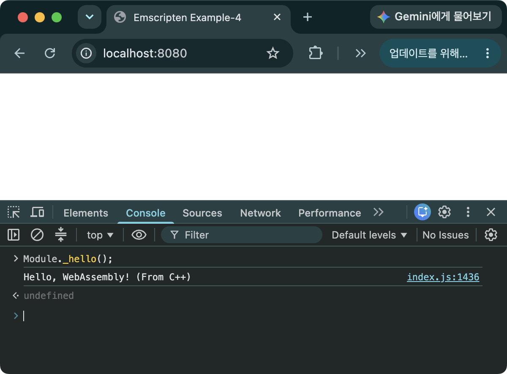
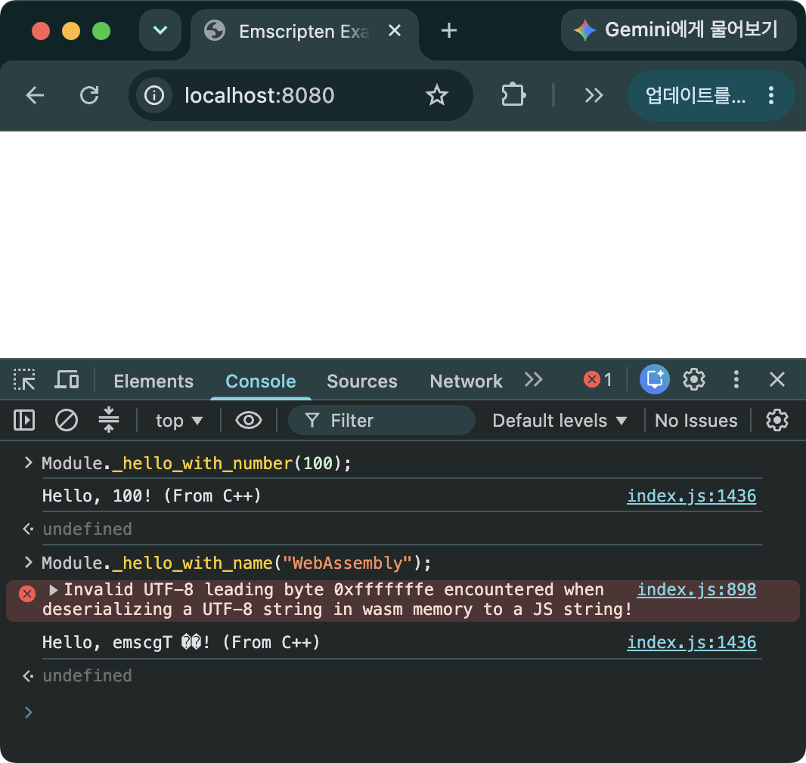
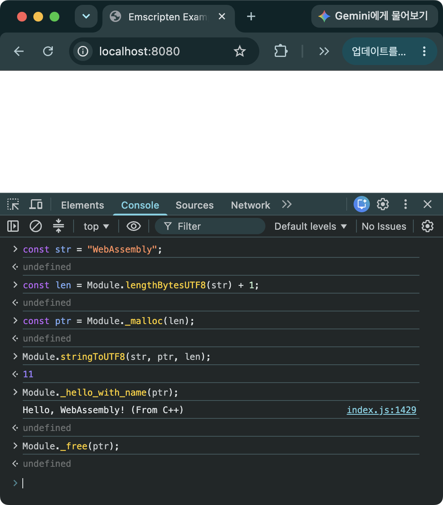
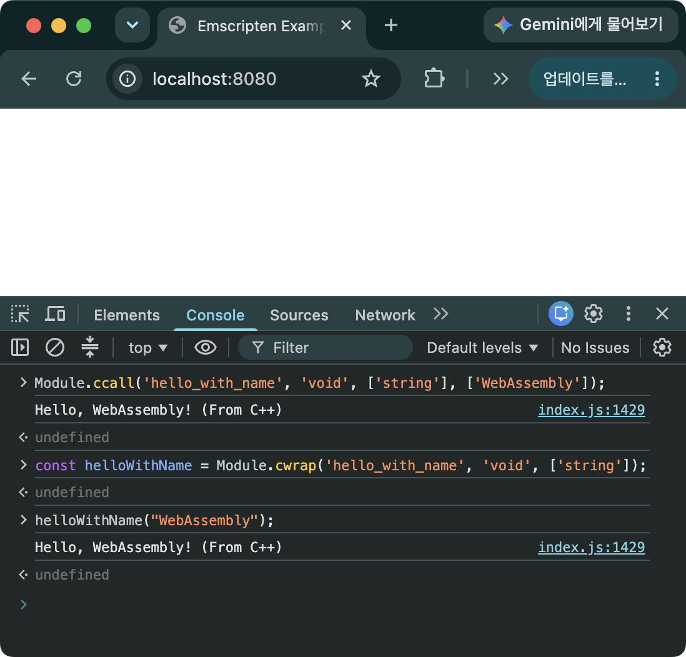

> [!SUMMARY]
> JavaScript에서 C++의 함수를 호출하는 방법에 대해 소개한다. 문자열 인자를 JS에서 C++로 전달할 때는 Wasm에 메모리 할당, 데이터 복사, 해제의 과정이 필요하지만 ccall, cwrap는 이 과정을 대신 처리해주기 때문에 손쉽게 문자열을 전달할 수 있다.

## C++ 함수 내보내기

> [!Important]
> 런타임에 JS에서 Wasm 함수를 호출하려면, 원하는 C++ 함수를 `EMSCRIPTEN_KEEPALIVE`나 `EXPORTED_FUNCTIONS`를 이용하여 Wasm 모듈에서 export 해야 한다.

`EMSCRIPTEN_KEEPALIVE`와 `EXPORTED_FUNCTIONS`를 이용해 함수를 내보내고 호출하는 기본 과정은 [Emscripten 설치 및 예제 - 예제 돌려보기 - 2](/posts/emscripten-install/#예제-돌려보기---2)에서 다룬 내용과 같다. 여기서는 이를 바탕으로 인자가 다른 여러 함수를 내보내고, 그중 문자열 인자를 넘기는 경우를 살펴본다.

### 소스 코드

```C++
// hello_c_api.cpp
#include <iostream>
#include <emscripten.h>

extern "C" {
  EMSCRIPTEN_KEEPALIVE
  void hello() {
    std::cout << "Hello, WebAssembly! (From C++)" << std::endl;
  }

  EMSCRIPTEN_KEEPALIVE
  void hello_with_number(int number) {
    std::cout << "Hello, " << number << "! (From C++)" << std::endl;
  }

  EMSCRIPTEN_KEEPALIVE
  void hello_with_name(const char* name) {
    std::cout << "Hello, " << name << "! (From C++)" << std::endl;
  }
}

// template.html
<!doctype html>
<html>
  <head>
    <title>Emscripten Example-4</title>
  </head>
  <body>
    {{{ SCRIPT }}}
  </body>
</html>
```

- `EMSCRIPTEN_KEEPALIVE`를 함수 앞에 붙이면 `Emscripten`이 해당 함수를 export 하고, JavaScript에서 호출할 수 있다.
- `Emscripten`은 빌드된 Wasm의 크기를 최소화 하기 위해 컴파일 타임에 dead code elimination을 수행하게 되는데, `EMSCRIPTEN_KEEPALIVE`가 붙어 있는 함수는 삭제하지 않는다.
- `hello`, `hello_with_number`, `hello_with_name`이라는 세 가지 함수를 내보내고 있다. 각 함수의 인자가 다르다는 점에 주목하자.

### 빌드하기

```bash
em++ hello_c_api.cpp -o index.html --shell-file template.html -s EXPORTED_FUNCTIONS="['_hello','_hello_with_number','_hello_with_name']"
```

- `--shell-file`
  - HTML 템플릿 파일 설정 ([HTML이 출력되게 빌드하기](/posts/emscripten-install/#html이-출력되게-빌드하기))
- `EXPORTED_FUNCTIONS`
  - 내보낼 함수의 이름을 추가
  - 원래의 함수명에 underscore(`_`)를 붙여서 내보내야 함
  - 내보낼 함수가 다수인 경우에는 배열 형태로 작성하여 내보낸다. `EXPORTED_FUNCTIONS="['_hello','_hello_with_number','_hello_with_name']"`

### 브라우저에서 실행하기

```bash
python -m http.server 8080
```


_그림 1. C++로 작성된 hello 함수를 브라우저에서 호출한 모습_

- WebAssembly 빌드 시에 모듈 이름과 관련된 별다른 설정을 하지 않은 경우에는 WebAssembly 모듈 인스턴스의 기본 이름은 `Module`이다.
- `EMSCRIPTEN_KEEPALIVE`를 통해 내보내진 함수를 호출하기 위해서는 함수명 앞에 underscore(`_`)를 붙여야 함

> [!CAUTION]
> Wasm 모듈 초기화가 끝나기 전에 내보낸 함수를 호출하면 오류가 발생할 수 있다. `Module.onRuntimeInitialized` 콜백을 이용하거나 초기화가 완료될 때까지 기다린 후에 호출해야 한다. 자세한 내용은 [Emscripten 설치 및 예제 - 예제 돌려보기 - 2](/posts/emscripten-install/#예제-돌려보기---2)의 관련 설명을 참고.

> [!NOTE]
> 보통 `EMSCRIPTEN_KEEPALIVE` 또는 `EXPORTED_FUNCTIONS` 둘 중에 하나만 이용해도 JS에서 호출할 수 있다. `EMSCRIPTEN_KEEPALIVE` 소스 코드 내부에서, `EXPORTED_FUNCTIONS는` 빌드 설정에서 export를 지정한다는 차이가 있다.

### 예제 코드 및 emsdk 버전

- https://github.com/dadak797/blog-examples/tree/master/examples/ex-4
- emsdk 5.0.3

## JavaScript에서 C++로 문자열 넘기기


_그림 2. C++로 작성된 hello_with_number 함수와 hello_with_name 함수를 브라우저에서 호출한 모습. hello_with_number 함수에 전달한 인자 100은 정상적으로 출력되지만, hello_with_name에서는 인자로 넘긴 문자열이 정상적으로 출력되지 않는다._

> [!NOTE]
> Wasm 함수는 숫자 타입(i32, i64, f32, f64)만 인자로 받을 수 있다. 따라서, 문자열을 C++ 함수에 전달하기 위해서는 포인터를 이용해야 한다.

### JavaScript에서 C++로 문자열을 넘기는 과정


_그림 3. C++로 작성된 hello_with_name 함수에 문자열 인자를 여러 단계를 거쳐서 전달하는 모습. 인자로 넘긴 문자열이 hello_with_name에서 정상적으로 출력되는 것을 볼 수 있다._

```JavaScript
const str = "WebAssembly";
const len = Module.lengthBytesUTF8(str) + 1;
const ptr = Module._malloc(len);
Module.stringToUTF8(str, ptr, len);
Module._hello_with_name(ptr);
Module._free(ptr);
```

1. Wasm Heap에 메모리 할당
   - JS 런타임 헬퍼 함수 `lengthBytesUTF8`를 사용하여 문자열의 길이를 얻어옴
   - Wasm 모듈의 `_malloc` 함수를 이용하여 할당. 이때 문자열 Null 문자(`\0`)를 채우기 위해 1 byte 만큼 더 할당해야 함
2. JS 문자열을 할당한 메모리에 복사
   - JS 런타임 헬퍼 함수 `stringToUTF8`을 사용하여 복사
3. 포인터를 함수에 넘김
4. 사용이 끝나면 할당한 메모리 해제
   - Wasm 모듈의 `_free` 함수를 이용하여 해제

### 빌드하기

```bash
em++ hello_c_api.cpp -o index.html --shell-file template.html -s EXPORTED_FUNCTIONS="['_hello','_hello_with_number','_hello_with_name','_malloc','_free']" -s EXPORTED_RUNTIME_METHODS="['lengthBytesUTF8','stringToUTF8']"
```

- `EXPORTED_FUNCTIONS=[...,'_malloc','_free']`
  - C++의 `malloc` 함수와 `free` 함수를 JavaScript에서 사용하기 위해 export
- `EXPORTED_RUNTIME_METHODS="['lengthBytesUTF8','stringToUTF8']"`
  - C++에서 내보내는 함수가 아닌 JS 런타임 헬퍼 함수를 내보낼 때 사용
  - Emscripten이 C/C++를 컴파일할 때 생성해주는 glue 코드의 일부이고, 순수 JS 함수가 아니기 때문에 `Module.stringToUTF8`의 형태로만 접근할 수 있다.
  - `lengthBytesUTF8(str)`: JS 문자열(`str`)을 UTF-8로 인코딩했을 때 몇 바이트가 되는지를 계산해주는 함수
  - `stringToUTF8(str, ptr, len)`: JS 문자열(`str`)을 UTF-8 문자열로 변환하여 Wasm Heap 메모리의 특정 포인터(ptr)를 시작점으로 하여 특정 크기(`len`)만큼 복사한 후 `len + 1`의 위치에는 Null 문자를 할당함
- 소스 코드와 emsdk 버전은 위와 동일

## JavaScript에서 C++로 문자열을 손쉽게 넘기기 - `ccall`과 `cwrap`

> [!NOTE]
> JavaScript에서 C++로 문자열을 넘길 때 마다 위의 네 가지 단계를 거치는 것은 매우 번거로운 일이다. Emscripten은 위의 과정을 자동으로 처리해 주는 JS 런타임 헬퍼 함수 `ccall`과 `cwrap`을 제공한다.


_그림 4. C++로 작성된 hello_with_name 함수를 ccall과 cwrap을 이용하여 브라우저에서 호출한 모습. ccall과 cwrap을 이용하여 JS에서 C++로 문자열을 간편하게 전달하고 있다._

```JavaScript
Module.ccall('hello_with_name', 'void', ['string'], ['WebAssembly']);
```

- `ccall`
  - C++로 내보낸 함수에 문자열 인자가 있는 경우 직접 호출하기 위해 사용
  - 첫 번째 인자: C++에서의 함수 이름
  - 두 번째 인자: 리턴 타입
  - 세 번째 인자: C++ 함수의 인자 배열. 숫자형인 경우에는 `number`로 작성한다.
  - 네 번째 인자: C++ 함수에 넘길 인자

```JavaScript
const helloWithName = Module.cwrap('hello_with_name', 'void', ['string']);
helloWithName("WebAssembly");
```

- `cwrap`
  - C++로 내보낸 함수를 JS 함수로 wrapping 하기 위해 사용
  - 첫 번째 인자: C++에서의 함수 이름
  - 두 번째 인자: 리턴 타입
  - 세 번째 인자: C++ 함수의 인자 배열
- `ccall`과 `cwrap`에서 C++ 함수를 호출할 때는 underscore(`_`) 붙이지 않는다.

> [!CAUTION]
> `ccall`과 `cwrap`의 문자열은 보통 스택에 임시로 할당하고 호출이 끝나면 자동으로 해제한다. 그래서 인자로 전달받은 포인터를 Wasm이 내부적으로 저장하고 있다가 나중에 다시 참조하는 구조라면 문제가 발생하게 됨. 이런 경우에는 `malloc`과 `free`를 이용하여 직접 메모리 할당과 해제를 관리해야 함

### 빌드하기

```bash
em++ hello_c_api.cpp -o index.html --shell-file template.html -s EXPORTED_FUNCTIONS="['_hello','_hello_with_number','_hello_with_name','_malloc','_free']" -s EXPORTED_RUNTIME_METHODS="['lengthBytesUTF8','stringToUTF8','ccall','cwrap']"
```

- `EXPORTED_RUNTIME_METHODS=[...,'ccall','cwrap']`
  - `ccall`과 `cwrap`을 포함하여 빌드한다.
- 소스 코드와 emsdk 버전은 위와 동일

## FAQ

- JavaScript에서 C++의 클래스를 사용하는 방법은 없나요?
  - Embind([JavaScript에서 C++ 클래스 사용하기]())와 WebIDL Binder를 활용하면 C++의 클래스를 내보내고, JavaScript에서 내보낸 클래스 인스턴스를 생성할 수도 있습니다.
- ccall과 cwrap 중 어느 걸 써야 하나요?
  - 반복 호출이 많은 함수는 `cwrap`으로 한 번 감싸 쓰는 게 유리하고, 한 번만 호출한다면 `ccall`이 간편함
- "ccall is not defined" 같은 에러가 나요.
  - `EXPORTED_RUNTIME_METHODS`에 추가하는 걸 빠뜨렸는지 확인해 볼 것
- C++ 함수가 반환하는 문자열은 어떻게 리턴 받나요?
  - `ccall`의 리턴 타입에 `string`을 쓰면 내부적으로 `UTF8ToString`을 호출해 C++ 문자열을 JavaScript 문자열로 자동 변환해 줌
  - 아래의 예제는 문자열이 읽기 전용 데이터 영역에 저장되어 프로그램의 종료 시점까지 유효하지만 지역 변수로 스택에 생성한 문자열은 함수를 벗어나는 순간 삭제되기 때문에 포인터(const char\*)만 반환하는 형태로는 크래시가 발생할 수 있다는 점에 유의해야 함. 이는 native C++에서도 동일하게 발생하는 문제임

```C++
// C++
extern "C" {
  EMSCRIPTEN_KEEPALIVE
  const char* get_hello() {
    return "Hello from C++!";
  }
}

// JavaScript
const helloStr = Module.ccall('get_hello', 'string', [], []);
console.log(helloStr);  // "Hello from C++!"를 출력함
```

- 구조체나 클래스를 반환하는 함수는 `ccall`로 호출할 수 있나요?
  - `ccall`/`cwrap`의 리턴 타입은 `number`, `string`, `boolean`, `array` 정도만 지원하기 때문에 여러 필드로 이루어진 구조체나 클래스를 그대로 표현할 수 없습니다. 게다가 구조체를 값으로 반환하는 함수는 C/Wasm 레벨에서 아예 다른 형태(숨겨진 포인터 인자로 결과를 받는 방식)로 컴파일되기 때문에, 인자 없이 호출하면 크래시가 날 수도 있습니다.
  - 이런 마샬링을 자동으로 처리해주는 것이 Embind 입니다. [JavaScript에서 C++ 클래스 사용하기]()를 참고

## 참고 자료

- [Connecting C++ and JavaScript](https://emscripten.org/docs/porting/connecting_cpp_and_javascript/index.html)
