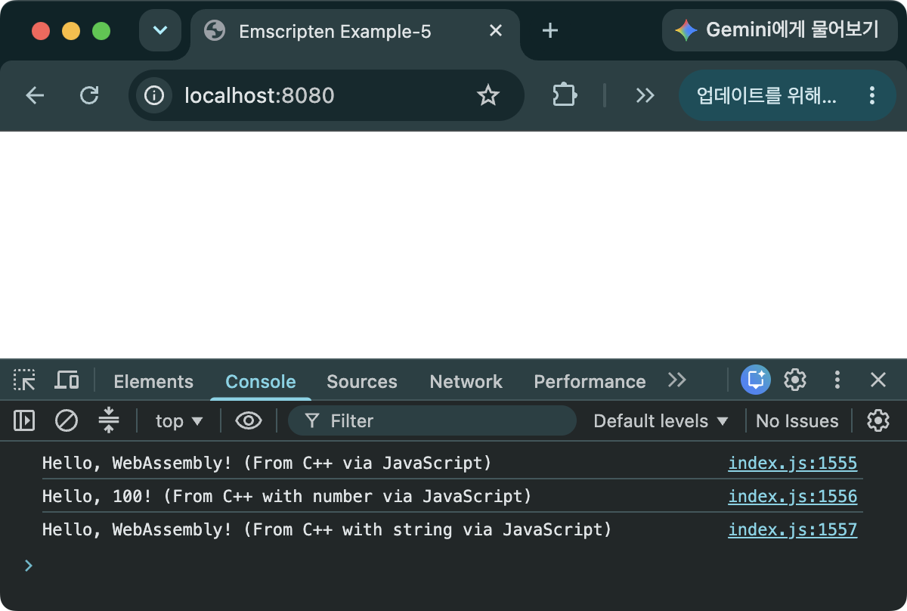
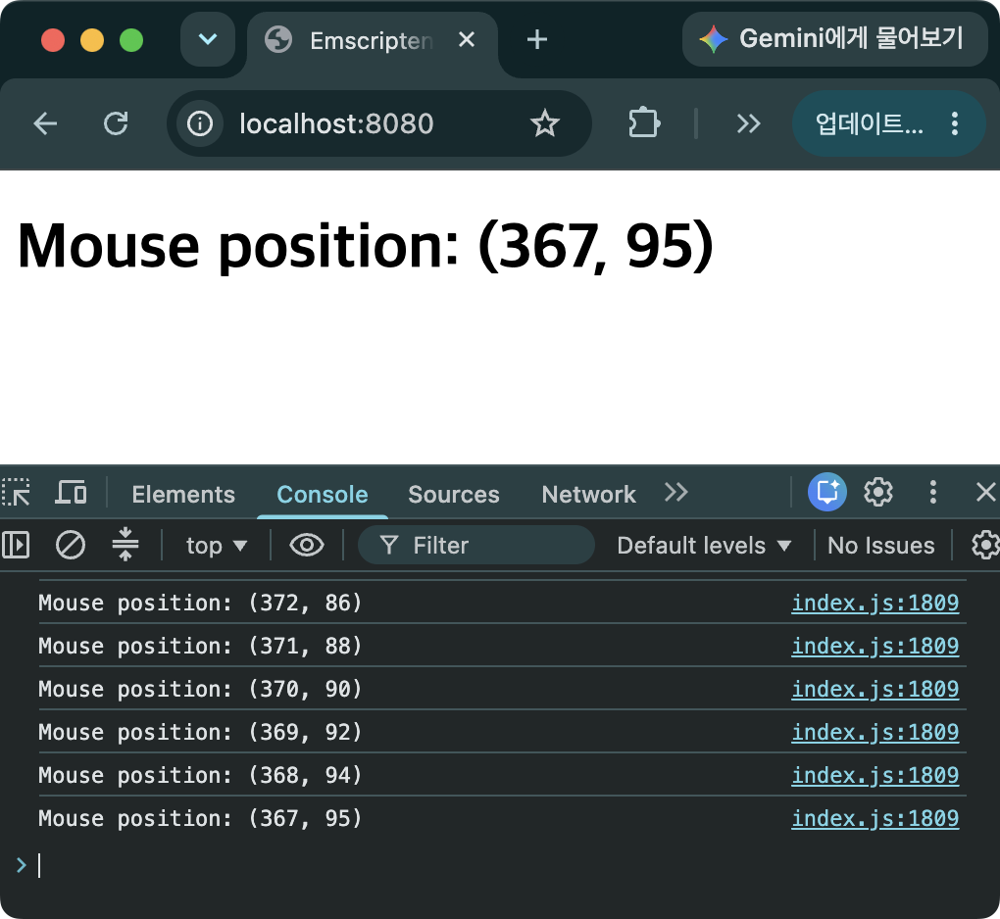

> [!SUMMARY]
> C++에서 DOM에 접근하고 JavaScript의 함수를 호출하는 방법에 대해 소개한다. 첫 번째 예제에서는 C++에서 EM_ASM을 이용하여 JavaScript 함수를 호출하고 C++ 인자를 JavaScript로 전달하는 방법을 보여준다. 두 번째 예제는 C++에서 EM_JS와 EM_ASM을 이용하여 웹 브라우저에서 마우스의 위치를 출력하는 예제를 보여 준다.

## C++에서 JavaScript 함수로 콘솔 출력 하기

### 소스 코드

```C++
// main.cpp
#include <iostream>
#include <emscripten.h>

int main() {
  EM_ASM({
    console.log("Hello, WebAssembly! (From C++ via JavaScript)");
  });

  int c_number = 100;
  EM_ASM({
    const js_number = $0;
    console.log("Hello, " + js_number + "! (From C++ with number via JavaScript)");
  }, c_number);

  const char* c_name = "WebAssembly";
  EM_ASM({
    const js_name_ptr = $0;
    const js_name = UTF8ToString(js_name_ptr);
    console.log("Hello, " + js_name + "! (From C++ with string via JavaScript)");
  }, c_name);

  return 0;
}

// template.html
<!doctype html>
<html>
  <head>
    <title>Emscripten Example-5</title>
  </head>
  <body>
    {{{ SCRIPT }}}
  </body>
</html>
```

- `EM_ASM`
  - C++ 코드내에서 JavaScript 코드를 사용할 수 있게 해주는 매크로 함수
  - `emscripten.h`를 포함해야 사용할 수 있음
  - 인자가 없는 경우, 숫자형 인자, 문자열 인자의 세 가지 형태로 호출함
  - `EM_ASM()` 내에서 `{}` 블록 안에 JavaScript 코드를 작성할 수 있음
  - `{}` 블록 뒤에 C++의 인자를 순차적으로 넘길 수 있고, `{}` 블록 안에서는 `$0, $1, ...` 형태로 인자를 넘겨 받을 수 있다. 인자의 index는 0부터 시작함
  - C++에서 JavaScript로 넘길 수 있는 것이 사실상 숫자 타입(i32, i64, f32, f64) 밖에 없기 때문에(JavaScript에서 C++의 경우에도 마찬가지 [Javascript에서 C++로 문자열 넘기기](/posts/call-cpp-from-js/#javascript에서-c로-문자열-넘기기)) 포인터를 넘긴 후 `UTF8ToString` 함수를 이용하여 JavaScript 문자열로 변환하는 과정이 필요함
- `UTF8ToString(_ptr_[, _maxBytesToRead_][, _ignoreNul_])`
  - C++의 UTF8 문자열의 포인터를 인자로 받아 JavaScript의 문자열로 변환해주는 함수
  - 첫 번째 인자: 문자열의 포인터
  - 두 번째 인자: 문자열의 최대 바이트 수. 이 인자를 안 넘기는 경우에는 null 문자를 인식하여 문자열로 변환
  - 세 번째 인자: true로 설정되면 null 문자를 인식하여 문자열 길이를 계산하지 않고 두 번째 인자의 값을 이용하여 문자열 길이를 계산함

### 빌드하기

```bash
em++ main.cpp -o index.html --shell-file template.html -s EXPORTED_RUNTIME_METHODS="UTF8ToString"
```

- `UTF8ToString`를 사용하기 위해 `EXPORTED_RUNTIME_METHODS` 목록에 추가

### 실행 결과


_그림 1. C++에서 JavaScript의 console.log 함수를 이용하여 문자열을 순차적으로 출력한 것을 확인할 수 있다._

### 예제 코드 및 emsdk 버전

- https://github.com/dadak797/blog-examples/tree/master/examples/ex-5
- emsdk 5.0.3

## C++에서 JavaScript 함수로 마우스의 위치를 얻어 오기

### 소스 코드

```C++
#include <emscripten.h>
#include <iostream>

// JavaScript 전역 변수를 이용하여 마우스의 X-좌표를 받아옴
EM_JS(int, jsGetMouseX, (), {
  return window.mouseX;
});

// JavaScript 전역 변수를 이용하여 마우스의 Y-좌표를 받아옴
EM_JS(int, jsGetMouseY, (), {
  return window.mouseY;
});

int g_MouseX = 0;
int g_MouseY = 0;

void MainLoop() {
  const int mouseX = jsGetMouseX();
  const int mouseY = jsGetMouseY();

  // 새로운 위치 값으로 전역 변수를 갱신
  const bool changed = mouseX != g_MouseX || mouseY != g_MouseY;
  if (!changed) {
    return;
  }
  g_MouseX = mouseX;
  g_MouseY = mouseY;

  // 콘솔창에 새 위치를 출력
  std::cout << "Mouse position: (" << g_MouseX << ", " << g_MouseY << ")" << std::endl;

  // HTML의 DOM을 조작하여 새로운 위치를 렌더링
  EM_ASM({
    const mousePosElem = document.getElementById('mouse-pos');
    mousePosElem.innerText = 'Mouse position: (' + $0 + ', ' + $1 + ')';
  }, g_MouseX, g_MouseY);
}

int main() {
  EM_ASM({
    window.mouseX = 0;
    window.mouseY = 0;

    // mousemove 이벤트 함수를 등록
    window.addEventListener('mousemove', function(event) {
      // JavaScript 전역 변수 mouseX, mouseY에 마우스의 위치를 저장
      window.mouseX = event.clientX;
      window.mouseY = event.clientY;
    });
  });

  emscripten_set_main_loop(MainLoop, 0, true);

  return 0;
}

// template.html
<!doctype html>
<html>
  <head>
    <title>Emscripten Example-6</title>
  </head>
  <body>
    <h1 id="mouse-pos">Mouse position: (0, 0)</h1>
    {{{ SCRIPT }}}
  </body>
</html>
```

- `EM_JS`
  - JavaScript로 작성된 함수를 C++에서 호출할 수 있도록 wrapping 해주는 매크로 함수
  - 첫 번째 인자: 함수의 리턴 타입
  - 두 번째 인자: C++에서 사용할 함수 이름
  - 세 번째 인자: 함수의 인자 목록
  - `{}`에 JavaScript 코드로 함수를 작성
  - `jsGetMouseX`/`jsGetMouseY` 함수를 생성. JavaScript 전역 변수 `window.mouseX`/`mouseY`를 이용하여 C++로 마우스 위치를 넘겨주는 함수
- `MainLoop` 함수
  - Main 루프에서 호출된 함수
  - 매 프레임 마다 `jsGetMouseX`/`jsGetMouseY` 함수를 이용하여 마우스의 위치를 받아오고, 위치가 갱신된 경우에만 콘솔과 HTML에 변경된 위치를 출력
- `main` 함수
  - `EM_ASM` 매크로 함수를 이용하여 `mousemove`에 대한 이벤트 함수를 등록. JavaScript 전역 변수 `mouseX`, `mouseY`를 선언
- `emscripten_set_main_loop`
  - Native C++에서는 무한 루프를 while 문을 통해 생성하지만, WebAssembly에서 while 문을 사용하게 되면 main thread를 브라우저에 반환하지 않아 브라우저가 응답 없는 페이지가 됨
  - 이를 해결하기 위해 main thread는 브라우저가 제어할 수 있도록 하고, 브라우저의 제어 하에서 인자로 넘겨준 함수를 주기적으로 호출하게 해주는 함수
  - 첫 번째 인자: 브라우저가 주기적으로 호출하게 할 함수. 리턴 타입 void이고 인자가 없는 함수이어야 함
  - 두 번째 인자: fps 값을 설정. 0이나 음수값으로 설정하면 브라우저의 `requestAnimationFrame` 메커니즘을 사용하여 메인 루프 함수를 호출
  - 세 번째 인자: 함수는 호출한 함수의 실행을 중단시키기 위해 예외를 발생시킴. 그 결과 `emscripten_set_main_loop()` 호출 이후의 코드가 실행되지 않고, 메인 루프가 시작됨
  - [Emscripten API Reference](https://emscripten.org/docs/api_reference/emscripten.h.html#id3)

### 빌드 하기

```bash
em++ main.cpp -o index.html --shell-file template.html
```

### 실행 결과


_그림 2. 마우스의 위치가 HTML과 콘솔창에 출력되는 것을 확인할 수 있다._

### 예제 코드 및 emsdk 버전

- https://github.com/dadak797/blog-examples/tree/master/examples/ex-6
- emsdk 5.0.3

## FAQ

- `EM_ASM`과 `EM_JS` 중 어느 걸 써야 하나요?
  - `ccall`과 `cwrap`의 관계처럼 반복 호출이 많은 함수는 `EM_JS`으로 한 번 감싸 쓰는 게 유리하고, 한 번만 호출한다면 `EM_ASM`이 간편함 ([JavaScript에서 C++ 함수 호출 하기](/posts/call-cpp-from-js/#faq))
- 예제를 보면 그냥 JavaScript에서 처리하면 될 것 같은데, 굳이 C++에서 JavaScript를 호출해서 처리할 필요가 있나요?
  - 위의 예제에서는 큰 필요성을 못 느낄 수 있습니다. 하지만, 아래와 같은 경우 등에 C++ 코드 내에서 JavaScript 코드를 반드시 사용해야 하는 경우가 발생할 수 있습니다.
  - C++ 코드에서 파일 브라우저를 열고 파일을 읽어와야 하는 경우 ([WebAssembly에서 File 다루기]())
  - C++ 코드에서 JavaScript Fetch API를 사용해야 하는 경우 ([WebAssembly에서 Fetch 하기]())
  - C++을 이용한 그래픽 프로그래밍(WebGL, WebGPU)에서 브라우저의 크기에 따라 프레임 버퍼(Frame buffer)의 크기를 갱신해야 하는 경우
- `EM_ASM`이나 `EM_JS` 내에서 비동기 함수를 호출하면 어떻게 되나요?
  - `EM_ASM`이나 `EM_JS` 모두 기본적으로 동기 호출이라 Promise를 그대로 리턴 받을 수 없습니다. 비동기 호출을 위해서는 `EM_ASYNC_JS`를 사용해야 하고, 이 매크로 함수 내부에서는 `await`를 사용하여 값을 리턴받을 수 있습니다. `EM_ASYNC_JS`를 사용하기 위해서는 빌드 옵션으로 `-s ASYNCIFY`를 추가해야 합니다. ([Asyncify](https://emscripten.org/docs/porting/asyncify.html#making-async-web-apis-behave-as-if-they-were-synchronous))
- `EM_ASM`/`EM_JS`로 작성한 JavaScript 코드는 어떻게 디버깅하나요?
  - `EM_ASM`/`EM_JS` 안의 코드는 문자열 형태로 그대로 빌드 결과물(예: `index.js`)에 포함될 뿐이라 `em++`이 JavaScript 문법을 검사해주지 않습니다. 오타나 문법 오류가 있어도 컴파일은 성공하고, 브라우저에서 실행하는 순간에야 개발자 도구(DevTools)의 Console 탭에 `Uncaught SyntaxError`와 같은 형태로 드러납니다.
  - 이때 에러 위치는 `main.cpp`가 아니라 컴파일된 글루 코드 파일(`index.js`)의 특정 줄로 표시되기 때문에, `EM_ASM`/`EM_JS` 블록이 여러 개라면 어느 블록에서 문제가 생겼는지 바로 알기 어렵습니다.
  - 브레이크포인트가 필요하다면 개발자 도구의 Sources 탭에서 이 글루 코드 파일을 열어 실제 JavaScript 코드 위치에 걸면 됩니다. 다만 최적화 빌드에서는 코드가 압축(minify)되어 찾기 어려우므로, 디버깅 중에는 `-g` 옵션으로 빌드하거나 `console.log`를 임시로 넣어 위치를 확인하는 방법을 추천합니다.

## 참고 자료

- [Inline assembly/JavaScript](https://emscripten.org/docs/api_reference/emscripten.h.html#inline-assembly-javascript)
