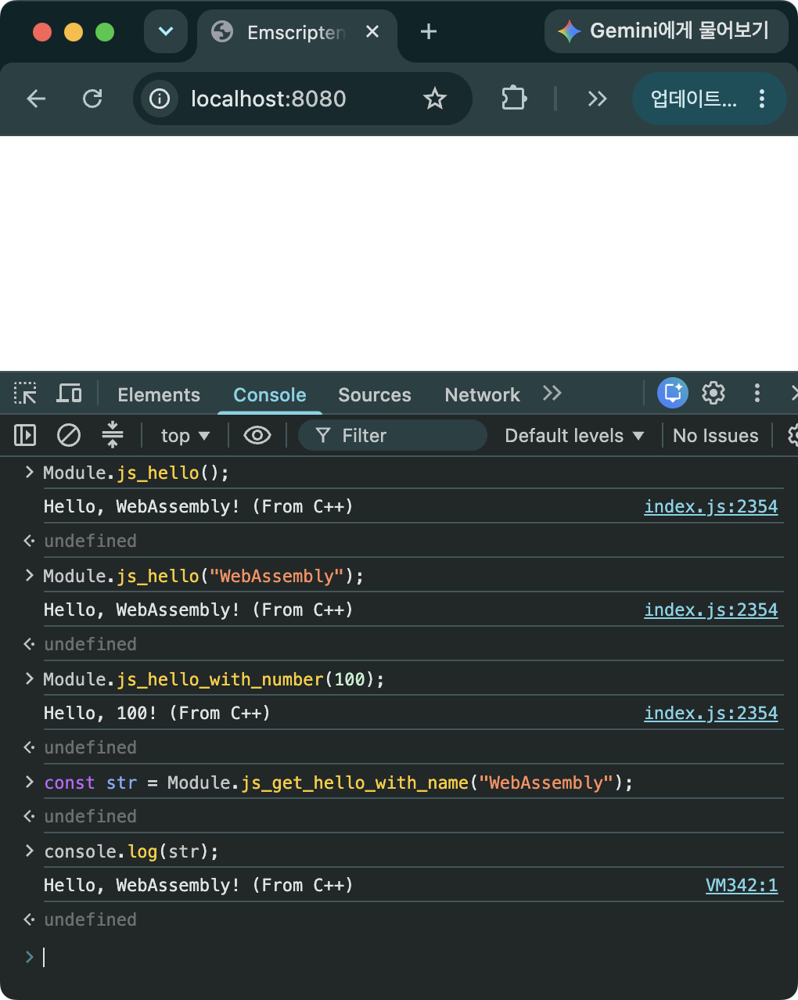
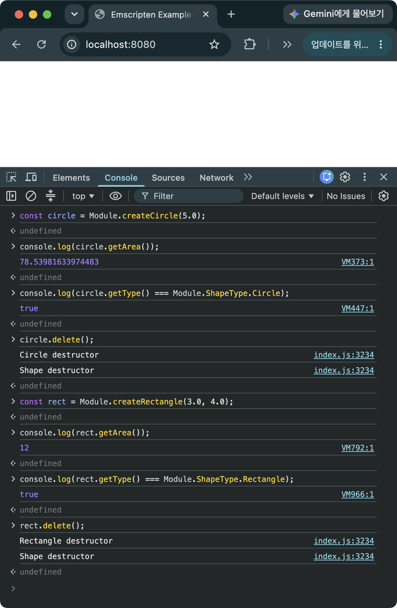

> [!SUMMARY]
> C++의 클래스를 JavaScript에서 사용하도록 하기 위한 Embind에 대해 소개한다. Embind를 이용하여 C++의 클래스 뿐만 아니라 함수, 변수, enum class를 바인딩하여 JavaScript에서 사용하는 예제도 함께 소개한다.

## 일반 함수 바인딩 하기

### 소스 코드

```C++
// hello_embind.cpp
#include <emscripten.h>
#include <emscripten/bind.h>
#include <string>
#include <iostream>

void hello() {
  std::cout << "Hello, WebAssembly! (From C++)" << std::endl;
}

void hello(const std::string& name) {
  std::cout << "Hello, " << name << "! (From C++)" << std::endl;
}

void hello_with_number(int number) {
  std::cout << "Hello, " << number << "! (From C++)" << std::endl;
}

std::string get_hello_with_name(const std::string& name) {
  std::string message = "Hello, " + name + "! (From C++)";
  return message;
}

EMSCRIPTEN_BINDINGS(my_module) {
  emscripten::function("js_hello", emscripten::select_overload<void()>(&hello));
  emscripten::function("js_hello", emscripten::select_overload<void(const std::string&)>(&hello));
  emscripten::function("js_hello_with_number", &hello_with_number);
  emscripten::function("js_get_hello_with_name", &get_hello_with_name);
}

// template.html
<!doctype html>
<html>
  <head>
    <title>Emscripten Example-7</title>
  </head>
  <body>
    {{{ SCRIPT }}}
  </body>
</html>
```

- `bind.h`를 추가해야 함
- `EMSCRIPTEN_BINDINGS` 뒤에 오는 `my_module`은 바인딩 블록의 식별자일뿐 JavaScript 쪽에서 함수를 바인딩 된 함수를 불러올 때 사용하는 이름하고는 상관이 없음. 단, 이름은 변수 이름처럼 문자, 숫자, underscore(`_`)만 사용할 수 있고, 숫자로 시작해서는 안됨. 또한, 바인딩 블록을 여러 파일에서 지정하는 경우에는 이 블록의 이름이 중복되어선 안됨
- `emscripten::function`
  - 첫 번째 인자: JavaScript에서 사용할 함수명. C++ 함수명의 이름과 같을 필요는 없음
  - 두 번째 인자: JavaScript와 바인딩할 C++ 함수의 이름. `&`를 붙여 함수 포인터를 인자로 넘김
  - `js_hello`라는 이름으로 두 가지의 함수를 내보냈는데, JavaScript 쪽에서는 함수의 인자 개수가 다른 경우에만 같은 이름으로 함수를 오버로딩 할 수 있음
- `emscripten::select_overload`
  - C++에서 오버로드 된 함수를 정확히 지정하기 위해 함수의 리턴 타입, 인자, 함수명을 명시적으로 알려주기 위해 사용

### 빌드하기

```bash
em++ hello_embind.cpp -o index.html --shell-file template.html -lembind
```

- `-lembind`를 붙여 embind 런타임을 링크에 포함시켜야 함. `--bind`를 붙여도 동작은 하지만 오래된 방식임

### 실행 결과


_그림 1. Embind를 이용하여 내보낸 함수를 실행한 모습. 문자열도 별도의 메모리 할당없이 잘 전달되는 것을 확인할 수 있다._

- `EMSCRIPTEN_KEEPALIVE`와 Embind의 차이점 ([C++ 함수 내보내기](/posts/call-cpp-from-js/#c-함수-내보내기))
  - 내보낸 함수를 직접 호출하는 경우에는 underscore(`_`)를 붙여서 호출해야 함 ([브라우저에서 실행하기](/posts/call-cpp-from-js/#브라우저에서-실행하기)). `ccall`/`cwrap`을 이용하여 호출하는 경우와 Embind를 이용하여 내보낸 경우는 underscore(`_`)를 붙이지 않아도 됨
  - Embind로 내보낼 때는 함수를 `extern "C"`로 감싸지 않아도 됨
  - Embind는 등록된 타입만 함수의 인자로 사용할 수 있는데 char 타입은 등록되어 있지 않기 때문에, `const char*`를 인자로 사용할 수 없음
  - Embind는 문자열을 인자로 넘기고 리턴값으로 받기 위해 `const char*` 대신 `std::string` 클래스를 활용하면 됨. `EMSCRIPTEN_KEEPALIVE`로 내보낸 함수를 직접 호출할 때의 번거로운 과정([JavaScript에서 C++로 문자열 넘기기](/posts/call-cpp-from-js/#javascript에서-c로-문자열을-넘기는-과정))이 필요하지 않음
  - `std::string`을 리턴 타입으로 받는 경우에도 자동으로 JavaScript 문자열로 변경해 줌

> [!NOTE]
> C++ 함수를 JavaScript로 내보내기 위한 가장 편리한 방법 **Embind**
>
> 1. 문자열 인자를 넘길 때나 문자열을 리턴 받을 때 `std::string`을 사용하면 편리함
> 2. 함수명에 underscore(`_`)를 붙이지 않고 직접 사용 가능함
> 3. 함수를 `extern "C"`를 감싸지 않아도 됨
> 4. C++의 클래스를 내보내서 사용할 수 있음
> 5. 단점으로는 Wasm의 용량 증가, 런타임 오버헤드, 컴파일 시간 증가 등 전체적인 오버헤드가 증가한다는 점이 있음 ([Emscripten 소개 - 단점](/posts/emscripten-intro/#단점))

### 예제 코드 및 emsdk 버전

- https://github.com/dadak797/blog-examples/tree/master/examples/ex-7
- emsdk 5.0.3

## 클래스 바인딩 하기

### 소스 코드

```C++
// class_embind.cpp
#include <emscripten/bind.h>
#include <iostream>

constexpr double PI = 3.14159265358979323846;

enum class ShapeType {
  Circle,
  Rectangle,
};

class Shape {
 public:
  Shape(ShapeType type) : m_Type(type) {}

  virtual ~Shape() {
    std::cout << "Shape destructor" << std::endl;
  }

  virtual double GetArea() const = 0;
  ShapeType GetType() const { return m_Type; }

 private:
  ShapeType m_Type;
};

class Circle : public Shape {
 public:
  static Shape* Create(double radius) {
    return new Circle(radius);
  }

  virtual ~Circle() {
    std::cout << "Circle destructor" << std::endl;
  }

  double GetArea() const override { return PI * m_Radius * m_Radius; }

 private:
  double m_Radius;

  Circle(double radius)
    : Shape(ShapeType::Circle), m_Radius(radius) {}
};

class Rectangle : public Shape {
 public:
  static Shape* Create(double width, double height) {
    return new Rectangle(width, height);
  }

  virtual ~Rectangle() {
    std::cout << "Rectangle destructor" << std::endl;
  }

  double GetArea() const override { return m_Width * m_Height; }

 private:
  double m_Width;
  double m_Height;

  Rectangle(double width, double height)
    : Shape(ShapeType::Rectangle), m_Width(width), m_Height(height) {}
};

EMSCRIPTEN_BINDINGS(shape_module) {
  emscripten::enum_<ShapeType>("ShapeType")
    .value("Circle", ShapeType::Circle)
    .value("Rectangle", ShapeType::Rectangle);
  emscripten::class_<Shape>("Shape")
    .function("getArea", &Shape::GetArea)
    .function("getType", &Shape::GetType);
  emscripten::function("createCircle", &Circle::Create, emscripten::allow_raw_pointers());
  emscripten::function("createRectangle", &Rectangle::Create, emscripten::allow_raw_pointers());
}

// template.html
<!doctype html>
<html>
  <head>
    <title>Emscripten Example-8</title>
  </head>
  <body>
    {{{ SCRIPT }}}
  </body>
</html>
```

- 추상 클래스 Shape과 유도 클래스 Circle과 Rectangle을 정의
- `emscripten::enum_<>()`을 통해서 C++의 enum class를 내보냄
  - Embind는 C++의 enum class를 JavaScript의 객체와 매핑 시켜줌
  - `<>`: 내보내고 싶은 C++ enum 클래스의 이름
  - `()`: JavaScript에서 사용할 객체의 이름
  - `.value()`: enum class에서 내보내고 싶은 값을 추가
  - `Module.ShapeType.Circle`과 같은 형태로 사용할 수 있음
- `emscripten::class_<>()`을 통해서 C++의 class를 내보냄
  - `<>`: 내보내고 싶은 C++ 클래스의 이름
  - `()`: JavaScript에서 사용할 클래스의 이름
  - `.function()`: 내보내고 싶은 클래스 멤버 함수를 추가
- `emscripten::function`
  - Static 멤버 함수의 경우에는 특정 클래스 인스턴스와 독립적이기 때문에, 별도의 함수로 내보낼 수 있음
  - `emscripten::allow_raw_pointers()`: `createCircle`, `createRectangle` 함수를 통해 `Circle`, `Rectangle` 클래스의 인스턴스를 생성한 후 포인터(`Shape*`)를 리턴하기 위해 붙여줘야 함. `Shape` 클래스가 Embind를 통해 등록되어 있어야 오류가 발생하지 않음
- `Circle`, `Rectangle`은 별도로 `emscripten::class_`에 등록하지 않았지만, `Shape`의 가상 함수(`GetArea`)를 통한 다형성만으로 각 파생 클래스의 동작을 그대로 사용할 수 있음. 즉, 파생 클래스마다 개별적으로 바인딩을 작성하지 않고 베이스 클래스 하나만 최소한으로 노출해도 필요한 기능을 구현할 수 있음

### 실행 결과


_그림 2. Embind로 내보낸 클래스를 생성 및 삭제하고 멤버 함수를 호출한 모습_

- `Shape` 클래스의 가상 함수 `getArea` 함수를 호출하여 유도 클래스의 GetArea 함수가 잘 호출되는 것을 확인할 수 있음
- `enum class ShapeType`이 `Module.ShapeType` 객체로 잘 내보내진 것을 확인할 수 있음
- `delete` 함수를 통해 각 클래스의 소멸자가 잘 호출되는 것을 확인할 수 있음

> [!CAUTION]
> 인스턴스의 사용이 완료되면 반드시 `delete` 함수를 호출해서 클래스의 소멸자가 호출되게 해야 함. 그렇지 않으면 메모리 누수가 발생할 수 있음

### 실행 스크립트

```JavaScript
const circle = Module.createCircle(5.0);
console.log(circle.getArea());
console.log(circle.getType() === Module.ShapeType.Circle);
circle.delete();
const rect = Module.createRectangle(3.0, 4.0);
console.log(rect.getArea());
console.log(rect.getType() === Module.ShapeType.Rectangle);
rect.delete();
```

### 예제 코드 및 emsdk 버전

- https://github.com/dadak797/blog-examples/tree/master/examples/ex-8
- emsdk 5.0.3

## FAQ

- Embind에서 `const char*`를 함수의 인자로 사용하면 어떻게 되나요?
  - 예를 들어 아래와 같이 `const char*`를 인자로 받는 함수를 바인딩한다고 하면

    ```C++
    void test(const char* str) {}

    EMSCRIPTEN_BINDINGS(my_module) {
      emscripten::function("js_test", &test);
    }
    ```

  - 아무 정책 없이 사용하면 컴파일 단계에서 바로 막힘

    ```
    error: static assertion failed due to requirement '!std::is_pointer<const char *>::value':
    Implicitly binding raw pointers is illegal.  Specify allow_raw_pointer<arg<?>>
    ```

  - `emscripten::allow_raw_pointers()`를 추가하면 컴파일은 통과하지만, 실제로 JavaScript에서 그 함수를 호출하는 순간 런타임 에러가 발생함

    ```
    Uncaught UnboundTypeError: Cannot call js_test due to unbound types: PKc
    ```

    - `PKc`는 `const char*`의 (Itanium C++ ABI) 맹글링된 타입명. `allow_raw_pointers()`는 "raw pointer를 인자로 받는 것을 허용"할 뿐이지, `PKc` 타입 자체를 Embind에 등록(bind)해주지는 않기 때문에 JavaScript 쪽에서는 이 타입을 다룰 방법이 없어서 발생하는 오류

  - 즉, `allow_raw_pointers()`로 컴파일은 우회할 수 있어도 결국 사용할 수 없다는 결론은 같음. `const char*` 대신 `std::string`을 사용하는 것이 유일한 실질적인 해법

- `Circle`, `Rectangle`도 `emscripten::class_`로 등록해야 하나요?
  - 위 예제처럼 `createCircle`/`createRectangle`이 `Shape*`를 리턴하는 형태로만 쓴다면 등록하지 않아도 동작함. JavaScript 쪽에서는 두 인스턴스 모두 그냥 `Shape` 타입으로만 보이고, `getArea`/`getType`처럼 `Shape`에 등록된 함수만 호출할 수 있음
  - 만약 `Circle`에만 있는 함수(예: `getRadius`)를 JavaScript에서 호출하고 싶거나, `circle instanceof Module.Circle`처럼 실제 타입을 구분하고 싶다면 `emscripten::base<Shape>`를 지정해서 상속 관계를 등록해야 함

    ```C++
    emscripten::class_<Circle, emscripten::base<Shape>>("Circle")
      .function("getRadius", &Circle::GetRadius);
    ```

  - 이렇게 등록해두면 `createCircle`이 리턴한 `Shape*`를 Embind가 실제로는 `Circle` 인스턴스라는 것을 인식해서, JavaScript에서 `getRadius`도 호출할 수 있고 `circle instanceof Module.Circle`도 `true`가 됨
  - `getRadius`는 virtual 함수가 아닌데도 `Shape*`로부터 호출이 가능한데, 이는 C++에서 베이스 포인터로 non-virtual 자식 함수를 호출할 수 없는 것과는 다른, Embind 고유의 동작임

- 팩토리 함수 없이 `new Module.Circle(5.0)`처럼 바로 생성할 수 있나요?
  - 지금 예제의 `Circle`, `Rectangle`은 생성자가 `private`이라 `.constructor<>()`로 직접 등록할 수 없음. 이 때문에 `static Create()` 팩토리 함수를 `emscripten::function`으로 따로 내보낸 것
  - 생성자를 `public`으로 바꾸면 `.constructor<double>()`을 붙여서 JavaScript에서 직접 생성할 수 있음

    ```C++
    emscripten::class_<Circle, emscripten::base<Shape>>("Circle")
      .constructor<double>()
      .function("getRadius", &Circle::GetRadius);
    ```

    ```JavaScript
    const circle = new Module.Circle(5.0);  // createCircle 없이 바로 생성
    ```

  - 단, `Shape`처럼 추상 클래스는 인스턴스를 만들 수 없으므로 `.constructor<>()`를 등록할 수 없고, 파생 클래스에만 등록 가능함

- `delete()`를 호출했는데도 메모리가 해제되지 않거나, 반대로 이미 지운 객체를 써서 에러가 나는 경우는요?
  - 함수가 클래스 인스턴스를 값(by-value)으로 리턴하거나 인자로 받으면, 그 과정에서 임시 복사본이 추가로 생성됨. 필요한 인스턴스만 `delete()`하고 이 임시 복사본은 놓치기 쉬움
  - 예외가 발생해서 함수가 중간에 빠져나가는 경로에는 `delete()` 호출이 누락되기 쉬움. C++에서 RAII로 자연스럽게 해결되는 문제가 Embind로 넘어온 JS 객체에는 적용되지 않으므로, `try`/`finally`로 명시적으로 `delete()`를 보장해야 함
  - 반대로, 같은 인스턴스를 여러 변수에 담아두고 그중 하나만 `delete()`하면 나머지 변수로 메서드를 호출할 때 "using deleted object" 계열의 에러가 발생함. 이는 실제로 이미 해제된 객체를 안전하게 걸러주는 Embind의 보호 장치이므로, 에러가 난다면 어딘가에서 이미 `delete()`가 호출된 참조를 들고 있다는 신호로 보면 됨

## 참고 자료

- [Emscripten - Embind](https://emscripten.org/docs/porting/connecting_cpp_and_javascript/embind.html)
