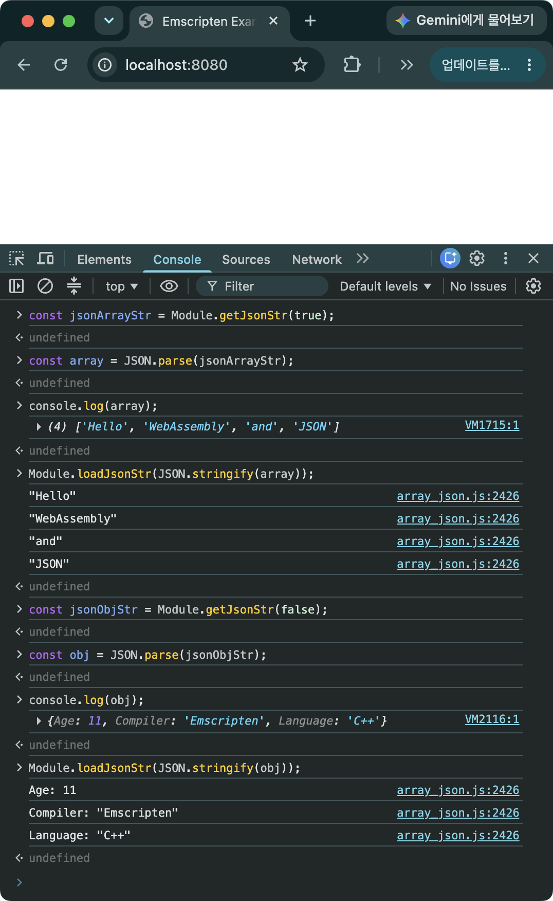
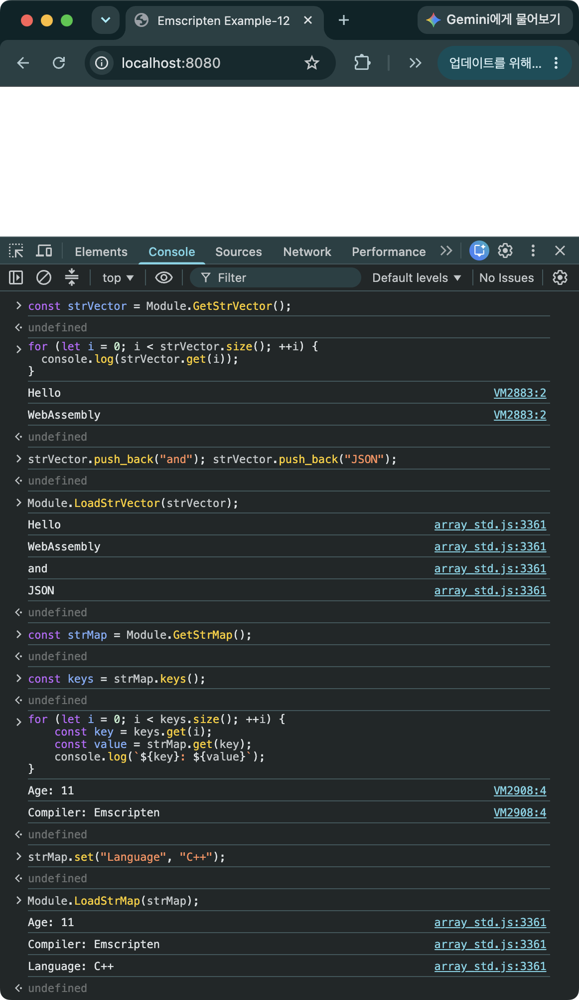
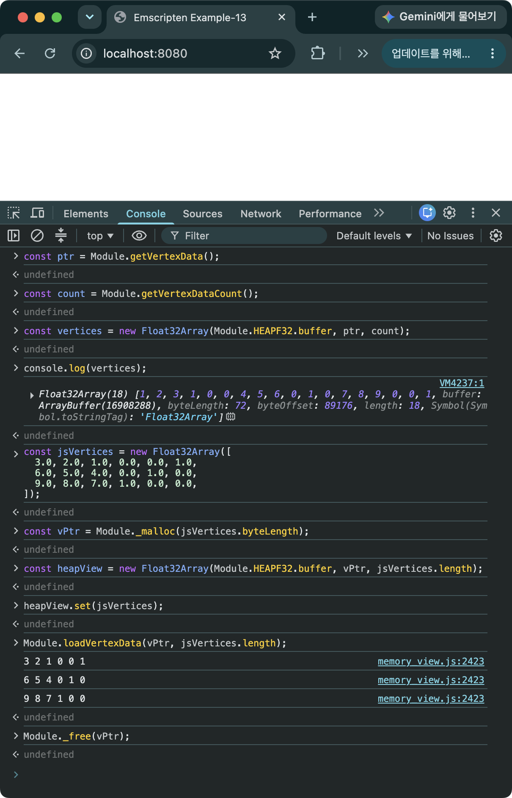

> [!SUMMARY]
> Introduces ways to pass an array as an argument when exporting a C++ function for use from JavaScript. Explains, with examples, three approaches: first, passing data as a JSON string and parsing it; second, binding the Standard Library with Embind; and third, accessing Wasm memory directly through a memory view. Finally, compares the pros and cons of all three.

## Using JSON Strings

- Converts data to a JSON string to pass it back and forth. In practice this means passing data using `std::string`
- Converts the received JSON string into an array or object type to use it
- Has the advantage of being able to pass object types as well as arrays
- Since converting between a JSON object and a JSON string incurs overhead, this isn't recommended for large data

### `nlohmann-json`

- A JSON library for C++. Unlike JavaScript, C++ doesn't support JSON by default
- A header-only library. You can use it by including just `single_include/nlohmann/json.hpp`
- https://github.com/nlohmann/json
- Version - 3.12.0

### Source Code

```C++
// array_json.cpp
#include "nlohmann/json.hpp"
#include <string>
#include <iostream>
#include <emscripten/bind.h>

using json = nlohmann::json;

std::string GetJsonStr(bool isArray) {
  if (isArray) {
    json j = json::array({"Hello", "WebAssembly", "and", "JSON"});
    return j.dump();
  } else {
    json j = json::object({{"Compiler", "Emscripten"}, {"Age", 11}, {"Language", "C++"}});
    return j.dump();
  }
}

void LoadJsonStr(const std::string& jsonStr) {
  auto j = json::parse(jsonStr);

  if (j.is_array()) {
    for (const auto& item : j) {
      std::cout << item << std::endl;
    }
    return;
  }

  if (j.is_object()) {
    for (const auto& [key, value] : j.items()) {
      std::cout << key << ": " << value << std::endl;
    }
    return;
  }
}

EMSCRIPTEN_BINDINGS(my_module) {
  emscripten::function("getJsonStr", &GetJsonStr);
  emscripten::function("loadJsonStr", &LoadJsonStr);
}

// index.html
<!doctype html>
<html>
  <head>
    <title>Emscripten Example-11</title>
  </head>
  <body>
    <script async type="text/javascript" src="array_json.js"></script>
  </body>
</html>
```

- `GetJsonStr`
  - If the argument is true, converts a JSON array to a JSON string and returns it
  - If the argument is false, converts a JSON object to a JSON string and returns it
- `LoadJsonStr`
  - Parses the received JSON string and prints the array or object

### Building

```bash
em++ array_json.cpp -o array_json.js -lembind
```

### Result


_Figure 1. C++ and JavaScript exchanging data with each other using a JSON string_

### Script to Run

```JavaScript
// Array data exchange
const jsonArrayStr = Module.getJsonStr(true);  // C++ → JS: pass a string
const array = JSON.parse(jsonArrayStr);        // JS string → JS array
console.log(array);                            // Print the JS array
Module.loadJsonStr(JSON.stringify(array));     // JS array → JS string → printed from C++

// Object data exchange
const jsonObjStr = Module.getJsonStr(false);  // C++ → JS: pass a string
const obj = JSON.parse(jsonObjStr);           // JS string → JS object
console.log(obj);                             // Print the JS object
Module.loadJsonStr(JSON.stringify(obj));      // JS object → JS string → printed from C++
```

### Example Code and emsdk Version

- https://github.com/dadak797/blog-examples/tree/master/examples/ex-11
- emsdk 5.0.3

## Using the C++ Standard Library

- With Embind you can export `std::vector` and `std::map` for use from JavaScript. `std::string` is [already supported by Embind by default](/en/posts/embind/#binding-regular-functions)
- However, you can't export an entire template class — only a concrete (instantiated) class can be exported
- Emscripten provides helper functions for exporting a concrete template class
  - `register_vector<T>()`: a function for exporting `std::vector<T>`
  - `register_map<K, V>()`: a function for exporting `std::map<K, T>`
- Since only explicitly exported classes can be used, this is less flexible than JSON, but it has the advantage of not needing any conversion between a JSON object and a JSON string

### Source Code

```C++
// array_std.cpp
#include <vector>
#include <string>
#include <map>
#include <iostream>
#include <emscripten/bind.h>

std::vector<std::string> GetStrVector() {
  std::vector<std::string> arr = {"Hello", "WebAssembly", "and", "JSON"};
  return arr;
}

std::map<std::string, std::string> GetStrMap() {
  std::map<std::string, std::string> map = {
    {"Compiler", "Emscripten"},
    {"Age", "11"},
    {"Language", "C++"}
  };
  return map;
}

void LoadStrVector(const std::vector<std::string>& arr) {
  for (const auto& item : arr) {
    std::cout << item << std::endl;
  }
}

void LoadStrMap(const std::map<std::string, std::string>& map) {
  for (const auto& [key, value] : map) {
    std::cout << key << ": " << value << std::endl;
  }
}

EMSCRIPTEN_BINDINGS(my_module) {
  emscripten::register_vector<std::string>("StrVector");
  emscripten::register_map<std::string, std::string>("StrMap");
  emscripten::function("GetStrVector", &GetStrVector);
  emscripten::function("GetStrMap", &GetStrMap);
  emscripten::function("LoadStrVector", &LoadStrVector);
  emscripten::function("LoadStrMap", &LoadStrMap);
}

// index.html
<!doctype html>
<html>
  <head>
    <title>Emscripten Example-12</title>
  </head>
  <body>
    <script async type="text/javascript" src="array_std.js"></script>
  </body>
</html>
```

- `register_vector<std::string>("StrVector")`
  - Exposes `std::vector<std::string>` to JavaScript under the name `StrVector`
  - https://emscripten.org/docs/api_reference/bind.h.html#vectors
- `register_map<std::string, std::string>("StrMap")`
  - Exposes `std::map<std::string, std::string>` to JavaScript under the name `StrMap`
  - https://emscripten.org/docs/api_reference/bind.h.html#maps

### Building

```bash
em++ array_std.cpp -o array_std.js -lembind
```

### Result


_Figure 2. C++ and JavaScript exchanging `std::vector<std::string>` and `std::map<std::string, std::string>` data with each other_

- You use the `get` function to access elements of the exported `std::vector<std::string>` and `std::map<std::string, std::string>` — unlike in C++, where you'd use `[]` or `at` to access an element
- You can't pass a JavaScript Array directly to C++; you need to use the exported `std::vector` to pass the data
- On the JS side, you can construct instances directly using the exported concrete class names (`StrVector`, `StrMap`)

```JavaScript
const strVector = new Module.StrVector();
strVector.push_back("Hello");
strVector.push_back("WebAssembly!");
Module.LoadStrVector(strVector);
```

- Not every function of `std::vector` or `std::map` is exposed to JavaScript — only some of them are, as shown below

| `C++ std::vector v`  | Embind JS Wrapper v  |
| -------------------- | -------------------- |
| `v.size()`           | `v.size()`           |
| `v[i] / v.at(i)`     | `v.get(i)`           |
| `v[i] = value`       | `v.set(i, value)`    |
| `v.push_back(value)` | `v.push_back(value)` |

| `C++ std::map m`         | Embind JS Wrapper m        |
| ------------------------ | -------------------------- |
| `m.size()`               | `m.size()`                 |
| `m[key] / m.at(key)`     | `m.get(key)`               |
| `m[key] = value`         | `m.set(key, value)`        |
| `m.find(key) != m.end()` | `m.get(key) !== undefined` |
| `key iteration`          | `m.keys()`                 |

### Script to Run

```JavaScript
// std::vector<std::string> exchange
const strVector = Module.GetStrVector();  // C++ → JS: pass an array of strings
for (let i = 0; i < strVector.size(); ++i) {
  console.log(strVector.get(i));          // Print each element
}
strVector.push_back("and"); strVector.push_back("JSON"); // Add elements "and", "JSON"
Module.LoadStrVector(strVector);          // Pass the string array to C++ → printed from C++
strVector.delete();                       // Free strVector once you're done using it

// std::map<std::string, std::string> exchange
const strMap = Module.GetStrMap();    // C++ → JS: pass a map
const keys = strMap.keys();           // The map's array of keys
for (let i = 0; i < keys.size(); ++i) {
    const key = keys.get(i);          // Get a key by index
    const value = strMap.get(key);    // Get a value by key
    console.log(`${key}: ${value}`);  // Print the map's key and value
}
keys.delete();                        // Free keys (a std::vector<std::string>) once you're done using it
strMap.set("Language", "C++");        // Add a new item to the map
Module.LoadStrMap(strMap);            // Pass the map to C++ → printed from C++
strMap.delete();                      // Free strMap once you're done using it
```

> [!CAUTION]
> For objects exported from C++, like `strVector`, `strMap`, and `keys`, the actual data lives in Wasm heap memory. So once you're done using such a variable, you must explicitly call `delete()` to invoke its destructor. `std::string` values like `key` and `value`, however, are automatically converted into JavaScript strings, so the JS garbage collector takes care of cleaning them up without you needing to delete them directly.

### Example Code and emsdk Version

- https://github.com/dadak797/blog-examples/tree/master/examples/ex-12
- emsdk 5.0.3

## Using Memory Views

### Memory Views

- Lets you view a region of memory on the C++ heap as a JavaScript TypedArray, with no copying involved
- You can create one using a TypedArray View from the WebAssembly memory model, a C++ pointer, and an element count
- WebAssembly's memory is one giant ArrayBuffer, and various TypedArray views are provided so you can access it as different data types
- The available TypedArray views include `HEAP8`, `HEAP16`, `HEAP32`, `HEAPU8`, `HEAPU16`, `HEAPU32`, `HEAPF32`, and `HEAPF64`, where the number indicates the bit size, `U` means unsigned, and `F` means float (https://emscripten.org/docs/api_reference/preamble.js.html#type-accessors-for-the-memory-model)

> [!CAUTION]
> A typed memory view becomes invalid if the Wasm memory is resized, so a TypedArray you created earlier may no longer be valid

### Source Code

```C++
#include <cstddef>
#include <vector>
#include <iostream>
#include <emscripten/bind.h>

std::vector<float> g_Vertices = {
  1.0f, 2.0f, 3.0f, 1.0f, 0.0f, 0.0f,  // Vertex 1: position (1, 2, 3), color (1, 0, 0)
  4.0f, 5.0f, 6.0f, 0.0f, 1.0f, 0.0f,  // Vertex 2: position (4, 5, 6), color (0, 1, 0)
  7.0f, 8.0f, 9.0f, 0.0f, 0.0f, 1.0f   // Vertex 3: position (7, 8, 9), color (0, 0, 1)
};

uintptr_t GetVertexData() {
  return reinterpret_cast<uintptr_t>(g_Vertices.data());
}

std::size_t GetVertexDataCount() {
  return g_Vertices.size();
}

void LoadVertexData(uintptr_t ptr, std::size_t size) {
  float* data = reinterpret_cast<float*>(ptr);
  for (std::size_t i = 0; i < size; ++i) {
    std::cout << data[i] << " ";
    if ((i + 1) % 6 == 0) { // Print a newline after every 6 floats (one vertex)
      std::cout << std::endl;
    }
  }
}

EMSCRIPTEN_BINDINGS(my_module) {
  emscripten::function("getVertexData", &GetVertexData);
  emscripten::function("getVertexDataCount", &GetVertexDataCount);
  emscripten::function("loadVertexData", &LoadVertexData);
}
```

- If you bind a pointer to a basic C++ data type like `int`, `float`, or `double`, using the `emscripten::allow_raw_pointers()` option lets you get past the compile error, but you'll then hit a runtime error (for more on the limits of binding raw pointers, see the [Embind FAQ](/en/posts/embind/#faq)). Rather than passing a pointer, you can cast it to an integer type and pass that instead, which works without error

```C++
reinterpret_cast<uintptr_t>(g_Vertices.data())
float* data = reinterpret_cast<float*>(ptr);
```

### Building

```bash
em++ memory_view.cpp -o memory_view.js -lembind -s EXPORTED_FUNCTIONS="['_malloc','_free']" -s EXPORTED_RUNTIME_METHODS="['HEAPF32']"
```

- Exports `_malloc` and `_free` so the JS side can dynamically allocate and free Wasm memory
- Exports the TypedArray view (`HEAPF32`) that the JS side will use (for the kinds of memory views available and how they work, see [Emscripten Module - FAQ](/en/posts/emscripten-module/#faq))

### Result


_Figure 3. C++ and JavaScript exchanging TypedArray data with each other through a memory view_

### Script to Run

```JavaScript
// Read C++ memory with no copying (memory view)
const ptr = Module.getVertexData();
const count = Module.getVertexDataCount();

const vertices = new Float32Array(Module.HEAPF32.buffer, ptr, count);  // Create a TypedArray that looks into g_Vertices on the Wasm heap (no copy)
console.log(vertices);  // Print the vertices data

// Create data on the JS side
const jsVertices = new Float32Array([
  3.0, 2.0, 1.0, 0.0, 0.0, 1.0,
  6.0, 5.0, 4.0, 0.0, 1.0, 0.0,
  9.0, 8.0, 7.0, 1.0, 0.0, 0.0,
]);

// Allocate space in Wasm memory, in bytes, to copy jsVertices into
const vPtr = Module._malloc(jsVertices.byteLength);

// Create a TypedArray that looks into the Wasm heap
const heapView = new Float32Array(Module.HEAPF32.buffer, vPtr, jsVertices.length);

// Copy the JS data into Wasm
heapView.set(jsVertices);

// Read the data from C++
Module.loadVertexData(vPtr, jsVertices.length);

// Free the Wasm memory once you're done using it
Module._free(vPtr);
```

### Example Code and emsdk Version

- https://github.com/dadak797/blog-examples/tree/master/examples/ex-13
- emsdk 5.0.3

## Comparing the Three Approaches

| Category                               | JSON String                                                    | C++ Standard Library                                                                               | Memory View                                                                         |
| -------------------------------------- | -------------------------------------------------------------- | -------------------------------------------------------------------------------------------------- | ----------------------------------------------------------------------------------- |
| **How it works**                       | Serializes data as a JSON string to pass it                    | Binds `std::vector`, `std::map`, etc. with Embind to pass them                                     | Accesses Wasm memory directly through a TypedArray view                             |
| **Implementation difficulty**          | Low                                                            | Moderate                                                                                           | High                                                                                |
| **Flexibility of data representation** | High                                                           | Moderate                                                                                           | Low                                                                                 |
| **Data conversion**                    | Needs JSON serialization/deserialization                       | Needs type conversion and a wrapper via Embind                                                     | Numeric arrays are accessible with no separate conversion                           |
| **Memory copying**                     | A lot                                                          | Can occur during Embind's processing                                                               | C++ → JS is accessible with no copying                                              |
| **Efficiency with large data**         | Low                                                            | Moderate                                                                                           | High                                                                                |
| **Composite data of multiple types**   | Very well suited                                               | Needs a binding per type                                                                           | You have to define and handle the structure yourself                                |
| **Extra binding needed**               | `std::string` is supported by default                          | Needs registration per concrete STL type                                                           | Needs to expose pointers and data sizes to JS                                       |
| **Memory/lifetime management**         | Mostly automatic                                               | Needs `delete()` management for Embind objects                                                     | Needs to manage pointers, memory allocation/freeing, and view validity              |
| **Main advantage**                     | Code is intuitive and can easily pass data of varied structure | Lets you use the C++ STL while passing data with no JSON conversion step                           | The highest performance and memory efficiency, well suited to large contiguous data |
| **Main drawback**                      | Serialization/deserialization cost and increased string size   | Needs a binding per type, and requires using an Embind wrapper interface that differs from C++ STL | Code is complex and requires understanding the Wasm memory layout                   |
| **Well-suited data**                   | Settings, metadata, small arrays and objects                   | Medium-sized arrays, maps, and C++ objects                                                         | Large contiguous numeric arrays such as meshes, coordinates, or analysis results    |

> [!NOTE]
> Small, structurally complex data is best suited to JSON; data that makes use of C++ STL containers is best suited to Standard Library binding; and large contiguous numeric data such as meshes or analysis results is best suited to a memory view.

## FAQ

- Can you bind every Standard Library data structure?
  - No. Currently (as of emsdk 6.0.8), the data structures provided are `std::vector` (requires registering the concrete type) and `std::map` (requires registering the concrete type), and dedicated helper functions exist for registering them.
  - A fixed-size structure like `std::array` can be bound to a JavaScript object via `emscripten::value_array`, and a plain-data struct can be bound to a JavaScript object via `emscripten::value_object`. Since the data of a JavaScript object bound this way is created in JavaScript memory, you don't need to manage its memory with a `delete` function.

- I want to check whether `strMap` has a certain key — isn't there a function like `m.has(key)`?
  - No, there isn't. The functions `register_map` actually exposes are only `size`, `get`, `set`, and `keys` — there's no separate function corresponding to C++'s `std::map::find` for checking existence.
  - `get(key)` is implemented internally using `std::optional`, so it returns `undefined` if the key isn't found. So you can check for existence with `strMap.get(key) !== undefined`.

- Can you iterate over a registered `std::vector` with JavaScript's `for...of`?
  - Yes, you can. `register_vector` also registers the JS iterable protocol based on the `size` and `get` functions, so you can iterate as shown below without handling indices directly.

    ```JavaScript
    for (const item of strVector) {
      console.log(item);
    }
    ```

  - Note, however, that an object registered as a `std::map` (via `register_map`) doesn't have this iterable registered, so you need to get the list of keys with `keys()` and iterate as shown in the script example above.

- Can I pass a JavaScript Array directly to a C++ function without converting it to a `Module.StrVector`?
  - No, you can't. A function like `LoadStrVector`, which takes a `std::vector<std::string>` argument, can only accept the `StrVector` type registered by Embind — a plain JavaScript `Array` isn't a matching type, so passing one directly throws a `BindingError`.
  - To pass a JavaScript `Array`, you first need to convert it into a `StrVector` instance.

    ```JavaScript
    const jsArray = ["Hello", "WebAssembly"];
    const strVector = new Module.StrVector();
    jsArray.forEach((item) => strVector.push_back(item));
    Module.LoadStrVector(strVector);
    strVector.delete();
    ```

- Besides JSON, the Standard Library, and memory views, is there a way to use `emscripten::val`?
  - Yes, there is. `emscripten::val` is a type that lets C++ dynamically handle an arbitrary JavaScript value (an array, object, function, etc.), without needing to pre-register a type the way you do for `std::vector`/`std::map`, and without the cost of JSON serialization.
  - However, since its type isn't fixed at compile time, errors are harder to catch ahead of time, and there's overhead each time you cross the JS ↔ C++ boundary to access it. So it's mainly used for the exceptional cases where none of the three approaches above fit well — for example, when you need to hold onto a callback function as-is. See the [val guide in the official Emscripten docs](https://emscripten.org/docs/api_reference/val.h.html) for more.

## References

- https://emscripten.org/docs/api_reference/bind.h.html
