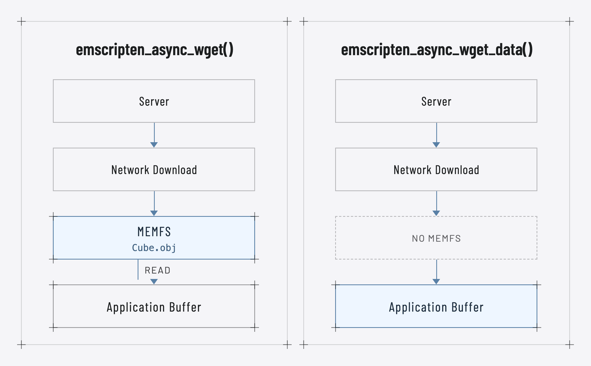
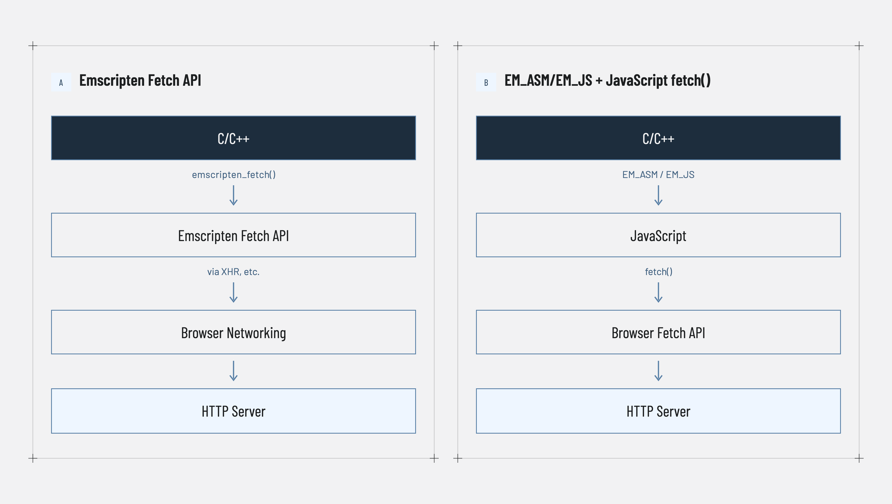
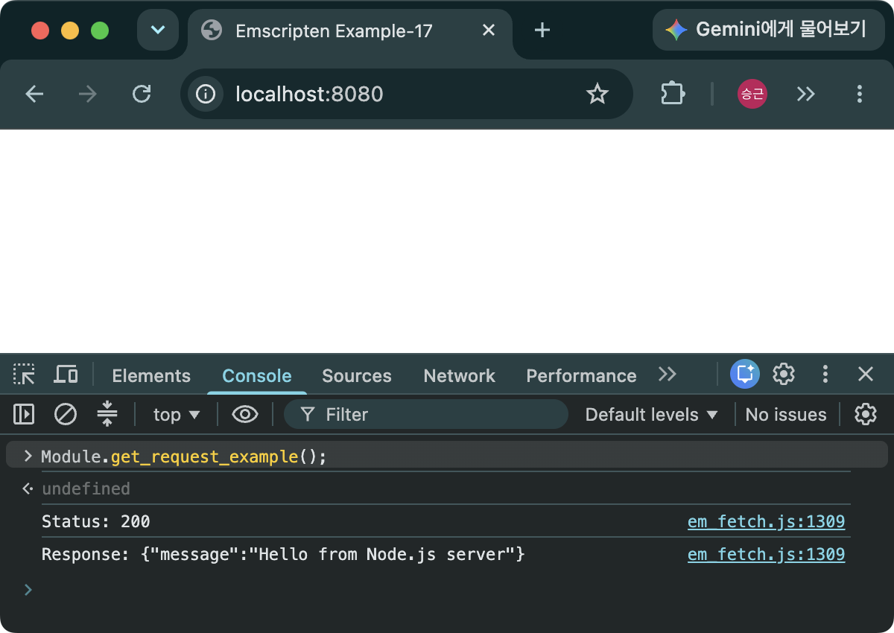
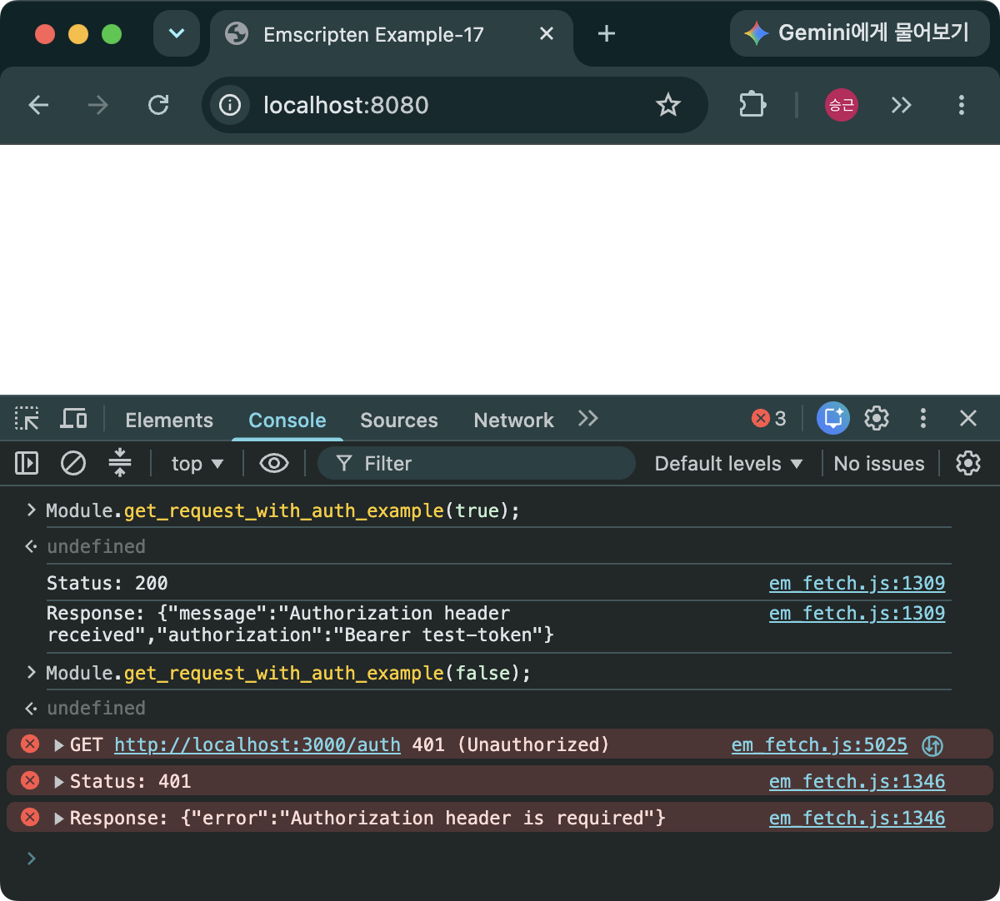
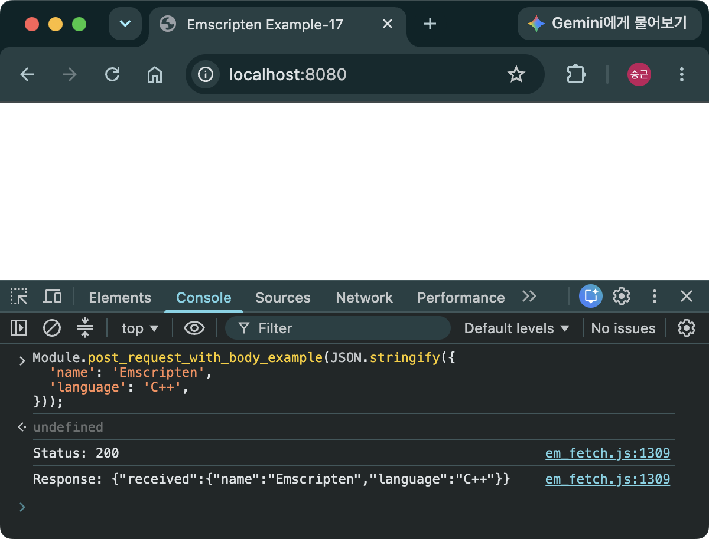
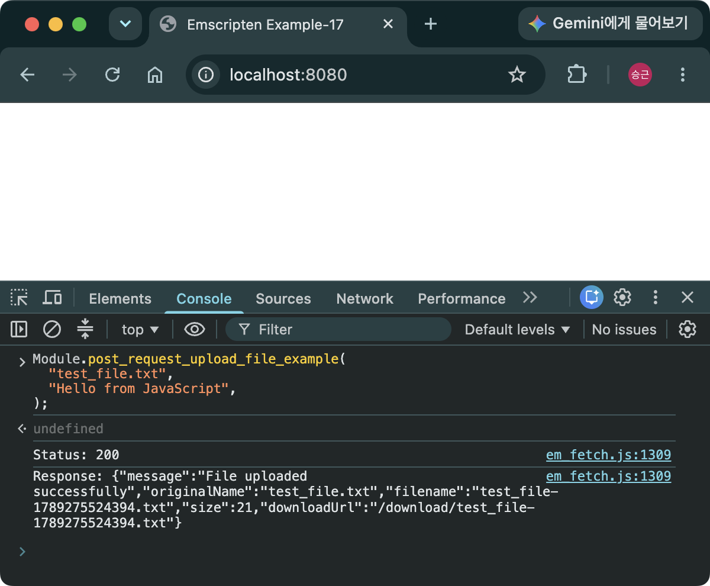
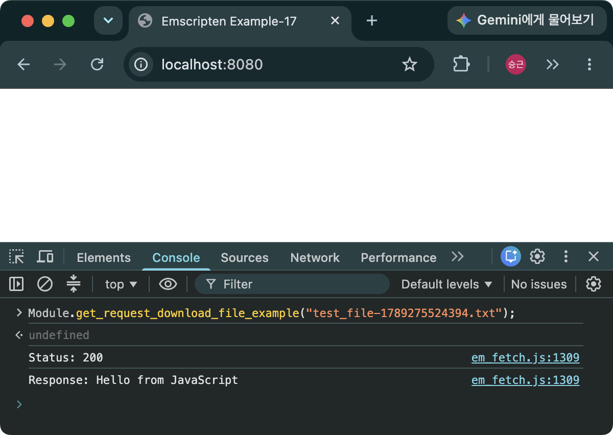

> [!SUMMARY]
> HTTP communication in Emscripten can be broadly divided into three approaches. This post covers the `emscripten_async_wget*` family of functions and `emscripten_fetch`.

## HTTP Communication in Emscripten

When C/C++ code is built into WebAssembly with Emscripten, the program runs in a browser environment. A native C/C++ program can communicate over HTTP through the operating system's socket API or an HTTP library built on top of it, but WebAssembly running in a browser cannot access those socket APIs directly. Emscripten therefore uses the networking features provided by the browser.

Browsers generally send HTTP requests using JavaScript's `fetch`. Emscripten provides several APIs that make the same functionality available to C/C++ code. These can be broadly divided into three approaches:

- Use the `emscripten_async_wget*` family of functions
- Use `emscripten_fetch`
- Call JavaScript's `fetch` directly from `EM_ASM` or `EM_JS`

The `emscripten_async_wget*` functions are convenience APIs suitable for simple file downloads. `emscripten_fetch` offers finer control over GET and POST requests, HTTP headers, request data, and other settings, making it useful when HTTP communication is implemented primarily in C/C++.

By contrast, calling JavaScript's `fetch` through `EM_ASM` or `EM_JS` gives direct access to browser Fetch API features such as `Response`, `ArrayBuffer`, `Blob`, and `ReadableStream`.

Because the code inside an `EM_ASM` or `EM_JS` macro is JavaScript, that approach is not covered separately here. See [Calling JavaScript Functions from C++](/en/posts/call-js-from-cpp/) for passing C++ arguments to `EM_ASM` or `EM_JS`, [Using C++ Classes from JavaScript](/en/posts/embind/) for binding C++ types, and [Emscripten Virtual File System](/en/posts/emscripten-file-handling-memfs/#emscripten-virtual-file-system-vfs) for sharing files created by C++ with JavaScript code.

This post begins with the simpler `emscripten_async_wget*` family and then moves on to `emscripten_fetch`.

> [!NOTE]
> The Fetch API request tests below use the server configured in [Building a Test Web Server](/en/posts/building-test-web-server/). All of those examples assume that the test server is running.

## `emscripten_async_wget*` - Simple File Downloads

### Source Code

```C++
// em_wget.cpp
#include <emscripten.h>
#include <emscripten/bind.h>
#include <iostream>
#include <string>
#include <fstream>
#include <cstring>

// Callback invoked when emscripten_async_wget succeeds
void onLoadWget(const char* filename) {
  std::cout << "File downloaded: " << filename << std::endl;
  std::ifstream ifs(filename);
  std::cout << "File content:" << std::endl;
  std::string line;
  while (std::getline(ifs, line)) {
    std::cout << line << std::endl;
  }
  ifs.close();
}

// Callback invoked when emscripten_async_wget fails
void onErrorWget(const char* filename) {
  std::cerr << "Error downloading file: " << filename << std::endl;
}

// Download a file with emscripten_async_wget
void GetFile(const std::string& url, const std::string& filename) {
  emscripten_async_wget(url.c_str(), filename.c_str(), onLoadWget, onErrorWget);
}

// Callback invoked when emscripten_async_wget_data succeeds
void onLoadWgetData(void* userdata, void* data, int size) {
  char* filename = static_cast<char*>(userdata);
  std::cout << "Data downloaded to memory for file: " << filename << std::endl;
  char* buffer = static_cast<char*>(data);
  std::string content(buffer, size);
  std::cout << "Data content:" << std::endl;
  std::cout << content << std::endl;
  delete[] filename;  // Free the userdata memory
}

// Callback invoked when emscripten_async_wget_data fails
void onErrorWgetData(void* userdata) {
  char* filename = static_cast<char*>(userdata);
  std::cerr << "Error downloading data: " << filename << std::endl;
  delete[] filename;  // Free the userdata memory
}

// Receive a file in a memory buffer with emscripten_async_wget_data
void GetFileData(const std::string& url, const std::string& filename) {
  char* userData = new char[filename.size() + 1];  // Allocate memory on the heap
  std::strcpy(userData, filename.c_str());  // Copy filename into userData
  emscripten_async_wget_data(url.c_str(), static_cast<void*>(userData), onLoadWgetData, onErrorWgetData);
}

EMSCRIPTEN_BINDINGS(my_module) {
  emscripten::function("getFile", &GetFile);
  emscripten::function("getFileData", &GetFileData);
}
```

```HTML
<!-- index.html -->
<!doctype html>
<html>
  <head>
    <title>Emscripten Example-16</title>
  </head>
  <body>
    <script async type="text/javascript" src="em_wget.js"></script>
  </body>
</html>
```

- `GetFile(const std::string& url, const std::string& filename)`
  - Takes a `url` and `filename`, then calls `emscripten_async_wget`
  - Is bound so that it can be called from JavaScript
- `void emscripten_async_wget(const char* url, const char* filename, em_str_callback_func onload, em_str_callback_func onerror)`
  - Downloads the file at `url` with a GET request
  - Saves it in MEMFS under `filename`
  - Runs asynchronously, calling `onload` on success and `onerror` on failure
  - `em_str_callback_func` is a function pointer that returns `void` and takes `const char* filename`
- `onLoadWget`
  - The callback invoked when `emscripten_async_wget` succeeds
  - Receives `const char* filename`
  - The file already exists in MEMFS when the callback begins, so it can be opened with `std::ifstream`
- `onErrorWget`
  - The callback invoked when `emscripten_async_wget` fails
- `GetFileData(const std::string& url, const std::string& filename)`
  - Takes a `url` and `filename`, then calls `emscripten_async_wget_data`
  - `emscripten_async_wget_data` passes `userData` to its callbacks through a `void*` pointer
  - Because `userData` must remain valid until a callback runs, the function allocates memory on the heap, copies `filename`, and passes the pointer as `void*`
  - The dynamically allocated memory must be freed in the callback
- `void emscripten_async_wget_data(const char* url, void *userdata, em_async_wget_onload_func onload, em_arg_callback_func onerror)`
  - Downloads the file at `url` with a GET request
  - Passes callback-specific data through `userdata`
  - Runs asynchronously, calling `onload` on success and `onerror` on failure
  - `em_async_wget_onload_func` is a function pointer that returns `void` and takes `void* userdata`, `void* data`, and `int size`
  - `em_arg_callback_func` is a function pointer that takes `void* userdata`
  - Avoids the overhead of writing to and reading from MEMFS, unlike `emscripten_async_wget`
- `onLoadWgetData`
  - The callback invoked when `emscripten_async_wget_data` succeeds
  - Receives `void* userdata`, `void* data`, and `int size`. `data` points to the data buffer, while `size` is its size. Together they can be used to construct a string.
  - The `data` buffer is valid only while the callback is running, so it must be used inside the callback or copied elsewhere. This example copies it into `std::string content`.
  - Must free the `userdata` memory that was allocated on the heap
- `onErrorWgetData`
  - The callback invoked when `emscripten_async_wget_data` fails
  - Must also free `userdata` on failure

### Building

```bash
em++ em_wget.cpp -o em_wget.js -lembind
```

### Test Script

```JavaScript
Module.getFile("https://raw.githubusercontent.com/dadak797/blog-examples/master/examples/ex-14/models/Cube.obj", "Cube.obj");
Module.getFileData("https://raw.githubusercontent.com/dadak797/blog-examples/master/examples/ex-14/models/Cube.obj", "Cube.obj");
```

- Downloads the OBJ file used in [Handling Files in Emscripten](/en/posts/emscripten-file-handling-memfs/)
- Both calls print the file contents to the console. The difference is that the first call goes through MEMFS and therefore requires one additional copy.


_Figure 1. Comparing the data flow of emscripten_async_wget and emscripten_async_wget_data_

### Example Code and emsdk Version

- https://github.com/dadak797/blog-examples/tree/master/examples/ex-16
- emsdk 5.0.3

## Emscripten Fetch API - Making HTTP Requests from C++

The Emscripten Fetch API lets native code transfer files to and from remote servers through XMLHttpRequest (XHR). It supports HTTP GET, POST, and PUT, so it can also handle general HTTP communication, but its primary use case is transferring data such as file downloads and uploads from a C/C++ program.


_Figure 2. Comparing the Emscripten Fetch API with EM_ASM/EM_JS plus JavaScript fetch_

### Emscripten Fetch API Functions and Arguments

**`emscripten_fetch_t* emscripten_fetch(emscripten_fetch_attr_t* fetch_attr, const char* url)`**

- The function used to start an Emscripten Fetch request
- Takes an `emscripten_fetch_attr_t` and a URL

**`emscripten_fetch_attr_t`**

- A structure that configures the behavior of a Fetch request. Its main fields include:
- `char requestMethod[32]`: Sets the request method, such as GET or POST, as a string
- `void *userData`: A pointer used to pass custom data to callback functions
- `void (*onsuccess)(struct emscripten_fetch_t *fetch)`: The callback invoked when the request succeeds
- `void (*onerror)(struct emscripten_fetch_t *fetch)`: The callback invoked when the request fails
- `void (*onprogress)(struct emscripten_fetch_t *fetch)`: The callback invoked while a request is in progress. It is useful for monitoring large file downloads.
- `uint32_t attributes`: Flags such as `EMSCRIPTEN_FETCH_LOAD_TO_MEMORY` and `EMSCRIPTEN_FETCH_REPLACE` that control where Fetch data is stored and whether the operation is synchronous or asynchronous
- `const char * const *requestHeaders`: Adds HTTP headers. The array must end with `nullptr`.

```C++
const char* headers[] = {
  "Header-1", "Value-1",
  "Header-2", "Value-2",
  nullptr
};
```

- `const char *requestData`, `size_t requestDataSize`: Set the data sent in the body of a POST request. The data must remain valid for the duration of the Fetch operation, so passing stack memory is unsafe. Allocate the data on the heap and free it after the request finishes.
- `uint32_t timeoutMSecs`: Causes the request to time out if it is not completed within the specified number of milliseconds
- `bool withCredentials`: Enables credentials for a cross-origin request to an API that uses cookie-based authentication

**`emscripten_fetch_t`**

- The argument passed to the callback functions configured in `emscripten_fetch_attr_t`
- `const char *data`: A pointer to the downloaded data. It is `nullptr` unless `emscripten_fetch_attr_t.attributes` includes `EMSCRIPTEN_FETCH_LOAD_TO_MEMORY`.
- `uint64_t numBytes`: The size of `data`; it is often used together with `data`
- `uint64_t totalBytes`: The total response body size, useful for calculating progress in an `onprogress` callback
- `unsigned short status`: The HTTP response status code
- `char statusText[64]`: The text associated with `status`
- `const char *url`: The requested URL
- `void *userData`: The data received from `emscripten_fetch_attr_t` for this request. Because it was passed as `void*`, cast it back to its original type inside the callback.

```C++
void onSuccess(emscripten_fetch_t* fetch)
{
    MyObject* obj =
        static_cast<MyObject*>(fetch->userData);
    // ...
}
```

### Source Code

```C++
// em_fetch.cpp
#include <emscripten/bind.h>
#include <emscripten/fetch.h>
#include <emscripten.h>

#include <cstring>
#include <fstream>
#include <iostream>
#include <string>

// 1. GET request example
void get_request_example() {
  // Implementation code goes here...
}

// 2. GET request with authorization header example
// Use withAuth to test requests both with and without an Authorization header
void get_request_with_auth_example(bool withAuth) {
  // Implementation code goes here...
}

// 3. POST request with body example
void post_request_with_body_example(const std::string& body) {
  // Implementation code goes here...
}

// 4. File upload example
void post_request_upload_file_example(
    const std::string& fileName,
    const std::string& fileContent) {
  // Implementation code goes here...
}

// 5. File download example
// Call the download API using the filename returned by the upload response
void get_request_download_file_example(const std::string& fileName) {
  // Implementation code goes here...
}

EMSCRIPTEN_BINDINGS(my_module) {
  emscripten::function("get_request_example", &get_request_example);
  emscripten::function("get_request_with_auth_example", &get_request_with_auth_example);
  emscripten::function("post_request_with_body_example", &post_request_with_body_example);
  emscripten::function("post_request_upload_file_example",
    &post_request_upload_file_example);
  emscripten::function("get_request_download_file_example",
    &get_request_download_file_example);
}
```

- Exports functions for testing five types of requests through Embind
- Each function is implemented in the sections below

```HTML
<!-- index.html -->
<!doctype html>
<html>
  <head>
    <title>Emscripten Example-17</title>
  </head>
  <body>
    <script async type="text/javascript" src="em_fetch.js"></script>
  </body>
</html>
```

### Building

```bash
em++ em_fetch.cpp -o em_fetch.js -lembind -s FETCH=1 -s EXPORTED_RUNTIME_METHODS="['FS']"
```

- Add `-s FETCH=1` to the build options to use `emscripten_fetch`
- Add `FS` to `EXPORTED_RUNTIME_METHODS` to use the file system from JavaScript

### Example Code and emsdk Version

- https://github.com/dadak797/blog-examples/tree/master/examples/ex-17
- emsdk 5.0.3

## Testing Requests

> [!NOTE]
> The following tests repeat the request flow from [Building a Test Web Server](/en/posts/building-test-web-server/) using `emscripten_fetch`. Start the server from that example with `npm run dev`, then test each request through the functions exported with Embind. The client in this example is served with `python -m http.server 8080`.

### Testing a GET Request

```C++
// em_fetch.cpp
void get_request_example() {
  emscripten_fetch_attr_t attr;
  emscripten_fetch_attr_init(&attr);  // Initialize attr

  strcpy(attr.requestMethod, "GET");  // Set the request method to GET
  attr.attributes =
      EMSCRIPTEN_FETCH_LOAD_TO_MEMORY |  // Load the response into Wasm memory
      EMSCRIPTEN_FETCH_REPLACE;          // Do not use existing data in IndexedDB

  // Set the success callback
  attr.onsuccess = [](emscripten_fetch_t* fetch) {
    // Construct a string from data and numBytes in fetch
    std::string response(fetch->data, fetch->numBytes);

    std::cout << "Status: " << fetch->status << std::endl;  // Check the status
    std::cout << "Response: " << response << std::endl;     // Print the response

    emscripten_fetch_close(fetch);  // Release the resources used by the request
  };

  // Set the failure callback
  attr.onerror = [](emscripten_fetch_t* fetch) {
    std::string response =
        fetch->data
            ? std::string(fetch->data, fetch->numBytes)
            : std::string{};

    std::cerr << "Status: " << fetch->status << std::endl;
    std::cerr << "Response: " << response << std::endl;

    emscripten_fetch_close(fetch);
  };

  // Start the request with the configured attr structure and URL
  emscripten_fetch_t* fetch
    = emscripten_fetch(&attr, "http://localhost:3000/hello");
  if (!fetch) {  // Check whether the Fetch operation was created and started
    std::cerr << "Failed to start request" << std::endl;
  }
}
```

- Sets `requestMethod`, `attributes`, `onsuccess`, and `onerror` on `attr`, then passes it to `emscripten_fetch`
- `emscripten_fetch` runs asynchronously by default, so callbacks (`onsuccess` and `onerror`) define what happens after the request

```JavaScript
Module.get_request_example();
```

- Sends the same request as [Building a Test Web Server - Testing a GET Request](/en/posts/building-test-web-server/#testing-a-get-request)


_Figure 3. GET request result—the server returns a successful response_

### Testing a GET Request with an Authorization Header

```C++
// em_fetch.cpp
void get_request_with_auth_example(bool withAuth) {
  emscripten_fetch_attr_t attr;
  emscripten_fetch_attr_init(&attr);

  strcpy(attr.requestMethod, "GET");  // Set the request method to GET
  attr.attributes =
      EMSCRIPTEN_FETCH_LOAD_TO_MEMORY |
      EMSCRIPTEN_FETCH_REPLACE;

  // Set the Authorization header
  if (withAuth) {
    const char* headers[] = {
      "Authorization", "Bearer test-token",
      nullptr
    };
    attr.requestHeaders = headers;
  }

  // Set the success callback
  attr.onsuccess = [](emscripten_fetch_t* fetch) {
    std::string response(fetch->data, fetch->numBytes);

    std::cout << "Status: " << fetch->status << std::endl;
    std::cout << "Response: " << response << std::endl;

    emscripten_fetch_close(fetch);
  };

  // Set the failure callback
  attr.onerror = [](emscripten_fetch_t* fetch) {
    std::string response =
        fetch->data
            ? std::string(fetch->data, fetch->numBytes)
            : std::string{};

    std::cerr << "Status: " << fetch->status << std::endl;
    std::cerr << "Response: " << response << std::endl;

    emscripten_fetch_close(fetch);
  };

  emscripten_fetch_t* fetch
    = emscripten_fetch(&attr, "http://localhost:3000/auth");
  if (!fetch) {
    std::cerr << "Failed to start request" << std::endl;
  }
}
```

- Adds `attr.requestHeaders` when `withAuth` is `true`

```JavaScript
Module.get_request_with_auth_example(true);
Module.get_request_with_auth_example(false);
```

- Sends the same request as [Building a Test Web Server - Testing a GET Request with an Authorization Header](/en/posts/building-test-web-server/#testing-a-get-request-with-an-authorization-header)


_Figure 4. GET request with an Authorization header—the request without the header fails_

### Testing a POST Request

```C++
// em_fetch.cpp
void post_request_with_body_example(const std::string& body) {
  emscripten_fetch_attr_t attr;
  emscripten_fetch_attr_init(&attr);

  strcpy(attr.requestMethod, "POST");  // Set the request method to POST
  attr.attributes =
      EMSCRIPTEN_FETCH_LOAD_TO_MEMORY |
      EMSCRIPTEN_FETCH_REPLACE;

  // Set Content-Type in the headers
  const char* headers[] = {
    "Content-Type", "application/json",
    nullptr
  };
  attr.requestHeaders = headers;

  // Set the request body
  // Allocate requestBody on the Wasm heap so that it remains valid until the request completes
  auto* requestBody = new std::string(body);
  attr.requestData = requestBody->data();
  attr.requestDataSize = requestBody->size();

  // Pass requestBody through userData so that the callbacks can free it
  // The callbacks cast this userData value back to std::string*
  attr.userData = requestBody;

  // Success callback
  attr.onsuccess = [](emscripten_fetch_t* fetch) {
    std::string response(fetch->data, fetch->numBytes);

    std::cout << "Status: " << fetch->status << std::endl;
    std::cout << "Response: " << response << std::endl;

    // The request is complete, so free requestBody
    // The pointer assigned to attr.userData is available as fetch->userData
    // userData has type void*, so cast it back to std::string* before deleting it
    delete static_cast<std::string*>(fetch->userData);
    emscripten_fetch_close(fetch);
  };

  // Failure callback
  attr.onerror = [](emscripten_fetch_t* fetch) {
    std::string response =
        fetch->data
            ? std::string(fetch->data, fetch->numBytes)
            : std::string{};

    std::cerr << "Status: " << fetch->status << std::endl;
    std::cerr << "Response: " << response << std::endl;

    // The request is complete, so free requestBody
    delete static_cast<std::string*>(fetch->userData);
    emscripten_fetch_close(fetch);
  };

  emscripten_fetch_t* fetch
    = emscripten_fetch(&attr, "http://localhost:3000/echo");
  if (!fetch) {
    // A callback will not run if the request could not be created, so free the memory here
    delete requestBody;
    std::cerr << "Failed to start request" << std::endl;
  }
}
```

- Sets `attr.requestData` and `attr.requestDataSize` to send `requestBody` in the POST request
- Allocates `requestBody` on the heap because it must remain valid until the request completes
- The allocated `requestBody` must be deleted after the request. The example passes it as `void*` through `userData`, casts it back to `std::string*` in each callback, and then frees it.

```JavaScript
Module.post_request_with_body_example(JSON.stringify({
  'name': 'Emscripten',
  'language': 'C++',
}));
```

- Sends the same request as [Building a Test Web Server - Testing a POST Request](/en/posts/building-test-web-server/#testing-a-post-request)


_Figure 5. POST request result—the server returns the JSON body that was sent_

### Testing a File Upload

```C++
// em_fetch.cpp
void post_request_upload_file_example(
    const std::string& fileName,
    const std::string& fileContent) {
  // Define a boundary that separates the parts of the multipart/form-data body
  const std::string boundary =
      "----EmscriptenBoundary7MA4YWxkTrZu0gW";

  auto* requestBody = new std::string();

  // Start the multipart part
  *requestBody += "--" + boundary + "\r\n";

  // Set the form field name and uploaded filename
  *requestBody +=
      "Content-Disposition: form-data; "
      "name=\"uploadFile\"; "
      "filename=\"" + fileName + "\"\r\n";

  // Set the uploaded file's MIME type
  *requestBody += "Content-Type: text/plain\r\n";

  // Add an empty line between the part headers and file data
  *requestBody += "\r\n";

  // Append the file data
  requestBody->append(fileContent.data(), fileContent.size());
  *requestBody += "\r\n";

  // End the multipart body
  *requestBody += "--" + boundary + "--\r\n";

  emscripten_fetch_attr_t attr;
  emscripten_fetch_attr_init(&attr);

  strcpy(attr.requestMethod, "POST");
  attr.attributes =
      EMSCRIPTEN_FETCH_LOAD_TO_MEMORY |
      EMSCRIPTEN_FETCH_REPLACE;

  // Define Content-Type
  const std::string contentType =
      "multipart/form-data; boundary=" + boundary;

  // Set the headers
  const char* headers[] = {
      "Content-Type", contentType.c_str(),
      nullptr
  };

  attr.requestHeaders = headers;
  attr.requestData = requestBody->data();
  attr.requestDataSize = requestBody->size();
  attr.userData = requestBody;

  // Set the success callback
  attr.onsuccess = [](emscripten_fetch_t* fetch) {
    std::string response(fetch->data, fetch->numBytes);

    std::cout << "Status: " << fetch->status << std::endl;
    std::cout << "Response: " << response << std::endl;

    delete static_cast<std::string*>(fetch->userData);
    emscripten_fetch_close(fetch);
  };

  // Set the failure callback
  attr.onerror = [](emscripten_fetch_t* fetch) {
    std::string response =
        fetch->data
            ? std::string(fetch->data, fetch->numBytes)
            : std::string{};

    std::cerr << "Status: " << fetch->status << std::endl;
    std::cerr << "Response: " << response << std::endl;

    delete static_cast<std::string*>(fetch->userData);
    emscripten_fetch_close(fetch);
  };

  emscripten_fetch_t* fetch
    = emscripten_fetch(&attr, "http://localhost:3000/upload");
  if (!fetch) {
    delete requestBody;
    std::cerr << "Failed to start upload" << std::endl;
  }
}
```

- With Emscripten Fetch, the `multipart/form-data` request body must be constructed manually. JavaScript Fetch can instead use a `FormData` object, allowing the browser to generate the boundary and each part's headers automatically.

```JavaScript
Module.post_request_upload_file_example(
  "test_file.txt",
  "Hello from JavaScript",
);
```

- Sends the same request as [Building a Test Web Server - Testing a File Upload](/en/posts/building-test-web-server/#testing-a-file-upload)


_Figure 6. POST file upload result—a `test_file-{timestamp}.txt` file is created in the `uploads` directory_

### Testing a File Download

```C++
// em_fetch.cpp
void get_request_download_file_example(const std::string& fileName) {
  emscripten_fetch_attr_t attr;
  emscripten_fetch_attr_init(&attr);

  strcpy(attr.requestMethod, "GET");
  attr.attributes =
      EMSCRIPTEN_FETCH_LOAD_TO_MEMORY |
      EMSCRIPTEN_FETCH_REPLACE;

  std::string* fileNamePtr = new std::string(fileName);
  attr.userData = static_cast<void*>(fileNamePtr);

  attr.onsuccess = [](emscripten_fetch_t* fetch) {
    std::string response(fetch->data, fetch->numBytes);

    std::cout << "Status: " << fetch->status << std::endl;
    std::cout << "Response: " << response << std::endl;

    // Start downloading the file
    // Create a file in MEMFS from fetch->data and fetch->numBytes
    std::string* pFileName = static_cast<std::string*>(fetch->userData);
    std::ofstream outFile(*pFileName, std::ios::binary);
    outFile.write(fetch->data, fetch->numBytes);
    outFile.close();

    EM_ASM({
      const fileName = UTF8ToString($0);

      // Read the MEMFS file contents into a Uint8Array
      const content = FS.readFile(fileName);
      const blob = new Blob([content], {
        type: 'application/octet-stream'
      });

      // Create a temporary link and download the file
      const url = URL.createObjectURL(blob);
      const link = document.createElement('a');
      link.href = url;
      link.download = fileName;
      link.click();
      setTimeout(() => {
        URL.revokeObjectURL(url);
      }, 0);

      // Delete the temporary file from MEMFS
      FS.unlink(fileName);

      // File download complete
    }, (*pFileName).c_str());

    delete pFileName;
    emscripten_fetch_close(fetch);
  };

  attr.onerror = [](emscripten_fetch_t* fetch) {
    std::string response =
        fetch->data
            ? std::string(fetch->data, fetch->numBytes)
            : std::string{};

    std::cerr << "Status: " << fetch->status << std::endl;
    std::cerr << "Response: " << response << std::endl;

    delete static_cast<std::string*>(fetch->userData);
    emscripten_fetch_close(fetch);
  };

  emscripten_fetch_t* fetch =
    emscripten_fetch(&attr, ("http://localhost:3000/download/" + fileName).c_str());
  if (!fetch) {
    delete fileNamePtr;
    std::cerr << "Failed to start download" << std::endl;
  }
}
```

- If the file data only needs to be processed in C++, the code between `// Start downloading the file` and `// File download complete` is unnecessary. This example adds the `EM_ASM` block to perform the same download operation as [Building a Test Web Server - Testing a File Download](/en/posts/building-test-web-server/#testing-a-file-download).
- Reads and prints the file while also downloading it in a single request
- Writes the file data to MEMFS, reads it from JavaScript with `FS.readFile(fileName)`, creates a `Blob`, and downloads it

```JavaScript
Module.get_request_download_file_example("test_file-{timestamp}.txt");
```

- Sends the same request as [Building a Test Web Server - Testing a File Download](/en/posts/building-test-web-server/#testing-a-file-download)
- Uses the name of the file saved in [Testing a File Upload](#testing-a-file-upload)


_Figure 7. GET file download result—the response body is read as a string and printed while the requested file is also downloaded to the computer_

## FAQ



- The Emscripten Fetch API keeps request configuration, callbacks, and response handling together in C/C++ code. With `EMSCRIPTEN_FETCH_LOAD_TO_MEMORY`, the response can be processed directly in Wasm memory, while `userData` makes it convenient to pass a C++ object or request-specific state to a callback. Features such as progress tracking, timeouts, and IndexedDB storage can also be configured through `emscripten_fetch_attr_t`.
- If the request needs DOM manipulation or direct access to browser Fetch API features such as `Response`, `Blob`, or `ReadableStream`, calling JavaScript's `fetch` through `EM_ASM`/`EM_JS` may be simpler. Neither approach is always better: the Emscripten Fetch API is a natural fit when the request and response are handled mainly in C++, while the JavaScript Fetch API works well when browser integration is the main concern.
  



- An Emscripten Fetch request running in a browser is subject to the same CORS policy as any other XHR. In this post, the client runs at `http://localhost:8080` and the API server at `http://localhost:3000`. Because the ports differ, they have different origins. The server must allow the client's origin through `Access-Control-Allow-Origin`.
- A request with an `Authorization` header or certain `Content-Type` values may trigger a preflight (`OPTIONS`) request before the actual request. If the server does not allow the request method and headers such as `Authorization` and `Content-Type`, the browser will not send the actual request. Check the failed `OPTIONS` request and its response headers in the Network tab of the developer tools first.
- When using `withCredentials` for cookie-based authentication, the server must also respond with `Access-Control-Allow-Credentials: true`. In this case, `Access-Control-Allow-Origin` cannot be `*`; it must specify an allowed origin.
  



- The memory referenced by `requestData` must remain valid until the request finishes. Do not pass memory from a local variable that disappears when the request function returns. One option is to allocate it on the heap, as in the POST example, and free it in both the success and failure callbacks. If `emscripten_fetch()` cannot start the request and returns `nullptr`, no callback will run, so the caller must free the memory directly.
- `userData` only passes a pointer to the callback; Emscripten does not manage the lifetime of the pointed-to object. Take care not to free the same memory twice across the success and failure paths, or forget to free it on one of those paths.
- When `EMSCRIPTEN_FETCH_LOAD_TO_MEMORY` is set, `fetch->data` points to the response data. Calling `emscripten_fetch_close(fetch)` releases it. If the data is needed after the callback, copy it into another buffer or object before calling `close`. Call `emscripten_fetch_close()` after the request finishes, whether it succeeds or fails.
  



- `EMSCRIPTEN_FETCH_LOAD_TO_MEMORY` places the complete response in the Wasm heap, so a large file can substantially increase memory usage. If the downloaded data does not need to be processed immediately and will be used later, consider omitting `LOAD_TO_MEMORY` and using `EMSCRIPTEN_FETCH_PERSIST_FILE` to store it in IndexedDB. In that case, the success callback does not receive the file data through `fetch->data`.
- If the server supports Range requests and only part of the data is needed, use an HTTP Range request. Emscripten also provides `EMSCRIPTEN_FETCH_STREAM_DATA`, but browser support is limited. When streaming must work across multiple browsers, consider JavaScript's Fetch API with `ReadableStream`. See [Managing Large Files in the Emscripten documentation](https://emscripten.org/docs/api_reference/fetch.html#managing-large-files) for details.
  



- No. `EMSCRIPTEN_FETCH_REPLACE` controls whether Emscripten Fetch reuses existing data in IndexedDB. When it is used without `EMSCRIPTEN_FETCH_PERSIST_FILE`, the request neither reads from nor writes to IndexedDB, but normal browser HTTP caching may still apply.
- To control the HTTP cache, configure the request's `Cache-Control` header or the cache-related response headers sent by the server separately.
  

## References

- [Emscripten Fetch API](https://emscripten.org/docs/api_reference/fetch.html)
