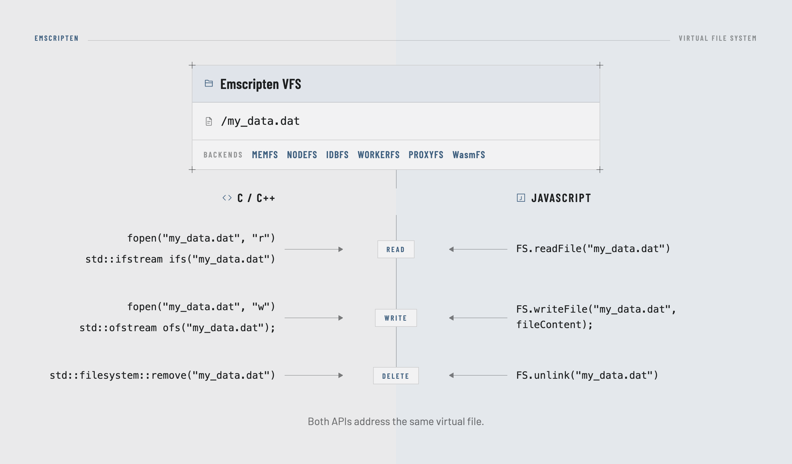
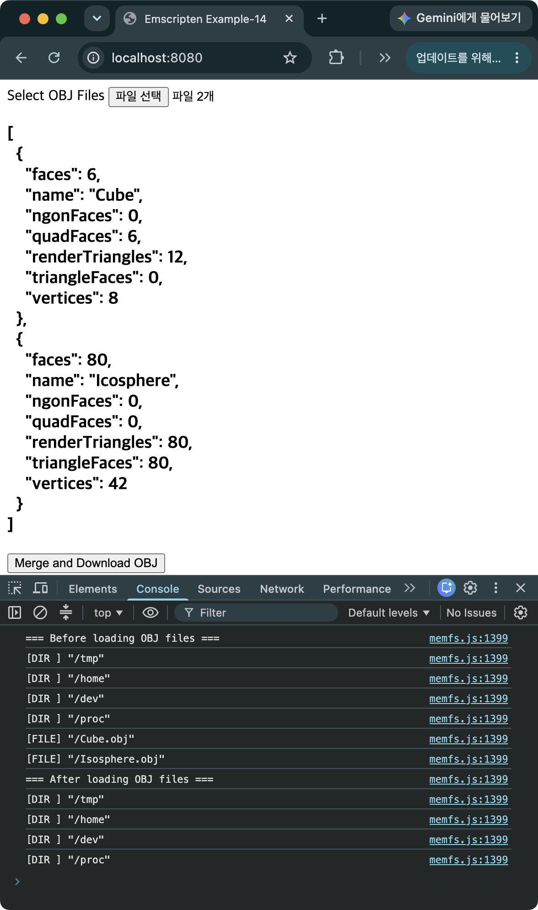
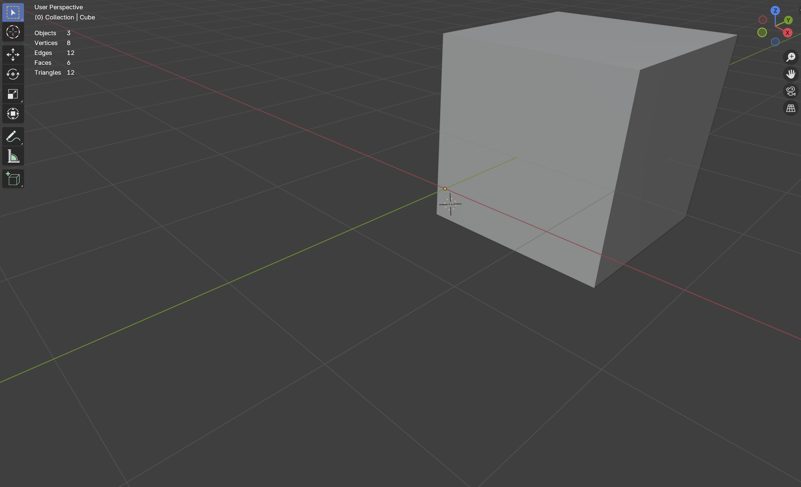
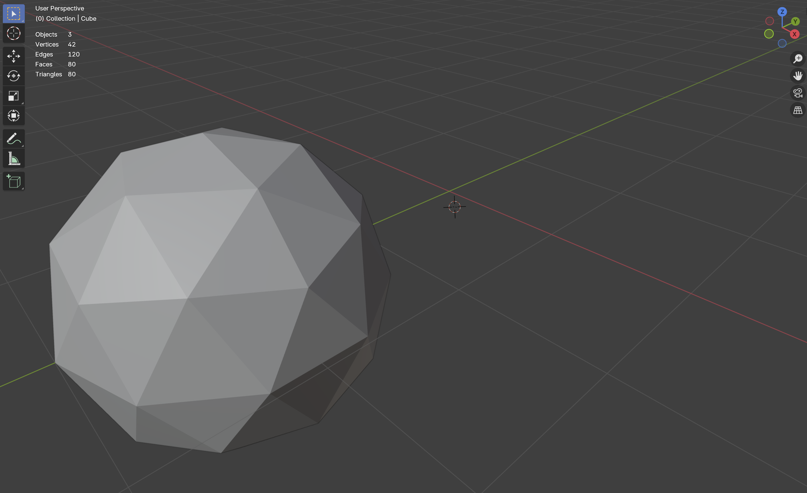
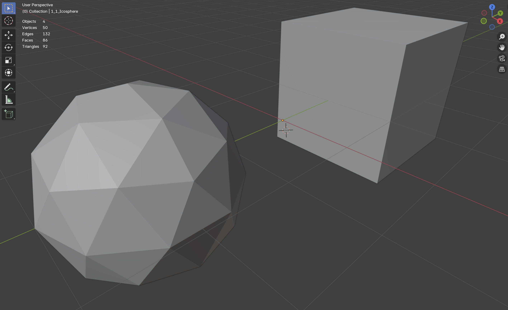

> [!SUMMARY]
> Introduces the Virtual File System for handling files in Emscripten. Shows the process of including an external C++ library, tinyobjloader, in a project and using Emscripten's MEMFS to read a user's Wavefront OBJ files and download the result.

## Emscripten Virtual File System (VFS)

Since WebAssembly built by Emscripten runs inside a browser environment, it can't freely access the user's local file system. In a native environment, you can access the operating system's file system directly by specifying a file path, as in `std::ifstream ifs("my_data.dat");`, but in a browser this kind of access is restricted for security reasons. To use a local file, the user must explicitly grant access, for example by selecting the file themselves.

That doesn't mean C++ code built with Emscripten can't use `fopen()` or `std::ifstream`. Emscripten provides a Virtual File System (VFS) so that C++ programs can keep using the existing file I/O APIs as-is.

The VFS isn't accessible only from C++ code. Using the `FS.*` API that Emscripten exposes on the JavaScript side, JavaScript can access the same virtual files as well.


_Figure 1. Emscripten's Virtual File System (VFS) can be thought of as a common file system abstraction layer where the C++ file API and the JavaScript `FS.*` API meet. The kinds of VFS include MEMFS, NODEFS, IDBFS, WORKERFS, PROXYFS, and WasmFS._

## Reading OBJ Files in the Browser and Downloading the Result (MEMFS)

Among the various kinds of VFS, this example uses MEMFS and the external library tinyobjloader to read two OBJ files, check the parsing results (vertex count, face count, etc.), merge the two objects into one, and download it as a file. The two objects and the merged object are then visualized using [Blender](https://www.blender.org/).

### MEMFS

- A VFS that's included by default without needing any extra build options
- Mounted at `/` when the Wasm runtime is initialized
- All files live in memory
  - They disappear when the page is reloaded
  - It's a good idea to delete a file once you're done using it, to free up memory

### tinyobjloader

- A header-only library that reads and parses files in the Wavefront (`.obj`/`.mtl`) format
- The Wavefront format is one of the formats used for storing 3D models, and it can be rendered using the free, open-source modeling software [Blender](https://www.blender.org/)
- Can be used by including just `tiny_obj_loader.h`
- https://github.com/tinyobjloader/tinyobjloader
- Version - 2.0.0

### Source Code - memfs.cpp

```C++
#define TINYOBJLOADER_IMPLEMENTATION
#include "tiny_obj_loader/tiny_obj_loader.h"
#include "nlohmann/json.hpp"

#include <optional>
#include <string>
#include <vector>
#include <iostream>
#include <fstream>
#include <filesystem>
#include <iomanip>
#include <limits>
#include <utility>
#include <emscripten.h>
#include <emscripten/bind.h>

using json = nlohmann::json;
namespace fs = std::filesystem;

// A struct that holds data read from an OBJ file
struct ObjFile {
  std::string filename;
  tinyobj::attrib_t attrib;
  std::vector<tinyobj::shape_t> shapes;
};

std::vector<ObjFile> g_ObjFiles;

// Print the files and folders at a given path in MEMFS
void PrintFiles(const std::string& path) {
  for (const auto& entry : fs::directory_iterator(path)) {
    if (entry.is_directory()) {
      std::cout << "[DIR ] ";
    }
    else if (entry.is_regular_file()) {
      std::cout << "[FILE] ";
    }
    std::cout << entry.path() << std::endl;
  }
}

// Take a JSON string of file names, read the OBJ files, and return a summary
std::optional<std::string> LoadObjFiles(const std::string& filenames) {
  std::cout << "=== Before loading OBJ files ===" << std::endl;
  PrintFiles("/");  // Check the files and folders at the MEMFS root

  g_ObjFiles.clear();

  json files = json::parse(filenames);
  if (!files.is_array()) {
    std::cerr << "Input must be a JSON array of file names." << std::endl;
    return std::nullopt;
  }

  json summary = json::array();  // A JSON array to hold the summary info

  for (const auto& file : files) {
    if (!file.is_string()) {
      std::cerr << "Each file name must be a string." << std::endl;
      return std::nullopt;
    }
    std::string filename = file.get<std::string>();

    tinyobj::attrib_t attrib;
    std::vector<tinyobj::shape_t> shapes;
    std::vector<tinyobj::material_t> materials;
    std::string warn, err;

    // Read the vertex attributes, shapes, and materials from the OBJ file
    bool ok = tinyobj::LoadObj(
      &attrib,
      &shapes,
      &materials,
      &warn,
      &err,
      filename.c_str(),
      nullptr,
      false  // Setting this to true would triangulate every face
    );

    fs::remove(filename.c_str());  // Delete the OBJ file from MEMFS regardless of success or failure

    if (!warn.empty()) {
      std::cout << "Warning: " << warn << std::endl;
    }
    if (!err.empty()) {
      std::cerr << "Error: " << err << std::endl;
      continue;
    }
    if (!ok) {
      std::cerr << "Failed to load/parse .obj file." << std::endl;
      continue;
    }

    for (size_t i = 0; i < shapes.size(); ++i) {
      uint32_t triangleFaceCount = 0;    // Number of triangular faces
      uint32_t quadFaceCount = 0;        // Number of quad faces
      uint32_t ngonFaceCount = 0;        // Number of n-gon faces
      uint32_t renderTriangleCount = 0;  // Number of triangles after triangulation

      for (const auto vertexCount : shapes[i].mesh.num_face_vertices) {
        if (vertexCount == 3) {
          ++triangleFaceCount;
        } else if (vertexCount == 4) {
          ++quadFaceCount;
        } else if (vertexCount > 4) {
          ++ngonFaceCount;
        }

        if (vertexCount >= 3) {
          renderTriangleCount += vertexCount - 2;
        }
      }

      summary.push_back({
        {"name", shapes[i].name},
        {"vertices", attrib.vertices.size() / 3},
        {"faces", shapes[i].mesh.num_face_vertices.size()},
        {"triangleFaces", triangleFaceCount},
        {"quadFaces", quadFaceCount},
        {"ngonFaces", ngonFaceCount},
        {"renderTriangles", renderTriangleCount}
      });
    }

    // Store the file name, vertex attributes, and shape info in g_ObjFiles
    g_ObjFiles.push_back({
      filename,
      std::move(attrib),
      std::move(shapes)
    });
  }

  std::cout << "=== After loading OBJ files ===" << std::endl;
  PrintFiles("/");  // Check that the temporary OBJ files were deleted from MEMFS

  return summary.dump();  // Serialize the summary info to a JSON string and return it
}

// Merge the objects held in g_ObjFiles, write them out as an OBJ file, and download it
void MergeAndDownloadObjFiles() {
  constexpr const char* MERGED_OBJ_FILE = "/merged.obj";  // Path of the output file to create in MEMFS
  std::ofstream output(MERGED_OBJ_FILE);
  if (!output) {
    std::cerr << "Failed to create merged OBJ file." << std::endl;
    return;
  }

  output << std::setprecision(
    std::numeric_limits<tinyobj::real_t>::max_digits10
  );
  output << "# Merged OBJ file\n";

  std::size_t vertexOffset = 0;
  std::size_t normalOffset = 0;
  std::size_t texcoordOffset = 0;

  for (std::size_t fileIndex = 0;
       fileIndex < g_ObjFiles.size();
       ++fileIndex) {
    const auto& loadedObj = g_ObjFiles[fileIndex];
    const auto& attrib = loadedObj.attrib;

    output << "\n# Source: " << loadedObj.filename << '\n';

    // Write out the vertex coordinates
    for (std::size_t i = 0; i + 2 < attrib.vertices.size(); i += 3) {
      output << "v "
             << attrib.vertices[i] << ' '
             << attrib.vertices[i + 1] << ' '
             << attrib.vertices[i + 2] << '\n';
    }

    // Write out the vertex normals
    for (std::size_t i = 0; i + 2 < attrib.normals.size(); i += 3) {
      output << "vn "
             << attrib.normals[i] << ' '
             << attrib.normals[i + 1] << ' '
             << attrib.normals[i + 2] << '\n';
    }

    // Write out the vertex texture coordinates
    for (std::size_t i = 0; i + 1 < attrib.texcoords.size(); i += 2) {
      output << "vt "
             << attrib.texcoords[i] << ' '
             << attrib.texcoords[i + 1] << '\n';
    }

    // Write out the vertex indices for each face
    for (std::size_t shapeIndex = 0;
         shapeIndex < loadedObj.shapes.size();
         ++shapeIndex) {
      const auto& shape = loadedObj.shapes[shapeIndex];
      output << "o " << fileIndex + 1 << '_' << shapeIndex + 1;
      if (!shape.name.empty()) {
        output << '_' << shape.name;
      }
      output << '\n';

      // Apply an offset since the attributes of multiple objects share global arrays
      std::size_t indexOffset = 0;
      for (const auto faceVertexCount : shape.mesh.num_face_vertices) {
        if (indexOffset + faceVertexCount > shape.mesh.indices.size()) {
          std::cerr << "Invalid face indices in " << loadedObj.filename
                    << std::endl;
          output.close();
          fs::remove(MERGED_OBJ_FILE);
          return;
        }

        output << 'f';
        for (std::size_t i = 0; i < faceVertexCount; ++i) {
          const auto& index = shape.mesh.indices[indexOffset + i];
          if (index.vertex_index < 0) {
            std::cerr << "Missing vertex index in " << loadedObj.filename
                      << std::endl;
            output.close();
            fs::remove(MERGED_OBJ_FILE);
            return;
          }

          const auto vertexIndex =
            static_cast<std::size_t>(index.vertex_index) + vertexOffset + 1;

          output << ' ' << vertexIndex;

          const bool hasTexcoord = index.texcoord_index >= 0;
          const bool hasNormal = index.normal_index >= 0;
          if (hasTexcoord || hasNormal) {
            output << '/';
            if (hasTexcoord) {
              output << static_cast<std::size_t>(index.texcoord_index)
                        + texcoordOffset + 1;
            }
            if (hasNormal) {
              output << '/'
                     << static_cast<std::size_t>(index.normal_index)
                          + normalOffset + 1;
            }
          }
        }
        output << '\n';
        indexOffset += faceVertexCount;
      }
    }

    vertexOffset += attrib.vertices.size() / 3;
    normalOffset += attrib.normals.size() / 3;
    texcoordOffset += attrib.texcoords.size() / 2;
  }

  output.close();
  if (!output) {
    std::cerr << "Failed to write merged OBJ file." << std::endl;
    fs::remove(MERGED_OBJ_FILE);
    return;
  }

  std::cout << "Merged " << g_ObjFiles.size()
            << " OBJ files into " << MERGED_OBJ_FILE << std::endl;

  // Read the MEMFS file and use the DOM to trigger a download
  EM_ASM({
    // Convert the MERGED_OBJ_FILE pointer to a JavaScript string
    const path = UTF8ToString($0);

    // Read the MEMFS file as a Uint8Array
    const data = Module.FS.readFile(path);

    // Create a Blob holding the file data
    const blob = new Blob([data], { type: "text/plain" });

    // Create a temporary URL pointing to the Blob
    const url = URL.createObjectURL(blob);

    // Create an anchor element to trigger the download
    const anchor = document.createElement("a");
    anchor.href = url;
    anchor.download = "merged.obj";
    document.body.appendChild(anchor);

    // Start the download
    anchor.click();
    anchor.remove();

    // Release the temporary Blob URL
    setTimeout(() => URL.revokeObjectURL(url), 0);
  }, MERGED_OBJ_FILE);

  // Clean up the merged file from MEMFS after starting the download
  fs::remove(MERGED_OBJ_FILE);
}

EMSCRIPTEN_BINDINGS(my_module) {
  emscripten::function("loadObjFile", &LoadObjFiles);
  emscripten::register_optional<std::string>();
  emscripten::function("mergeAndDownloadObjFiles", &MergeAndDownloadObjFiles);
}
```

- `ObjFile`
  - A struct for holding an OBJ file
  - Doesn't include material info, since this code doesn't read the material (`.mtl`) file
- `PrintFiles`
  - Prints the list of folders and files under the given path
  - On the JS side, you can do the same thing with `Module.FS.readdir(path)`
- `LoadObjFiles`
  - Return type `std::optional<std::string>`: bound using the `register_optional` helper function. If `std::nullopt` is returned, the JS side receives `undefined`
  - Calls `PrintFiles("/")` at the start and end of the function to check the list of files created in MEMFS
  - Reads multiple OBJ files, storing the data in `g_ObjFiles`, and stores summary info (vertex count, face count, etc.) in `summary`, which is returned as a JSON string
  - Uses the technique of converting a file name array and summary info into a JSON string to pass them ([Using JSON Strings](/en/posts/emscripten-exchange-array/#using-json-strings))
- `MergeAndDownloadObjFiles`
  - A function that merges the multiple objects stored in `g_ObjFiles` into a single file and downloads it
  - Writes vertex coordinates, normals, texture coordinates, and face info, in that order
  - When writing face info, applies an offset to the vertex IDs so they point to the correct vertex
  - The `EM_ASM` part: downloads the file using the DOM and JavaScript
  - Right now the download logic is placed inside `EM_ASM` in the C++ code, but you could instead change `MergeAndDownloadObjFiles` to just return the path of the merged file (`MERGED_OBJ_FILE`) instead of downloading it. In that case, the same result can be achieved by having the JavaScript side call `Module.FS.readFile` with that path, create a Blob, and run the download code

### Source Code - index.html

```HTML
<!doctype html>
<html>
  <head>
    <title>Emscripten Example-14</title>
  </head>
  <body>
    <!-- Select multiple OBJ files -->
    <div>
      <label for="fileInput">Select OBJ Files</label>
      <input type="file" accept=".obj" id="fileInput" disabled multiple />
    </div>
    <!-- Display the OBJ files' summary info -->
    <h3 id="shape-info" style="white-space: pre-wrap"></h3>
    <!-- Button to merge and download the OBJ files -->
    <button
      id="download-obj"
      onclick="Module.mergeAndDownloadObjFiles()"
      disabled
    >
      Merge and Download OBJ
    </button>
    <!-- Enable the button for opening OBJ files once the Wasm module is initialized -->
    <script>
      Module = {
        onRuntimeInitialized: () => {
          document.getElementById("fileInput").disabled = false;
        },
      };
    </script>
    <script async type="text/javascript" src="memfs.js"></script>
    <script>
      const fileInput = document.getElementById("fileInput");
      fileInput.addEventListener("change", async (event) => {
        let filenames = [];
        for (const file of event.target.files) {
          const buffer = await file.arrayBuffer();
          const typedArray = new Uint8Array(buffer);
          // Write the file to MEMFS
          Module.FS.writeFile(file.name, typedArray);
          // Add the file name to the array
          filenames.push(file.name);
        }
        // Load the OBJ files stored in MEMFS and get their summary info
        const summary = Module.loadObjFile(JSON.stringify(filenames));
        if (summary === undefined) {
          console.error("Failed to load OBJ files.");
          return;
        }
        // Convert the summary info to a JSON object and display it
        const shapes = JSON.parse(summary);
        const shapeInfoDiv = document.getElementById("shape-info");
        shapeInfoDiv.textContent = JSON.stringify(shapes, null, 2);
        // Enable the download button once the files have been read
        document.getElementById("download-obj").disabled = false;
      });
    </script>
  </body>
</html>
```

- Opens a browser file dialog to pass in multiple `.obj` files
- Writes the received OBJ files into MEMFS. This involves a data copy
- Reads the files and displays the summary info on screen. Once the display is done, enables the download button
- Clicking the download button calls the `Module.mergeAndDownloadObjFiles` function

### Building

```bash
em++ memfs.cpp -o memfs.js -lembind -s EXPORTED_RUNTIME_METHODS="['FS']"
```

- To access the file system from the JS side, you need to add `FS` to `EXPORTED_RUNTIME_METHODS`
- If the C++ code never touches the file system at all, Emscripten may strip out the file-system-related code during build optimization. To prevent this, you'd need to add the build option `-s FORCE_FILESYSTEM` so that the JS side can access files with functions like `Module.FS.writeFile`. In this example, since the C++ code also accesses the file system, the file system isn't stripped out even without that build option

### Result


_Figure 2. After reading the Cube.obj and Isosphere.obj files, the summary info is displayed correctly on screen._

- After reading the two files (`Cube.obj`, `Isosphere.obj`), clicking Merge and Download OBJ below downloads the `merged.obj` file
- Checking the root (`/`) folder at the start of the `LoadObjFiles` function (`=== Before loading OBJ files ===`) shows that the two files (`Cube.obj`, `Isosphere.obj`) exist
- Checking again at the end of the `LoadObjFiles` function (`=== After loading OBJ files ===`) shows that the two files have been deleted, leaving only MEMFS's default folders (`/tmp`, `/home`, `/dev`, `/proc`)

### Checking the OBJ Files with Blender


_Figure 3. The Cube.obj file rendered in Blender_


_Figure 4. The Isosphere.obj file rendered in Blender_


_Figure 5. The merged.obj file, produced by merging the two files (Cube.obj, Isosphere.obj), rendered in Blender_

### Example Code and emsdk Version

- https://github.com/dadak797/blog-examples/tree/master/examples/ex-14
- emsdk 5.0.3

## FAQ

- Why delete the OBJ files from MEMFS as soon as they've been read?
  - Since every file in MEMFS lives in memory, leaving files around after you're done with them keeps occupying that much memory for as long as the browser tab stays open. The difference gets larger especially when a user repeatedly uploads large OBJ files.
  - In `LoadObjFiles`, `fs::remove` is called right after `tinyobj::LoadObj`, regardless of success or failure. Even files that fail to parse are deleted, because leaving a failed file in MEMFS serves no purpose — it can't be reused, and it would just get in the way if the user tries to upload a file with the same name again.
  - The newly created `/merged.obj` file used for downloading is cleaned up for the same reason, with `fs::remove` right after triggering the download inside `EM_ASM`.

- Compared to reading a file natively, does writing a file into MEMFS really require one extra data copy?
  - Yes, that's correct. For security reasons, browsers don't let JS access the original file directly, and MEMFS is a separate storage area on the JS side, distinct from Wasm linear memory — so an extra copy is needed to bridge the two.

    | Step                                                                | Native (`std::ifstream`)                                | Browser + Emscripten MEMFS                                                                                       |
    | ------------------------------------------------------------------- | ------------------------------------------------------- | ---------------------------------------------------------------------------------------------------------------- |
    | 1                                                                   | Disk → kernel page cache                                | Disk → read by the browser into a JS `ArrayBuffer` (`file.arrayBuffer()`)                                        |
    | 2 (extra copy, Emscripten only)                                     | —                                                       | JS heap (`ArrayBuffer`) → copied into MEMFS's internal storage (`Module.FS.writeFile`)                           |
    | 3                                                                   | Kernel buffer → copied into the app's buffer (`read()`) | MEMFS storage → copied into Wasm linear memory (via the `std::ifstream` that `tinyobj::LoadObj` uses internally) |
    | Number of copies needed before the app code actually reads the data | 1                                                       | 2                                                                                                                |

  - Step 1 (disk → temporary storage) and step 3 (temporary storage → the buffer the app actually reads from) are copies that exist on both the native and browser sides regardless — they're needed either way. Step 2 (`Module.FS.writeFile`), on the other hand, is a copy that's only needed to move the data into the separate virtual file system that is MEMFS, and it has no counterpart on the native side.

- How can I also read the `.mtl` (material) file that accompanies an OBJ?
  - `tinyobj::LoadObj` tries to read not just the `.obj` file but also the `.mtl` file it references. By default it looks for the `.mtl` file in the same directory as the `.obj` file, and you can also specify a separate search path via the last argument (`mtl_search_path`).
  - In other words, to use this feature on top of MEMFS, you need to write the related `.mtl` file to the same path with `Module.FS.writeFile`, not just the `.obj` file. Since the current `index.html` simply writes whatever files the user selects, you'd need to either instruct users to also select the `.mtl` file, or widen the `input` element's `accept` attribute to `.obj,.mtl`.
  - The current code passes `materials` as the fourth argument to `LoadObj`, but discards what's read instead of storing it in `ObjFile`. To actually make use of the material info, you'd need to add a `std::vector<tinyobj::material_t> materials` field to `ObjFile` and also record the `mtllib`/`usemtl` directives when merging.

- What happens if you forget `-s EXPORTED_RUNTIME_METHODS="['FS']"` when building?
  - Emscripten minimizes the symbols it exposes on the `Module` object by default, so if you don't explicitly export the `FS` namespace, `Module.FS` will be `undefined` on the JS side.
  - As a result, the call to `Module.FS.writeFile(...)` in `index.html` throws a runtime error like `Cannot read properties of undefined (reading 'writeFile')`.
  - Code on the C++ side that accesses the file system (`tinyobj::LoadObj`, `std::ofstream`, etc.) still works fine regardless of this option. The problem is that JS then has no way to pass the user's files into MEMFS.

- What happens if you select a file with the same name twice (e.g. two different `Cube.obj` files from different folders)?
  - `Module.FS.writeFile(file.name, typedArray)` uses only the file name as the MEMFS path, so if you select multiple files with the same name, the one written later overwrites the one written earlier.
  - The `filenames` array then ends up containing the same name twice, but since `LoadObjFiles` already deleted that file from MEMFS while reading the first entry, the file can't be found when reading the second entry, so `err` gets filled in and it's skipped.
  - To avoid this, you could write each uploaded file with a unique prefix (e.g. `${index}_${file.name}`), or add logic to notify the user when there are files with overlapping names.

- How would I move the download logic out of C++'s `EM_ASM` and into JS code instead?
  - You can change `MergeAndDownloadObjFiles` to just return the path of the merged file (`MERGED_OBJ_FILE`) instead of handling the download itself.

    ```C++
    std::optional<std::string> MergeAndDownloadObjFiles() {
      // ... merging logic stays the same ...

      output.close();
      if (!output) {
        std::cerr << "Failed to write merged OBJ file." << std::endl;
        fs::remove(MERGED_OBJ_FILE);
        return std::nullopt;
      }

      return std::string(MERGED_OBJ_FILE);  // Return just the path instead of downloading
    }
    ```

  - On the JS side, you can get the same result by calling `Module.FS.readFile` with that path, creating a `Blob`, downloading it, and then cleaning up MEMFS.

    ```JavaScript
    document.getElementById("download-obj").addEventListener("click", () => {
      const path = Module.mergeAndDownloadObjFiles();
      if (path === undefined) {
        console.error("Failed to merge OBJ files.");
        return;
      }

      const data = Module.FS.readFile(path);
      const blob = new Blob([data], { type: "text/plain" });
      const url = URL.createObjectURL(blob);

      const anchor = document.createElement("a");
      anchor.href = url;
      anchor.download = "merged.obj";
      document.body.appendChild(anchor);
      anchor.click();
      anchor.remove();

      setTimeout(() => URL.revokeObjectURL(url), 0);
      Module.FS.unlink(path);  // Clean up MEMFS after downloading
    });
    ```

  - This gives you the same user experience without using `EM_ASM`, and lets the C++ code focus solely on the file-merging logic. Note that you'd also need to change the button in `index.html` from `onclick="Module.mergeAndDownloadObjFiles()"` to the event-listener approach shown above.
