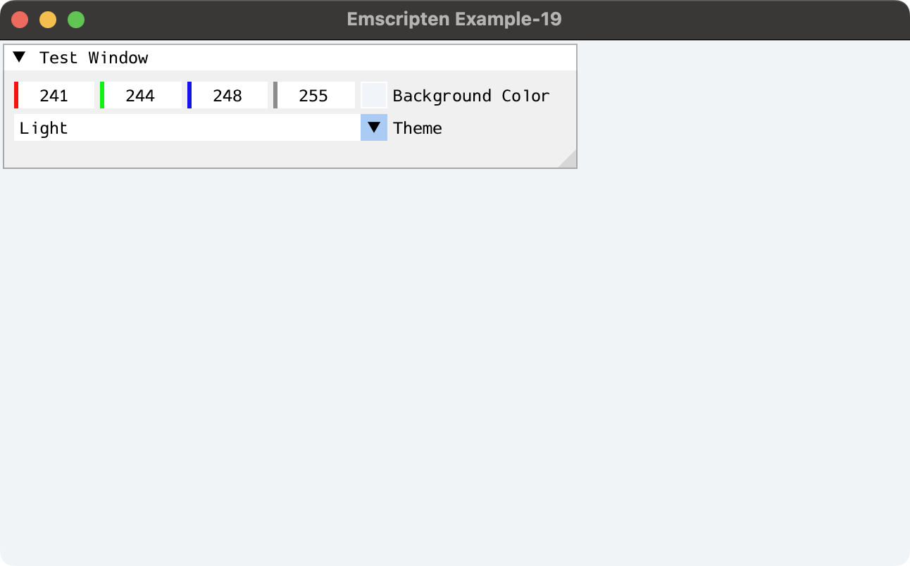
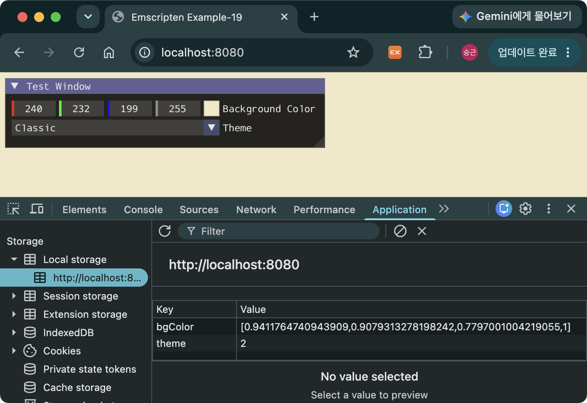
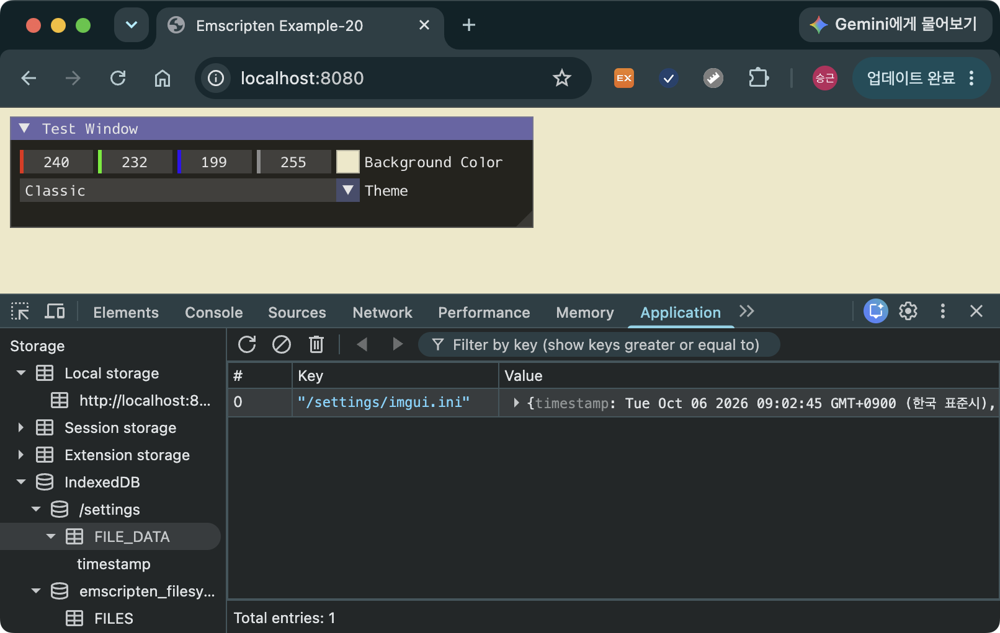

> [!SUMMARY]
> Emscripten의 가상 파일 시스템(VFS) 중 MEMFS는 파일을 메모리에 저장하기 때문에, 페이지를 새로고침하면 데이터가 사라진다. 이 글에서는 브라우저에 데이터를 유지하는 두 가지 방법(Local Storage, IDBFS)에 대해 소개한다.

## Local Storage - 파일이 필요 없는 작은 설정값

모든 데이터를 파일로 저장할 필요는 없다. 화면 크기, 음량, 테마처럼 작은 설정값은 Emscripten 파일 시스템에 기록하는 것보다 브라우저의 Local Storage에 직접 저장하는 편이 간단하다. 다만 Local Storage는 Emscripten의 VFS가 아니므로, C++ 코드에서 사용하기 위해 `EM_ASM`/`EM_JS`를 사용해야 한다.

[3D 그래픽스 개발환경 설정하기](/posts/setup-opengl-imgui/)의 예제에서 배경화면 색상과 테마 설정 값은 기억되지 않고, 페이지가 재시작되면 기본값으로 다시 설정된다. Native 환경에서는 배경색과 테마를 각각 파일에 저장했다가, 앱을 재실행할 때 이를 읽어 다시 설정한다. Web 환경에서는 사용자의 파일 시스템에 접근할 수 없기 때문에 Local Storage에 저장했다가 불러오는 방식으로 데이터를 유지한다.

### 소스 코드

> [!NOTE]
> [3D 그래픽스 개발환경 설정하기](/posts/setup-opengl-imgui/)에서 변경된 부분만 보여준다.

```CMake
# CMakeLists.txt
...

target_link_libraries(main PRIVATE imgui)

# nlohmann-json
add_library(nlohmann_json INTERFACE)

target_include_directories(nlohmann_json INTERFACE
  third_party
)

target_link_libraries(main PRIVATE nlohmann_json)
```

- JSON을 활용하기 위해 nlohmann-json을 프로젝트에 포함시킴

```C++
#include <iostream>
#include <cassert>

#ifdef __EMSCRIPTEN__
  #include <emscripten.h>
  #include <emscripten/html5.h>
#else
  #include <fstream>
  #include <glad/gl.h>  // GLAD
  #include <nlohmann/json.hpp>
  using json = nlohmann::json;
#endif

...

// Initial background color
float g_BgColor[4] = {0.0f, 0.1f, 0.2f, 1.0f};
int32_t g_Theme = 0;

namespace {

...

const char* g_ThemeNames[] = {"Dark", "Light", "Classic"};

#ifndef __EMSCRIPTEN__
constexpr const char* SETTINGS_FILE = "settings.json";

// Read settings.json as a JSON object (empty object if missing or invalid)
json readSettingsFile() {
  std::ifstream file(SETTINGS_FILE);
  if (!file) {
    return json::object();
  }

  auto settings = json::parse(file, nullptr, false);
  if (!settings.is_object()) {
    return json::object();
  }
  return settings;
}

void writeSettingsFile(const json& settings) {
  std::ofstream file(SETTINGS_FILE);
  if (!file) {
    std::cerr << "Failed to write " << SETTINGS_FILE << std::endl;
    return;
  }
  file << settings.dump(2) << std::endl;
}
#endif

void loadTheme() {
#ifdef __EMSCRIPTEN__
  // Local Storage에 저장했던 theme을 불러옴
  g_Theme = EM_ASM_INT({
    const themeIndex = localStorage.getItem('theme');
    return parseInt(themeIndex) | 0;
  });
#else
  const auto settings = readSettingsFile();
  g_Theme = settings.value("theme", 0);
#endif
}

void saveTheme() {
#ifdef __EMSCRIPTEN__
  EM_ASM({
    // Local Storage에 g_Theme 값을 저장
    localStorage.setItem('theme', $0);
  }, g_Theme);
#else
  auto settings = readSettingsFile();
  settings["theme"] = g_Theme;
  writeSettingsFile(settings);
#endif
}

void loadBgColor() {
#ifdef __EMSCRIPTEN__
  EM_ASM({
    // Local Storage에서 bgColor를 불러옴
    const color = JSON.parse(localStorage.getItem('bgColor') || '[0.0, 0.1, 0.2, 1.0]');
    HEAPF32.set(color, $0 >> 2);
  }, g_BgColor);
#else
  const auto settings = readSettingsFile();
  if (settings.contains("bgColor")) {
    settings["bgColor"].get_to(g_BgColor);
  }
#endif
}

void saveBgColor() {
#ifdef __EMSCRIPTEN__
  EM_ASM({
    // Local Storage에 g_BgColor를 저장
    localStorage.setItem('bgColor', JSON.stringify([$0, $1, $2, $3]));
  }, g_BgColor[0], g_BgColor[1], g_BgColor[2], g_BgColor[3]);
#else
  auto settings = readSettingsFile();
  settings["bgColor"] = g_BgColor;
  writeSettingsFile(settings);
#endif
}

bool applyTheme() {
  switch (g_Theme) {
    case 0:
      ImGui::StyleColorsDark();
      break;
    case 1:
      ImGui::StyleColorsLight();
      break;
    case 2:
      ImGui::StyleColorsClassic();
      break;
    default:
      assert(false && "Invalid theme");
      return false;
  }
  return true;
}

void renderFrame(GLFWwindow* window) {
  ...
  ImGui::Begin("Test Window");

  if (ImGui::ColorEdit4("Background Color", g_BgColor)) {
    saveBgColor();
  }

  if (ImGui::Combo("Theme", &g_Theme, g_ThemeNames, IM_ARRAYSIZE(g_ThemeNames))) {
    if (applyTheme()) {
      saveTheme();
    }
  }

  ImGui::End();
  ...
}

...

}  // namespace

int main() {
  ...
  // ImGui initialization
  IMGUI_CHECKVERSION();
  ImGui::CreateContext();
  ImGuiIO& io = ImGui::GetIO();
  io.Fonts->AddFontDefaultVector();

  loadTheme();
  applyTheme();

  ...
  glfwGetFramebufferSize(window, &framebufferWidth, &framebufferHeight);
  framebufferSizeCallback(window, framebufferWidth, framebufferHeight);

  loadBgColor();

  // Main loop
  ...
}
```

- ex-18에서 `ImGui::ShowDemoWindow()`와 `ImGui::StyleColorsDark()` 호출은 삭제됨
- `g_BgColor`: 배경색을 저장하는 전역 변수
- `g_Theme`: ImGui 테마를 저장하는 전역 변수
- `readSettingsFile`: Native 환경에서 settings.json을 읽어 배경색과 테마를 불러오는 함수
- `writeSettingsFile`: Native 환경에서 배경색과 테마를 settings.json에 저장하는 함수
- `loadTheme`: ImGui 테마를 불러오는 함수
- `saveTheme`: ImGui 테마를 저장하는 함수
- `applyTheme`: ImGui 테마를 적용하는 함수
- `loadBgColor`: 배경색을 불러오는 함수
- `saveBgColor`: 배경색을 저장하는 함수

### 빌드 및 실행하기

#### Native - macOS

```bash
cmake -S. -Bbuild/native
cmake --build build/native
./build/native/main
```


_그림 1. Native 환경(macOS)에서 실행한 모습. 앱을 재실행해도 배경색과 ImGui 테마가 유지된다. 배경색이나 테마를 변경하면 settings.json이 생성되는 것을 확인할 수 있다. 재실행해도 창의 크기와 위치 또한 잘 유지된다._

#### Web

```bash
emcmake cmake -S. -Bbuild/web
cmake --build build/web
python -m http.server 8080
```


_그림 2. Web 환경에서 실행한 모습. 앱을 재실행해도 배경색과 ImGui 테마가 유지된다. 배경색이나 테마를 변경하면 개발자 도구에서 Local Storage에 `theme`과 `bgColor`가 생성되는 것을 확인할 수 있다. 하지만 재실행해 보면 창의 크기와 위치는 유지되지 않는다._

### 예제 코드 및 테스트 환경

- https://github.com/dadak797/blog-examples/tree/master/examples/ex-19
- macOS Sonoma 14.6.1
  - Compiler: AppleClang 16.0.0.16000026
- Web
  - Compiler: emsdk 5.0.3

## IDBFS - 파일 전체를 유지하기

앞의 예제에서는 배경색과 테마를 유지하는 방법에 대해 소개했다. 하지만 앱을 재시작했을 때 Native 환경에서는 ImGui 창의 위치나 크기가 잘 유지되는 반면에 Web 환경에서는 창의 위치와 크기가 초기값으로 돌아간다. Native 환경에서는 이 설정 값들이 `imgui.ini`라는 파일에 자동 저장되기 때문이며, Web 환경에서는 이 자동 저장 파일을 저장 및 불러오는 방법이 필요하다. 이 장에서는 IDBFS를 이용하여 `imgui.ini` 파일을 브라우저의 IndexedDB에 저장하고, 불러오는 방법을 소개한다.

### IDBFS 마운트하기

```JavaScript
FS.mkdir('/data');
FS.mount(IDBFS, {}, '/data');
```

- MEMFS의 파일을 IndexedDB에 저장하기 위해서는 기존 VFS 디렉터리를 마운트 지점으로 삼아 IDBFS 인스턴스를 붙여야 함
- `/data` 디렉터리를 만든 뒤 해당 경로에 IDBFS를 마운트한다. `/data` 아래의 파일은 메모리상의 VFS에서 읽고 쓰며, 아래의 `FS.syncfs()`를 호출해 IndexedDB와 비동기로 동기화함
- [IDBFS](https://emscripten.org/docs/api_reference/Filesystem-API.html#filesystem-api-idbfs)

### MEMFS의 파일과 IDBFS의 파일 동기화

```
FS.syncfs(populate, callback);
```

- Emscripten은 브라우저의 IndexedDB와 MEMFS를 동기화하는 인터페이스를 제공함
- `populate`
  - `false`: MEMFS의 파일을 IndexedDB와 동기화함
  - `true`: IndexedDB의 파일을 MEMFS와 동기화함
- `callback`
  - 동기화가 완료된 이후 호출되는 콜백 함수
- [FS.syncfs](https://emscripten.org/docs/api_reference/Filesystem-API.html#FS.syncfs)

### 소스 코드

> [!NOTE]
> [Local Storage 예제](/posts/emscripten-file-persistency/#local-storage---파일이-필요-없는-작은-설정값)에서 변경된 부분만 보여준다.

```CMake
# CMakeLists.txt
...

target_link_options(main PRIVATE
  "-sUSE_GLFW=3"
  "-sMIN_WEBGL_VERSION=2"  # Set the minimum WebGL version to 2
  "-sMAX_WEBGL_VERSION=2"  # Set the maximum WebGL version to 2
  "-lidbfs.js"             # Use IDBFS to persist imgui.ini
)

...
```

- `-lidbfs.js`: IDBFS를 사용하기 위해 라이브러리를 링크해야 함

```C++
// main.cpp
#include <iostream>
#include <cassert>
#include <fstream>  // 네이티브 전용 블록에서 공통 영역으로 이동
#include <string>

...

#ifdef __EMSCRIPTEN__
...

constexpr const char* IMGUI_INI_PATH = "/settings/imgui.ini";
bool g_IniLoaded = false;

// Mount IDBFS and load imgui.ini once the browser storage is synced
void loadImGuiIni() {
  EM_ASM({
    FS.mkdir('/settings');
    FS.mount(IDBFS, {}, '/settings');  // Mount IDBFS in the browser at /settings
    // true: synchronize from the browser storage to the in-memory filesystem
    FS.syncfs(true, (err) => {
      if (err) console.error(err);
      _onImGuiIniSynced();
    });
  });
}

// Write imgui.ini to IDBFS and flush it to the browser storage
void saveImGuiIni() {
  size_t dataSize = 0;
  const char* data = ImGui::SaveIniSettingsToMemory(&dataSize);

  std::ofstream file(IMGUI_INI_PATH, std::ios::binary);
  file.write(data, dataSize);
  file.close();

  EM_ASM({
    // false: synchronize from the in-memory filesystem to the browser storage
    FS.syncfs(false, (err) => {
      if (err) console.error(err);
    });
  });
  ImGui::GetIO().WantSaveIniSettings = false;
}

// Called by emscripten_set_main_loop_arg
void browserMainLoop(void* argument) {
  ...
  // Wait until imgui.ini is loaded from IDBFS
  if (!g_IniLoaded) {
    return;
  }

  renderFrame(window);

  // Save the ini settings, when WantSaveIniSettings becomes true
  if (ImGui::GetIO().WantSaveIniSettings) {
    saveImGuiIni();
  }
}
#endif

}  // namespace

#ifdef __EMSCRIPTEN__
// Called from JavaScript when FS.syncfs(true) finishes
extern "C" EMSCRIPTEN_KEEPALIVE void onImGuiIniSynced() {
  std::ifstream file(IMGUI_INI_PATH, std::ios::binary);
  if (file) {
    std::string fileContents((std::istreambuf_iterator<char>(file)),
                             std::istreambuf_iterator<char>());
    ImGui::LoadIniSettingsFromMemory(fileContents.c_str(), fileContents.size());
  }
  g_IniLoaded = true;
}
#endif

int main() {
  ...
  ImGui::CreateContext();
  ImGuiIO& io = ImGui::GetIO();
  io.Fonts->AddFontDefaultVector();
#ifdef __EMSCRIPTEN__
  io.IniFilename = nullptr;  // Save imgui.ini manually to IDBFS
  loadImGuiIni();
#endif
  ...
}
```

- `loadImGuiIni`: 첫 로딩 시에 IndexedDB의 `imgui.ini` 파일을 불러와 창의 위치와 크기를 설정
- `saveImGuiIni`: `browserMainLoop`에서 `ImGui::GetIO().WantSaveIniSettings`가 true가 되면 MEMFS의 `imgui.ini` 파일을 IndexedDB에 저장
- `onImGuiIniSynced`
  - `loadImGuiIni`의 콜백 함수에서 호출되는 함수
  - JavaScript에서 호출하기 위해 `extern "C" EMSCRIPTEN_KEEPALIVE`를 통해 JavaScript로 노출함
  - JavaScript에서 호출할 때는 `_onImGuiIniSynced`처럼 언더스코어(`_`)를 붙임

### 빌드 및 실행하기

```bash
emcmake cmake -S. -Bbuild/web
cmake --build build/web
python -m http.server 8080
```


_그림 3. Web 환경에서 실행한 모습. 앱을 재실행해도 ImGui 창의 위치와 크기가 유지된다. 개발자 도구에서 IndexedDB에 `/settings/imgui.ini`가 생성된 것을 확인할 수 있다._

### 예제 코드 및 테스트 환경

- https://github.com/dadak797/blog-examples/tree/master/examples/ex-20
- Web
  - Compiler: emsdk 5.0.3

## FAQ



네, 가능합니다. 다만 이 글에서는 백엔드에 접근하지 않고 프론트엔드에서 모두 처리하는 방법을 소개합니다.





Local Storage는 간단하지만 key-value 구조로만 데이터를 저장할 수 있고, key와 value 모두 문자열만 가능합니다. 따라서 JSON 데이터를 저장하려면 직렬화 및 역직렬화 과정이 필요하며, 여러 필드의 데이터를 저장할 때는 key가 중복되지 않도록 설계해야 합니다.

저장 용량도 보통 5 MB 내외로 제한되므로 작은 데이터를 저장하는 용도로 사용하는 것이 적절합니다. 또한 동기적으로 작동하기 때문에 큰 데이터를 읽고 쓰면 메인 스레드가 블로킹된다는 단점이 있습니다.





`io.IniSavingRate`의 기본값이 5초이므로, 변경 직후에는 `WantSaveIniSettings`가 아직 설정되지 않았을 수 있습니다. 이후 `FS.syncfs(false)`의 콜백이 호출되어야 IndexedDB 반영까지 완료됩니다. 콜백 전에 탭을 닫으면 저장되지 않을 수 있습니다. 신경 쓰이면 `io.IniSavingRate`를 1초로 줄이면 됩니다.





사이트 데이터 삭제, 비공개 브라우징 종료, 저장 공간 부족 등에 의해 삭제될 수 있습니다.





브라우저 저장소는 `origin` 단위로 구분되므로 프로토콜, 호스트, 포트 중 하나만 달라도 별도의 저장소가 됩니다.





기본 설정에서는 `FS.syncfs(false)`를 호출해야 하며, `autoPersist: true` 마운트 옵션을 사용하면 자동으로 저장할 수 있습니다.



## 참고 자료

- [Emscripten File System API](https://emscripten.org/docs/api_reference/Filesystem-API.html)
