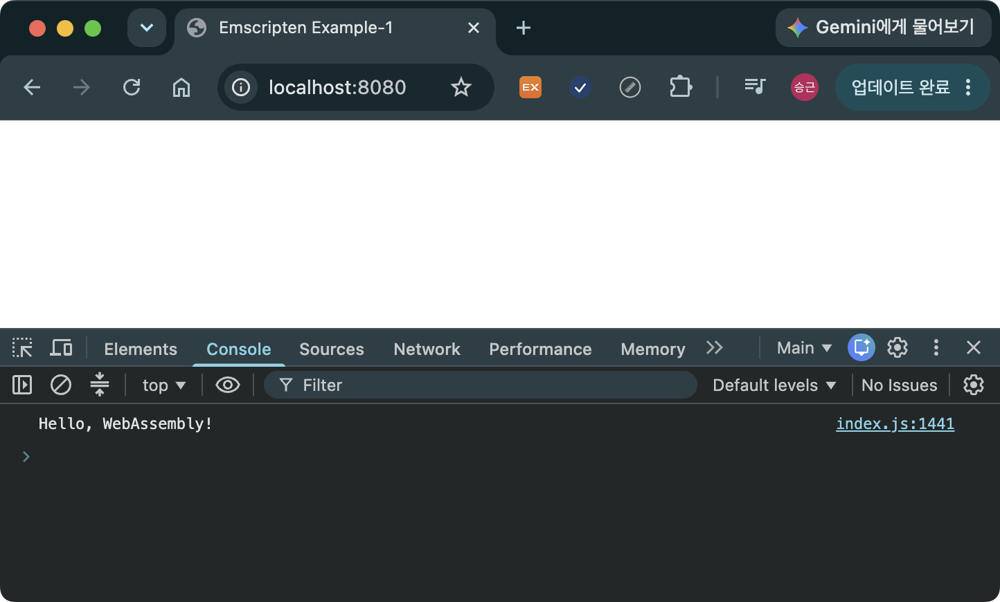
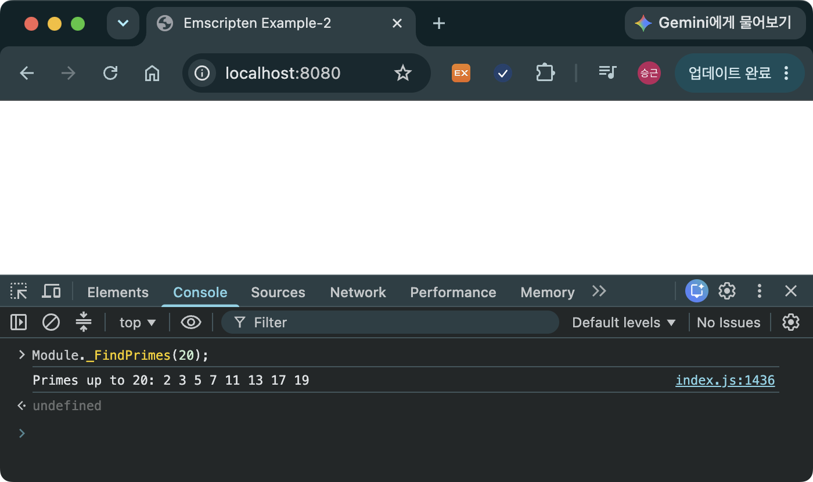

> [!SUMMARY]
> This guide covers how to install Emscripten on each platform, then builds C++ code into WebAssembly and runs examples in both Node.js and the browser.

## Installing on Windows (Command Prompt, CMD)

### 1. Install Prerequisites

- [Git](https://git-scm.com/install/windows)
- [Python](https://www.python.org/downloads/)

### 2. Clone the Repository

```bash
git clone https://github.com/emscripten-core/emsdk.git
cd emsdk  # move into the repository folder
```

### 3. Install and Activate the Latest Version

```bash
emsdk install latest
emsdk activate latest
```

### 4. Add Environment Variables

```bash
emsdk_env
```

- The command above only sets the environment variables for the current session. To make them permanent, add the base repository folder `emsdk`, along with `emsdk\upstream\emscripten` and `emsdk\node\{NODE_VERSION}\bin`, to your PATH.

### 5. Check emsdk Versions

```bash
emsdk list

# output
All recent (non-legacy) installable versions are:
         5.0.3    INSTALLED
         5.0.3-asserts
         5.0.2
         5.0.2-asserts
         5.0.1
         5.0.1-asserts
         5.0.0
         5.0.0-asserts
```

- If the list shows up correctly, the installation succeeded.
- It shows both the installable versions and the currently installed version (the one marked `INSTALLED`).

### 6. Install a Specific Version

```
emsdk install 5.0.0  # installs version 5.0.0
```

- Occasionally, when you pull in a static library built with a different version of emsdk and include it in your project, the build may fail or a runtime error may occur.
- In that case, it is recommended to install and use the same version with the command above.

> [!NOTE]
> If you are installing from PowerShell, run `.\emsdk.bat` instead of `emsdk`, and `.\emsdk_env.ps1` instead of `emsdk_env`.

## Installing on macOS

### 1. Install Prerequisites

- Git

```bash
brew install git
```

- Python

```bash
brew install python
```

### 2. Clone the Repository

- [Same as Windows](#2-clone-the-repository)

### 3. Install and Activate the Latest Version

```bash
./emsdk install latest
./emsdk activate latest
```

### 4. Add Environment Variables

```bash
source ./emsdk_env.sh
```

- The command above only sets the environment variables for the current session. To make them permanent, add the path to `emsdk_env.sh` to your `~/.zshrc` file.

```bash
# emsdk
source {EMSDK_INSTALL_PATH}/emsdk_env.sh
```

### 5. Check emsdk Versions

- [Same as Windows](#5-check-emsdk-versions)

### 6. Install a Specific Version

- [Same as Windows](#6-install-a-specific-version)

## Installing on Linux(Ubuntu)

### 1. Prerequisites

- Git

```bash
sudo apt update
sudo apt install git
```

- Python

```bash
sudo apt install python3 python3-pip python3-venv
```

### 2. Clone the Repository

- [Same as Windows](#2-clone-the-repository)

### 3. Install and Activate the Latest Version

- [Same as macOS](#3-install-and-activate-the-latest-version-1)

### 4. Add Environment Variables

```bash
source ./emsdk_env.sh
```

- The command above only sets the environment variables for the current session. To make them permanent, add the path to `emsdk_env.sh` to your `~/.bashrc` file.

```bash
# emsdk
source {EMSDK_INSTALL_PATH}/emsdk_env.sh
```

### 5. Check emsdk Versions

- [Same as Windows](#5-check-emsdk-versions)

### 6. Install a Specific Version

- [Same as Windows](#6-install-a-specific-version)

---

## Example 1

> [!GOAL]
> Write code that prints `"Hello, WebAssembly!"` to the console.

### Source Code

```cpp
// main.cpp
#include <iostream>

int main() {
  std::cout << "Hello, WebAssembly!" << std::endl;
  return 0;
}
```

### Building

```bash
em++ main.cpp -o main.js
```

- `em++`
  - Runs the C++ compiler, corresponding to `g++` in GCC/Clang.
  - `emcc` corresponds to `gcc`. Even if you build with `emcc`, a `.cpp` file is still compiled as C++.
- `-o`
  - Specifies the output file name, just like in GCC/Clang.
  - In Emscripten, the number of output files depends on the extension of the output file.
  - `{output_name}.wasm`
    - Generates only the WebAssembly binary (`.wasm`).
    - You must write the `.wasm` loading and glue code (`.js`) yourself.
  - `{output_name}.js`
    - Generates both `.wasm` and `.js`.
    - The most commonly used option.
  - `{output_name}.html`
    - Outputs `.wasm`, `.js`, and a test HTML file (`.html`).

### Running with Node.js

```bash
node main.js

# output
Hello, WebAssembly!
```

### Building so that HTML is Generated

```bash
em++ main.cpp -o index.html --shell-file template.html
```

- Using an HTML template lets you insert the glue code wherever you want.
- The HTML template file must contain `{{{ SCRIPT }}}`, and this part is replaced with the code that loads the glue code.
- We build as `index.html` so that it can be served by the Python web server.

### Running in the Browser

```bash
python -m http.server 8080
```

- Running the server with Python's http.server lets you run the build output in the browser.
- Accessing `localhost:8080` <span>&rarr;</span> loads `index.html` <span>&rarr;</span> loads `index.js` <span>&rarr;</span> loads `index.wasm`


_Figure 1. Running the first example's wasm code in the browser._

- The code written inside `main` runs automatically once the Wasm module finishes initializing.

### Example Code and emsdk Version

- https://github.com/dadak797/blog-examples/tree/master/examples/ex-1
- emsdk 5.0.3

## Example 2

> [!GOAL]
> Directly call a C++ function from both the browser and the Node.js runtime.

### Source Code

```c++
// prime_number.cpp
#include <iostream>
#include <emscripten.h>

extern "C" {
  EMSCRIPTEN_KEEPALIVE
  void FindPrimes(int limit) {
    if (limit < 2) {
      std::cout << "No primes" << std::endl;
      return;
    }

    std::cout << "Primes up to " << limit << ": ";

    for (int i = 2; i <= limit; ++i) {
      bool isPrime = true;
      for (int j = 2; j * j <= i; ++j) {
        if (i % j == 0) {
          isPrime = false;
          break;
        }
      }

      if (isPrime) {
        std::cout << i << " ";
      }
    }

    std::cout << std::endl;
  }
}
```

- `extern "C"`
  - Needed to prevent the compiler from changing the function name (prevents name mangling).
  - Regardless of whether you build with `emcc` or `em++`, mangling occurs as long as the file is `.cpp`.
- `EMSCRIPTEN_KEEPALIVE`
  - Keeps the function from being removed.
  - During optimization, Emscripten removes functions that are unused within the C++ code to reduce the output size.
  - Since Emscripten has no way of knowing whether a function will be called from the JavaScript side, you must explicitly mark it in the code to tell the compiler not to remove it.

> [!NOTE]
> **Name Mangling** - To support function overloading, C++ does not use the function name as-is; instead it mixes in information such as parameter types to create a unique internal name. When the name has been changed, the JavaScript side has no way of knowing it, so mangling must be prevented in order to call the function.

### Building

```bash
em++ prime_number.cpp -o index.js -s EXPORTED_FUNCTIONS="['_FindPrimes']"
```

- `-s`
  - Used to set compile options.
  - Set the option in the form `-s X=Y`
    - X is the type of compile option.
    - Y is the compile option parameter.
    - You may put a space after `-s` or not, but `X=Y` must be written with no spaces.
  - `EXPORTED_FUNCTIONS`
    - `_FindPrimes`: the name of the function to export. You must prefix the C++ function name with an underscore (`_`).

### Running in the REPL (Node.js Interactive Console)

- You can enter the interactive console by typing `node` in the terminal.

```node
> const Module = require('./index.js');
> Module._FindPrimes(20);

// output
Primes up to 20: 2 3 5 7 11 13 17 19
```

- `Module` represents the Wasm module.
- You must use `_FindPrimes`, which is the exported function name.

### Building so that HTML is Generated

```bash
em++ prime_number.cpp -o index.html --shell-file template.html -s EXPORTED_FUNCTIONS="['_FindPrimes']"
```

### Running in the Browser

```bash
python -m http.server 8080
```


_Figure 2. Running the second example's wasm code in the browser._

> [!CAUTION]
> When the Wasm output is large, it takes time for the Module to initialize, so calling an exported function immediately can cause an error. You should either define `Module.onRuntimeInitialized` as a callback so the function is called after initialization finishes, or wait long enough for initialization to complete before calling the function. This example is short, so running it sequentially in the interactive console causes no problems. In Example 1, the `main` function runs automatically once the Wasm module is initialized, so there was no need to worry about timing.

### Example Code and emsdk Version

- https://github.com/dadak797/blog-examples/tree/master/examples/ex-2
- emsdk 5.0.3

## FAQ

- Does building the same source on different operating systems produce the same output?
  - Yes. The `.wasm`, `.js`, and `.html` files are all identical regardless of the platform.
- What needs to match in order to build a pre-built library together with my own code into WebAssembly?
  - **Build target**: the library must also be built with Emscripten. Native binaries will not link.
  - **Emscripten version**: keep the library and your code on the same version. If they differ, the build may fail or a runtime error may occur.
  - **Compile options**: options that affect the ABI, such as `-pthread` (multithreading) or `-sMEMORY64=1` (memory model), must be the same on both sides. If they differ, the build fails.
- Why can't I just double-click `index.html` and open it directly in the browser?
  - When opened via `file://`, the browser's security policy prevents it from loading the `.wasm`. That is why we start a local server with `python -m http.server` and connect via `localhost`.
- I get a "command not found" error for `emsdk`.
  - Environment variables reset in a new terminal. Run `emsdk_env` (Windows) or `source ./emsdk_env.sh` (macOS/Linux) each time, or register them permanently in your PATH. On macOS/Linux, when `emsdk` is not on your PATH, you need to prefix it with `./`, as in `./emsdk`.
- If the `.js` is all I need, why is a separate `.wasm` also generated?
  - The actual compiled code lives in the `.wasm`, while the `.js` is the glue code that loads and initializes that `.wasm` and connects it to JS. Both the browser and Node.js run the `.wasm` through the `.js`, so the two files must be in the same location.
- `node main.js` works, so why does the browser need a server?
  - Node.js can read the `.wasm` directly from the file system, but the browser cannot fetch a `.wasm` over `file://`. That is why a local server is only needed for browser execution.

## References

- [Emscripten - Download and Install](https://emscripten.org/docs/getting_started/downloads.html)
- [Emscripten - Interacting with code](https://emscripten.org/docs/porting/connecting_cpp_and_javascript/Interacting-with-code.html)
