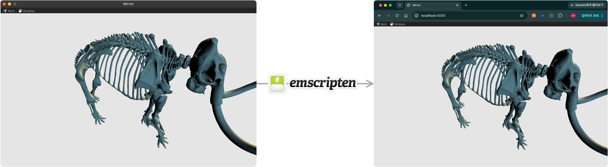

> [!SUMMARY]
> Emscripten은 C/C++ 코드를 WebAssembly 코드(.wasm)로 변환해주는 컴파일러이며, 이 WebAssembly를 통해 브라우저에서 돌아가는 고성능 어플리케이션을 만들 수 있다.

## 웹어셈블리(WebAssembly)

- WebAssembly(Wasm)는 브라우저에서 네이티브에 가까운 속도로 돌아가는 바이너리 포맷
- JavaScript를 대체하는게 아니라 단점을 보완하는 기술
- 사람이 직접 작성하는 것이 아니라 컴파일 타깃이기 때문에, C/C++로 작성된 코드를 Wasm으로 바꿔주는 도구가 필요하고 Emscripten이 그 역할을 함 (Rust로 작성된 코드는 자체 LLVM 백엔드를 이용하여 Wasm으로 변환을 할 수 있음)

## Emscripten

- Emscripten은 C/C++로 작성된 코드를 WebAssembly 바이너리(.wasm)와 JavaScript 접착 코드(.js)로 변환해주는 컴파일러
- 런타임에 Wasm 모듈은 DOM을 직접 접근할 수 없지만, 접착 코드(.js)를 이용하여 웹 브라우저의 DOM과 Web API에 접근할 수 있음
- Node.js 환경에서도 접착 코드를 이용하여 Wasm 모듈의 기능을 활용할 수 있음

_그림 1. Emscripten은 C/C++를 `.wasm` 바이너리와 `.js` glue로 컴파일하며, 이 glue가 WebAssembly와 DOM·Web API를 이어준다._

## 좋은 점

1. 빠름
   - WebAssembly는 미리 컴파일된 바이너리 포맷이라, JavaScript처럼 실행 중에 파싱·최적화하는 단계 없이 곧바로 실행됨
   - 다만 성능 이점은 문제 유형에 따라 달라서, 무거운 연산에서는 큰 차이가 나지만 가벼운 작업에서는 경계 호출 비용 때문에 이점이 작을 수 있음
2. 재활용성
   - 기존에 작성된 방대한 C++ 기반의 코드 재활용 가능
   - 빌드된 Wasm 모듈을 통째로 가져와서 사용할 수도 있음. Pyodide는 CPython을 Emscripten으로 빌드한 모듈로, 이 모듈을 이용하면 브라우저에서 Python을 돌릴 수 있음
3. 보안성
   - 기본적으로 격리된 실행 모델을 제공함. Wasm 모듈은 선형 메모리 밖으로 나갈 수 없음
   - Wasm 모듈에서는 JS로부터 import 된 기능만 사용할 수 있고, JS에서도 Wasm 모듈에서 export 한 기능만 사용할 수 있음
   - 다만 이 격리의 실제 범위는 호스트(JS)가 무엇을 import로 넘겨주느냐에 따라 정해짐
4. 서버의 부하를 분산
   - 서버에서 처리하던 무거운 작업도 브라우저에서 처리할 수 있음 (PC에서 처리 가능한 범위 내에서)

## 안 좋은 점

1. 사용자 파일 접근
   - 브라우저 환경 안에서 동작하기 때문에 사용자의 파일에 직접 접근할 수 없음. HTML input 태그의 file 속성으로 파일을 불러온 뒤 WebAssembly 메모리로 복사하는 과정이 필요하여 native 환경에 비해 로딩이 번거롭고 느림
   - 로딩 시점에 필요한 리소스는 미리 Wasm이 읽을 수 있는 형태로 가상 파일시스템에 넣어둬야 하며, 링크 옵션(`--preload-file`)으로 이 과정을 처리함
2. HTML의 DOM에 접근성
   - WebAssembly에서 DOM에 직접 접근할 수는 없고, 별도의 매크로(`EM_JS`, `EM_ASM` 등)를 이용하여 JavaScript를 통해 접근해야 함
3. 모듈 초기 로딩
   - Wasm 모듈(.wasm)과 JS 연동을 위한 glue 코드(.js)를 다운로드해야 해서 첫 로딩이 무거울 수 있음
4. JS &harr; Wasm 경계 호출 오버헤드
   - 경계를 자주 넘나들거나 문자열·큰 데이터를 주고 받는 경우에는 변환·메모리 복사 비용(marshaling)이 커질 수 있음
5. 멀티스레딩
   - 멀티스레딩을 사용하려면 SharedArrayBuffer가 필요하고, 이를 위해 COOP/COEP 헤더 설정이 강제됨
   - 설정 자체는 간단하지만, COEP는 페이지 전체에 적용되는 전역 정책이라 외부 CDN·서드파티 위젯 등 교차 출처 리소스가 함께 대응돼 있어야 함. 자체 호스팅 중심의 앱에서는 부담이 적지만, 외부 의존이 많은 사이트에서는 호환성 점검이 필요함

## 어떤 경우에 사용하는게 좋을까?

- 서버 왕복 없이 클라이언트에서 처리를 끝내고 싶을 때 (프라이버시 이점도 있음)
  - 예) FFmpeg.wasm (브라우저 내 미디어 변환), sql.js (브라우저 내 SQL DB)
- 대규모·고성능 연산이나 저지연 실시간 처리가 필요한 웹 앱
  - 예) Figma, Photoshop Web
- 기존 대형 C/C++ 앱을 웹으로 이식하고 싶을 때 - 예) AutoCAD Web, Google Earth
  
  _그림 2. 네이티브(왼쪽)로 작성한 C++ 3D 뷰어를 Emscripten으로 컴파일해 웹 브라우저(오른쪽)에서 동일하게 실행한 모습. 같은 코드가 두 환경에서 그대로 동작한다._
- 여러 플랫폼에서 동일한 핵심 로직을 공유하고 싶을 때 (C++ 코어 하나로 네이티브 앱 + 웹)
- 성숙한 C/C++ 라이브러리를 재작성 없이 웹에 그대로 가져오고 싶을 때
  - 예) OpenCASCADE (CAD 커널), VTK (과학·의료 시각화)

> [!NOTE]
> 위 제품들이 Emscripten/Wasm을 쓴다는 정보는 시점에 따라 바뀔 수 있으므로, 인용 시 각 사의 엔지니어링 자료로 최신 여부를 확인하는 것이 좋다.

## 참고 자료

- [Emscripten 공식 문서](https://emscripten.org/docs/)
- [WebAssembly 공식 홈페이지](https://webassembly.org/)
