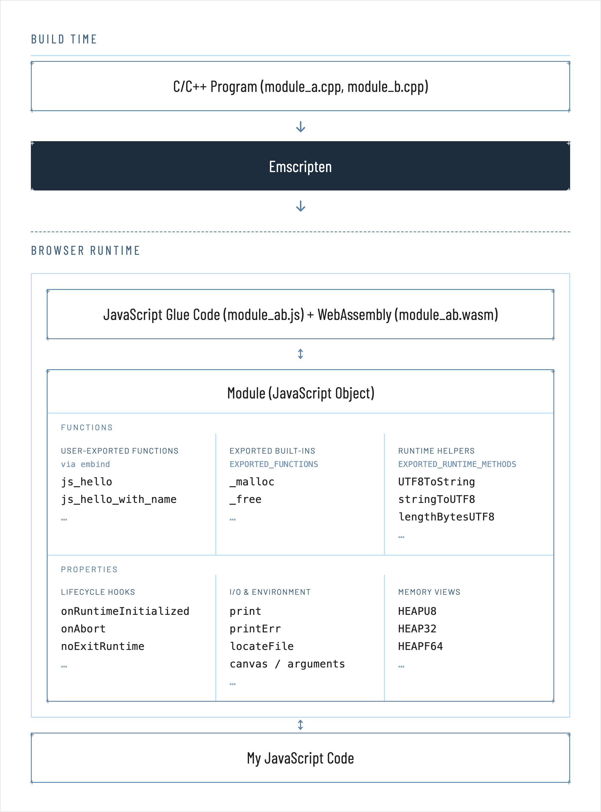
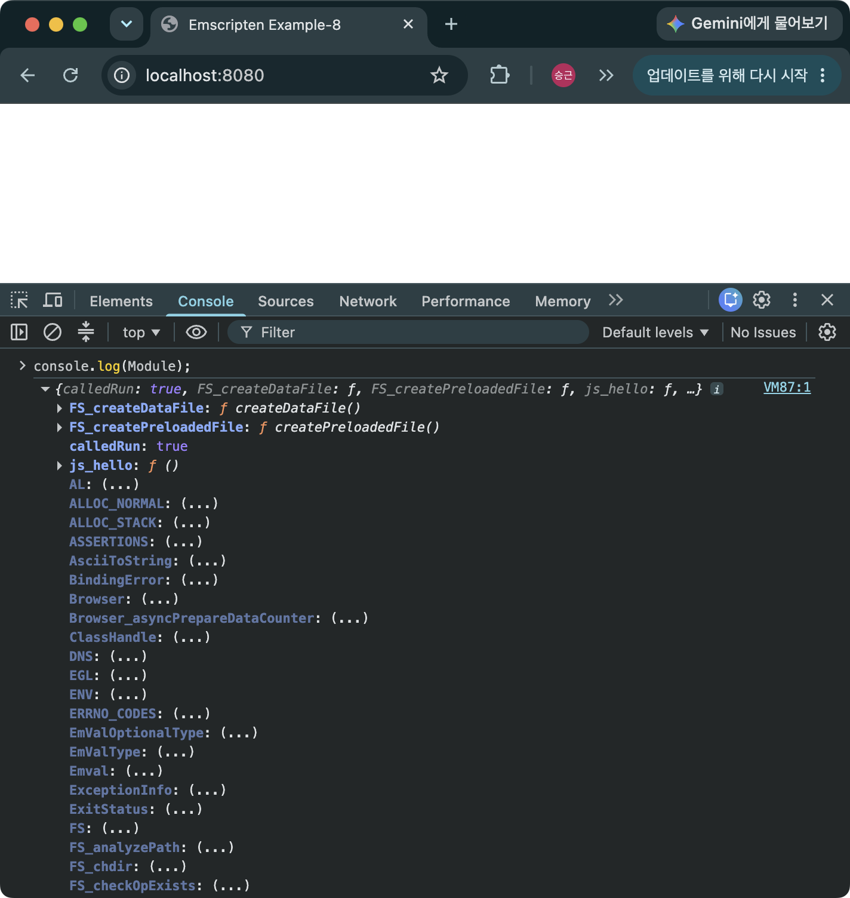
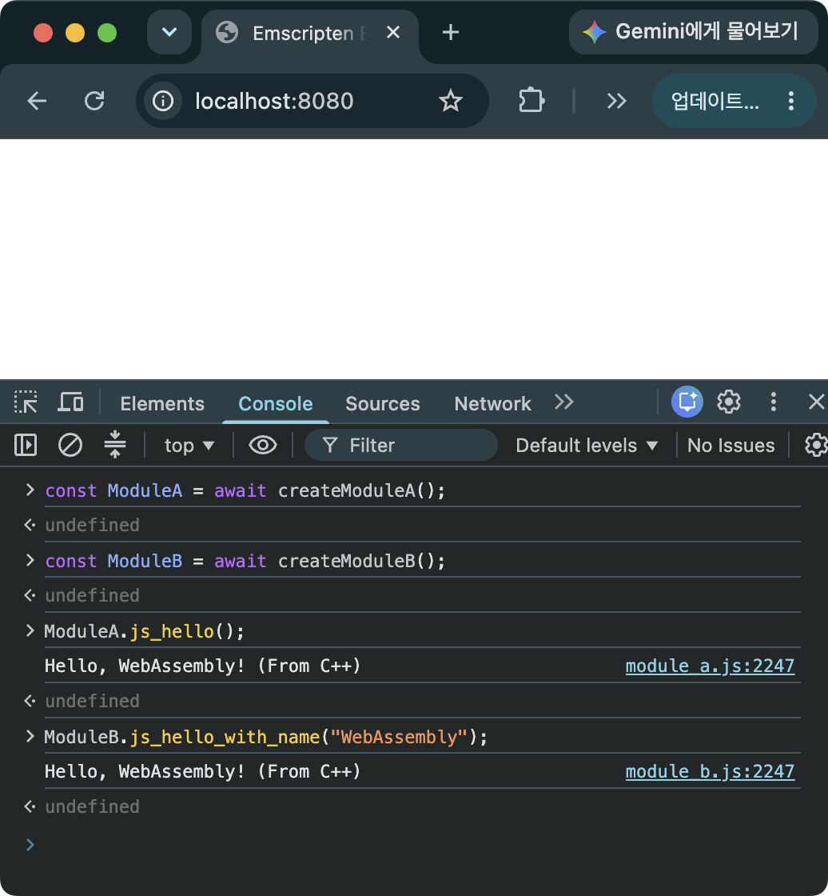
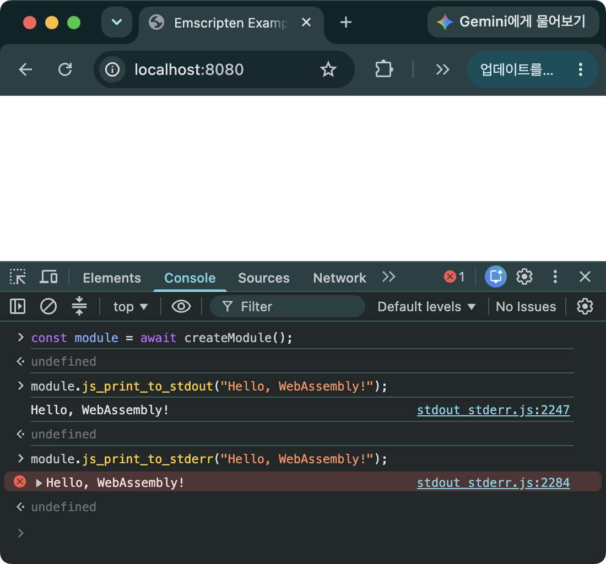
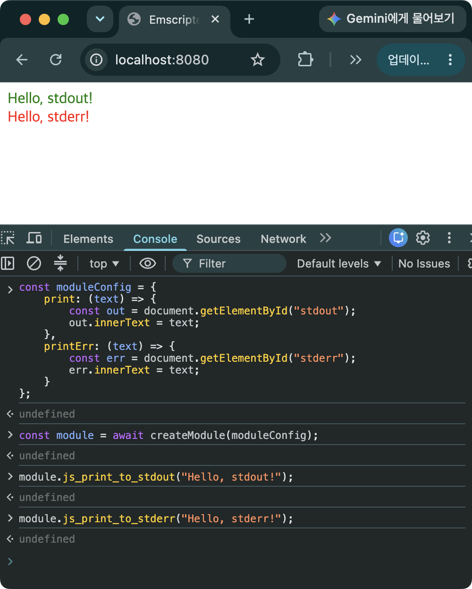

> [!SUMMARY]
> Emscripten Module의 역할, 초기화 설정 및 사용 방법에 대해 설명한다.

## Emscripten Module이란?

Emscripten Module은 Emscripten이 생성한 JavaScript 접착 코드의 동작을 외부에서 설정하거나 제어하기 위한 전역 JavaScript 객체이다. Module의 주요 역할은 아래와 같다.

1. Module의 속성을 설정하여 실행 동작을 제어
2. 내보낸 함수나 런타임 메서드에 접근할 수 있게 해줌
3. Heap 메모리 뷰 접근


_그림 1. Emscripten Module Diagram_

## Module 생성 하기

WebAssembly를 빌드 옵션 중에 출력 파일 옵션(`-o`)을 `{출력_파일_이름}.js`나 `{출력_파일_이름}.html`로 설정([Emscripten 설치하기 - 예제 빌드하기](/posts/emscripten-install/#빌드하기))하면 JavaScript 접착 코드가 Wasm과 함께 생성되며 Module은 JavaScript 접착 코드에 자동으로 생성된다. 이 때 [Embind](/posts/embind/)로 내보낸 함수와 클래스, [`EXPORTED_FUNCTIONS`](/posts/call-cpp-from-js/#c-함수-내보내기)로 내보낸 함수, [`EXPORTED_RUNTIME_METHODS`](/posts/call-cpp-from-js/#javascript에서-c로-문자열-넘기기)로 내보낸 헬퍼 함수들이 모두 Module에 등록된다. Emscripten이 자동으로 생성하는 Module의 속성, 함수 목록은 직접 출력하여 확인할 수 있다.


_그림 2. Module 속성과 함수 목록_

> [!NOTE]
> 출력 파일 옵션(`-o`)을 `{출력_파일_이름}.wasm`로 설정하고 빌드하면 Wasm 파일만 생성되어 Module 객체가 자동으로 생성되지 않는다. 사용자가 직접 제어할 수 있는 부분이 많아 최적화가 가능하겠지만, JS Glue 코드를 Emscripten 버전에 맞게 작성한다는 것이 매우 어려운 일이기 때문에 추천하지 않는다.

### 소스 코드

```C++
// module_a.cpp
#include <emscripten/bind.h>
#include <string>
#include <iostream>

void hello() {
  std::cout << "Hello, WebAssembly! (From C++)" << std::endl;
}

EMSCRIPTEN_BINDINGS(moduleA) {
  emscripten::function("js_hello", &hello);
}

// module_b.cpp
#include <emscripten/bind.h>
#include <string>
#include <iostream>

void hello_with_name(const std::string& name) {
  std::cout << "Hello, " << name << "! (From C++)" << std::endl;
}

EMSCRIPTEN_BINDINGS(moduleB) {
  emscripten::function("js_hello_with_name", &hello_with_name);
}

// index.html
<!doctype html>
<html>
  <head>
    <title>Emscripten Example-9</title>
  </head>
  <body>
    <script async type="text/javascript" src="module_ab.js"></script>
  </body>
</html>
```

### Module의 생성 옵션

```bash
em++ module_a.cpp module_b.cpp -o module_ab.js -lembind {Module_생성_옵션}
```

- 옵션을 추가하지 않는 경우 (Non-MODULARIZE)
  - 기본 이름(Module)으로 Module 객체가 생성됨
  - 모듈의 초기화가 완료되면 바로 내보낸 함수를 사용할 수 있음 `Module.js_hello();`
  - 초기화가 완료되지 않은 경우에 Module을 사용하게 되면 `Module is not defined` 오류가 발생함
  - 초기화 이후에 안정적으로 Module을 사용하기 위해서는 Module의 속성인 `onRuntimeInitialized` 콜백 함수를 통해 호출하고 싶은 함수를 설정해야 함. 충분히 초기화 시간을 제공한 이후 직접 함수를 호출하는 경우라면 `onRuntimeInitialized`를 이용하여 설정하지 않아도 됨

```HTML
<script>
  var Module = {
    onRuntimeInitialized: function () {
      Module.js_hello();
    },
  };
</script>
<script async type="text/javascript" src="module_a.js"></script>
```

- `-s MODULARIZE`
  - 기본 이름(Module)의 팩토리 함수가 내보내짐
  - 이 팩토리 함수를 이용하여 모듈을 생성할 수 있음
  - `const myModule = await Module(); myModule.js_hello();`
  - 여기서 `Module`은 전역에 내보내진 팩토리 함수의 이름이고, `myModule`은 그 팩토리를 호출해서 얻은 인스턴스를 담는 변수로, 특별히 전역이거나 이름이 고정될 필요 없이 원하는 대로 정할 수 있음
- `-s EXPORT_NAME="createModule"`
  - `-s MODULARIZE`와 함께 사용하여 내보내는 팩토리 함수의 이름을 설정할 수 있음. 단독으로 이 옵션을 사용하는 것은 의미가 없음
  - `const myModule = await createModule(); myModule.js_hello();`
  - 팩토리 함수를 호출할 때, 미리 정의한 Module의 속성을 인자로 전달할 수 있음
  - `onRuntimeInitialized`에서 함수의 호출을 `Module.js_hello();`가 아닌 `this.js_hello();`로 하는 것에 주의
  - `createModule`에 의한 초기화가 완료되면 `js_hello`가 호출됨

```JavaScript
var moduleConfig = {
  onRuntimeInitialized: function () {
    this.js_hello();
  },
};
const myModule = await createModule(moduleConfig);
```

> [!NOTE]
> Module의 속성을 지정 방식의 차이점
>
> - Non-MODULARIZE 방식은 JS 접착 코드가 로드되기 전에, 전역 `Module` 객체를 미리 정의해 속성을 설정한다. JS 접착 코드는 이미 존재하는 전역 `Module`을 발견하면 그 위에 런타임 내용을 얹으므로, 미리 설정한 속성이 적용된다.
> - MODULARIZE 방식은 전역 `Module`이 없으므로, 설정 속성을 담은 객체를 만들어 팩토리 함수의 인자로 전달한다. 팩토리는 이 객체를 바탕으로 인스턴스를 초기화한다.

> [!CAUTION]
> 같은 `EMSCRIPTEN_BINDINGS`의 이름(`moduleA`, `moduleB`)을 사용하고 하나의 Wasm으로 빌드하면 빌드 자체는 가능하지만 Module 객체 생성 시에 오류가 발생함. 여러 바인딩 블록을 생성하는 경우에는 독립적인 이름을 사용해야 함 ([일반 함수 바인딩 하기 - Embind](/posts/embind/#일반-함수-바인딩-하기))
>
> ```
> Uncaught (in promise) BindingError: Cannot register multiple overloads of a function with the same number of arguments (0)!
> ```

## 두 개의 모듈로 빌드하고 내보낸 함수 실행하기

두 소스코드를 별도의 JS 접착 코드와 Wasm으로 빌드하고, 별도의 Module로 로딩할 수 있음

- 장점
  - 처음엔 하나의 module_a만 필요하고 module_b는 나중에 필요하다면, 초기 로딩이 가벼워지고 module_b는 지연 로딩 할 수 있음
  - Module이 수정된 경우 그 Module만 다시 빌드/배포하면 됨
  - Wasm의 병렬 fetch가 가능함
- 단점
  - 다른 Wasm 메모리 간에 공유가 불가능 하기 때문에, Module 간에 결합도가 높은 경우에는 JS를 거쳐 데이터 복사를 통해 주고 받아야 하는 비효율성이 발생함
  - Wasm/JS 접착 코드가 Emscripten 런타임을 각자 포함하므로 중복 오버헤드가 커질 수 있음 ([Emscripten 소개 - 단점](/posts/emscripten-intro/#단점))

### 빌드하기

```bash
em++ module_a.cpp -o module_a.js -lembind
em++ module_b.cpp -o module_b.js -lembind
python -m http.server 8080
```

- 위와 같이 각각 빌드된 접착 코드(`module_a.js`, `module_b.js`)를 호출하면 Module의 기본 이름을 그대로 사용하기 때문에 두 번째 로딩된 Wasm은 Module 객체를 생성하지 못하고 오류가 발생함
- 따라서, 별도의 이름으로 모듈을 초기화 해야 함

```bash
em++ module_a.cpp -o module_a.js -lembind -s MODULARIZE -s EXPORT_NAME="createModuleA"
em++ module_b.cpp -o module_b.js -lembind -s MODULARIZE -s EXPORT_NAME="createModuleB"
python -m http.server 8080
```

- 각 Module의 팩토리 함수를 `createModuleA`와 `createModuleB`로 내보냄

### 실행하기

```HTML
<script async type="text/javascript" src="module_a.js"></script>
<script async type="text/javascript" src="module_b.js"></script>
```

- JS 접착 코드를 호출하는 부분 수정


_그림 3. 두 개의 모듈을 생성하고 각각의 모듈에서 내보낸 함수를 호출하는 모습_

### 실행 스크립트

```JavaScript
const ModuleA = await createModuleA();
const ModuleB = await createModuleB();
ModuleA.js_hello();
ModuleB.js_hello_with_name("WebAssembly");
```

### 예제 코드 및 emsdk 버전

- https://github.com/dadak797/blog-examples/tree/master/examples/ex-9
- emsdk 5.0.3

## Module의 속성을 설정하여 동작 제어하기 - 출력 방식 변경

Module에는 내보낸 함수 뿐만 아니라 동작을 제어하기 위한 여러 속성들이 포함되어 있다. 앞의 예제에서 나온 `Module.onRuntimeInitialized`도 이러한 속성 중의 하나로 Module이 초기화 된 이후의 동작을 설정할 수 있다. `Module.print`, `Module.printErr`과 같이 JS Glue 코드에서 기본적으로 제공하는 속성들이 있으며 이 속성을 override 하여 사용한다고 생각할 수 있다.

- `Module.print`: C++ 코드에서 `printf`, `std::cout`을 통해 전달되는 stdout을 어떤 방식으로 사용할 지 설정할 수 있다. JS Glue 코드에서 제공하는 기본 기능을 이용하면 stdout에 전달된 문자열을 `console.log` 함수를 이용하여 콘솔에 출력한다.
- `Module.printErr`: C++ 코드의 `fprintf(stderr, ...)`, `std::cerr`을 통해 전달되는 stderr을 어떤 방식으로 사용할 지 설정

### 소스 코드

```C++
#include <emscripten/bind.h>
#include <string>
#include <iostream>

void print_to_stdout(const std::string& message) {
  std::cout << message << std::endl;
}

void print_to_stderr(const std::string& message) {
  std::cerr << message << std::endl;
}

EMSCRIPTEN_BINDINGS(my_module) {
  emscripten::function("js_print_to_stdout", &print_to_stdout);
  emscripten::function("js_print_to_stderr", &print_to_stderr);
}

// index.html
<!doctype html>
<html>
  <head>
    <title>Emscripten Example-10</title>
  </head>
  <body>
    <div id="stdout" style="color: green"></div>
    <div id="stderr" style="color: red"></div>
    <script async type="text/javascript" src="stdout_stderr.js"></script>
  </body>
</html>
```

### 빌드하기

```bash
em++ stdout_stderr.cpp -o stdout_stderr.js -lembind -s MODULARIZE -s EXPORT_NAME="createModule"
```

### 실행하기


_그림 4. `js_print_to_stdout`은 `console.log`로 `js_print_to_stderr`은 `console.error`로 전달되어 출력되는 것을 알 수 있다._

### stdout과 stderr로 전달된 값을 받아 HTML 수정하기

```JavaScript
const moduleConfig = {
  print: (text) => {
    const out = document.getElementById("stdout");
    out.innerText = text;
  },
  printErr: (text) => {
    const err = document.getElementById("stderr");
    err.innerText = text;
  }
};
const module = await createModule(moduleConfig);
```

- `print`, `printErr` 속성에 해당하는 콜백 함수가 DOM을 조작하도록 override 함


_그림 5. `js_print_to_stdout`, `js_print_to_stderr`를 호출하면 더 이상 콘솔에 출력하지 않고, HTML에 렌더링 하는 것을 알 수 있다._

### 예제 코드 및 emsdk 버전

- https://github.com/dadak797/blog-examples/tree/master/examples/ex-10
- emsdk 5.0.3

## 그 밖의 Module 생성 옵션

- `--pre-js`
  - Wasm을 빌드할 때 사용하는 옵션
  - `--pre-js config.js`: 같이 전달된 JavaScript 파일(config.js)이 JS Glue 코드의 Module 생성 부분 앞쪽에 배치됨
  - 아래와 전달한 객체를 override 하여 Module을 생성하게 됨

```JavaScript
// config.js
const Module = {
  print: (text) => {
    const out = document.getElementById("stdout");
    out.innerText = text;
  },
  printErr: (text) => {
    const err = document.getElementById("stderr");
    err.innerText = text;
  }
};
```

- `--post-js`
  - Wasm을 빌드할 때 사용하는 옵션
  - `--post-js config.js`: 같이 전달된 JavaScript 파일(config.js)이 JS Glue 코드의 가장 뒤쪽에 배치됨
  - 여기에 포함된 JavaScript 코드가 Module이 생성된 이후에 호출되는 것을 보장하지 않는다는 점에 주의해야 함. Module 생성 이후의 시점에 호출하기 위해서는 `onRuntimeInitialized` (Non-MODULARIZE) 또는 팩토리 함수(MODULARIZE)가 반환한 Promise의 `.then()`에 추가해야 함

## 그 밖의 유용한 속성

- `Module.arguments`
  - 지정한 값이 main 함수의 argc, argv에 전달됨

```C++
// main.cpp
#include <iostream>

int main(int argc, char **argv) {
  for (int i = 0; i < argc; ++i) {
    std::cout << "Argument " << i << ": " << argv[i] << std::endl;
  }
  return 0;
}

// 빌드
em++ main.cpp -o main.js -s MODULARIZE -s EXPORT_NAME="createModule"

// 실행
const moduleConfig = {
  arguments: ["arg1", "arg2", "arg3"],
};
const module = await createModule(moduleConfig);

// 실행 결과
Argument 0: ./this.program
Argument 1: arg1
Argument 2: arg2
Argument 3: arg3
```

- `Module.locateFile`
  - JS 접착 코드를 로딩할 때, 접착 코드는 보통 Wasm 파일(`.wasm`)이나 데이터 파일(`.data`)을 같이 로딩해야 함. 이 때 Wasm 파일이나 데이터 파일은 JS 접착 코드와 다른 URL에서 불러오고 싶을 때 사용

```JavaScript
// JS 접착 코드는 루트에 있고, Wasm은 /wasm/ 폴더에 있는 경우의 예시
const Module = {
  locateFile: function(path, prefix) {
    if (path.endsWith(".wasm")) {
      return "/wasm/" + path;
    }
    return prefix + path;
  }
};

// CDN에서 wasm을 서빙할 때의 예시
const Module = {
  locateFile: function(path) {
    return "https://cdn.example.com/wasm/" + path;
  }
};
```

- `Module.onAbort`
  - 프로그램이 비정상적으로 종료될 때 호출되는 콜백 함수를 지정

```JavaScript
const Module = {
  onAbort: function(reason) {
    console.error('WASM aborted:', reason);
  }
};
```

- `Module.onRuntimeInitialized`
  - 앞에서도 간단히 소개되었고, 가장 자주 사용하는 속성 중 하나
  - Emscripten 런타임의 초기화가 완전히 끝나고 컴파일된 코드를 안전하게 실행할 수 있음

```JavaScript
const Module = {
  onRuntimeInitialized: function() {
    // 초기화 된 이후에 실행할 코드를 여기에 작성
  }
};
```

- `Module.noExitRuntime`
  - `true`로 설정하면 C++의 main 함수가 종료된 이후에도 C++ 코드를 계속 사용할 수 있음
  - `emscripten_set_main_loop(...)`처럼 Wasm 런타임이 계속 살아있어야 하는 것이 명백한 경우에는 Emscripten이 이 설정을 자동으로 처리하는 경우도 있음

```JavaScript
const Module = {
  noExitRuntime: true
};
```

- `Module.noInitialRun`
  - `true`로 설정하면 `main` 함수를 자동으로 실행하지 않음
  - `Module.callMain()`으로 `main` 함수를 호출 시점을 정할 수 있음. 단, `callMain`도 기본적으로 Module에 내보내지지 않으므로 `EXPORTED_RUNTIME_METHODS`에 추가해야 함

```JavaScript
const Module = {
  noInitialRun: true
};
```

- `Module.preInit`, `Module.preRun`, `Module.postRun`
  - 아래의 초기화 순서를 고려하여 처리해야 할 동작을 정의할 수 있음

```
JS runtime basic initializer → preInit → preRun → C/C++ global initializer → main() → postRun
```

- `Module.instantiateWasm`
  - 고급 기능이지만 중요한 API
  - 일반적으로 Emscripten이 `.wasm` 다운로드 → WebAssembly 컴파일 → WebAssembly 인스턴스 생성을 알아서 수행하는데 이 과정을 직접 제어하고 싶을 때 사용함
  - 비동기 작업을 병렬화하여 초기화를 빠르게 수행하고 싶을 때 사용

```JavaScript
Module = {
  instantiateWasm: async (imports, successCallback) => {
    // Wasm 바이너리를 찾고/가져온다.
    const result = await /* custom wasm instantiation */;
    successCallback(
      result.instance,
      result.module
    );
  };
};
```

## FAQ

- [`EM_ASM`/`EM_JS`](/posts/call-js-from-cpp/)로 JS를 호출하는 C++ 코드가 있는데, `MODULARIZE`와 `EXPORT_NAME`으로 빌드하면 모듈 이름을 C++ 작성 시점에 알아야 하나요?
  - 아니요. `-sMODULARIZE -sEXPORT_NAME=createModuleA`로 빌드해도 `EM_JS`/`EM_ASM`에서는 일반적으로 `Module`을 사용하면 됩니다.
  - 일반적인 `-sMODULARIZE` 빌드에서 `EXPORT_NAME`으로 지정하는 이름(예: `createModuleA`)은 외부 JavaScript에서 모듈 인스턴스를 생성하기 위한 factory function의 이름입니다.
  - 반면 `EM_ASM`/`EM_JS` 안에서 사용하는 `Module`은 생성된 접착 코드의 private scope 안에서 현재 모듈 인스턴스를 참조하는 이름입니다. 따라서 `EXPORT_NAME`과는 역할이 다르며, C++ 코드가 `EXPORT_NAME` 값을 알 필요는 없습니다.
  - 단, 실험적인 `-sMODULARIZE=instance` 모드에서는 현재 `EM_JS` 및 JS library code 내부의 `Module` 사용이 지원되지 않습니다. 일반적인 `MODULARIZE + EXPORT_ES6`는 이 제한과 구별해야 합니다. (emsdk 6.0.8 기준)

- Module을 통해 Wasm의 Heap 메모리에는 어떻게 접근하나요?
  - Module은 Wasm의 선형 메모리를 가리키는 타입드 배열 뷰를 제공합니다. 대표적으로 `Module.HEAP8`/`Module.HEAPU8`(8비트), `Module.HEAP32`/`Module.HEAPU32`(32비트 정수), `Module.HEAPF64`(64비트 부동소수점) 등이 있으며, 원하는 단위로 메모리를 직접 읽고 쓸 수 있습니다.
  - 단, 이 뷰들은 기본적으로 Module에 내보내지지 않습니다. Emscripten의 설명에 따르면 예전에는 여러 런타임 요소를 기본으로 노출했지만 지금은 전부 제거되었고, 필요한 것은 `EXPORTED_RUNTIME_METHODS`에 직접 추가해야 합니다. 예를 들어 `-s EXPORTED_RUNTIME_METHODS=HEAP32,getValue,setValue`처럼 빌드 옵션을 지정해야 아래 예제가 동작합니다.
  - 예를 들어 C++에서 `malloc`으로 할당한 4바이트 버퍼에 정수를 쓰고 읽으려면 다음과 같이 사용할 수 있습니다.

    ```JavaScript
    const ptr = Module._malloc(4);        // ptr은 Wasm 힙 상의 바이트 오프셋
    Module.HEAP32[ptr / 4] = 42;          // ptr / 4: HEAP32는 4바이트(32비트) 단위로 접근하는 뷰이므로, 바이트 오프셋을 4로 나눠 "몇 번째 4바이트 원소인지"를 나타내는 인덱스로 바꿔줌
    console.log(Module.HEAP32[ptr / 4]);  // 42
    Module._free(ptr);
    ```

    - `Module.HEAP32`는 Wasm 메모리 버퍼 전체를 4바이트 단위로 나눠서 보는 `Int32Array`입니다. 자바스크립트 배열처럼 인덱스로 접근하지만, 이 인덱스는 바이트 오프셋이 아니라 "몇 번째 4바이트 칸인지"를 의미합니다. `_malloc`이 돌려주는 `ptr`은 바이트 단위 주소이므로, `HEAP32`의 인덱스로 쓰려면 원소 크기(4바이트)로 나눠서 변환해야 합니다. (`HEAP8`처럼 1바이트 단위 뷰라면 나눌 필요 없이 `ptr`을 그대로 인덱스로 사용합니다.)

  - 인덱스를 원소 크기로 직접 나눠 계산하는 대신, `Module.getValue(ptr, 'i32')`와 `Module.setValue(ptr, 42, 'i32')`를 사용하면 타입 크기를 신경 쓰지 않아도 됩니다. 이 두 함수 역시 `EXPORTED_RUNTIME_METHODS`에 추가해야 사용할 수 있습니다.
  - Memory View를 이용해서 배열 전체를 C++과 JS 사이에 복사 없이 주고받는 실전 예제는 [JavaScript와 C++로 배열 주고받기 - Memory View 이용하기](/posts/emscripten-exchange-array/#memory-view-이용하기) 참고

- `onRuntimeInitialized` 콜백을 등록했는데 호출되지 않는 경우는요?
  - `onRuntimeInitialized`는 초기화가 진행되는 동안 Module 설정 객체에 이미 포함되어 있어야 호출됩니다. 팩토리 함수를 호출한 뒤, 혹은 Non-MODULARIZE에서 초기화가 이미 끝난 뒤에 뒤늦게 이 속성을 할당하면 그 시점은 이미 지나가버렸기 때문에 콜백이 호출되지 않습니다.
  - MODULARIZE 방식에서는 팩토리 함수가 반환하는 Promise 자체가 런타임 초기화(내부적으로 `onRuntimeInitialized` 호출까지 포함)가 끝난 뒤에야 resolve 됩니다. 따라서 `onRuntimeInitialized`를 따로 등록할 필요 없이, `await createModule()` 다음 줄에 코드를 바로 이어서 작성해도 안전합니다.

- 같은 팩토리 함수를 여러 번 호출하면 어떻게 되나요? 하나의 모듈로 여러 인스턴스를 만들 수 있나요?
  - 네, 이것이 `MODULARIZE`의 핵심 장점 중 하나입니다. 팩토리 함수를 호출할 때마다 서로 격리된 새 인스턴스가 생성되며, 인스턴스끼리 Wasm 메모리나 내부 상태를 공유하지 않습니다.

    ```JavaScript
    const instance1 = await createModule();
    const instance2 = await createModule();
    // instance1과 instance2는 서로 독립된 Wasm 메모리를 가짐
    ```

  - 앞서 다룬 "두 개의 모듈"은 서로 다른 소스 코드(`module_a.cpp`, `module_b.cpp`)를 각각 하나씩 인스턴스화하는 경우였다면, 이번은 동일한 소스 코드로 만들어진 하나의 모듈을 여러 개 인스턴스화하는 경우라는 점에서 다릅니다. 예를 들어 웹 워커마다 독립된 계산 인스턴스가 필요한 경우에 유용합니다.

- `MODULARIZE`로 빌드했는데 브라우저 콘솔에 `Module`이 보이지 않는 이유는요?
  - `MODULARIZE`는 내부 코드와 심볼을 팩토리 함수의 private scope 안에 캡슐화해서 전역 네임스페이스를 오염시키지 않는 것이 핵심 목적입니다. Non-MODULARIZE 기본 출력은 `Module`뿐 아니라 내부 심볼까지 전역에 노출되지만, `MODULARIZE`는 의도적으로 이를 막기 때문에 콘솔에 `Module`을 입력해도 아무것도 나오지 않는 것이 정상입니다.
  - 디버깅을 위해 인스턴스에 접근하고 싶다면, 팩토리 함수가 반환한 객체를 원하는 전역 변수에 직접 할당해두면 됩니다.

    ```JavaScript
    window.debugModule = await createModule();
    ```

## 참고 자료

- [Emscripten - Module object](https://emscripten.org/docs/api_reference/module.html#module-object)
